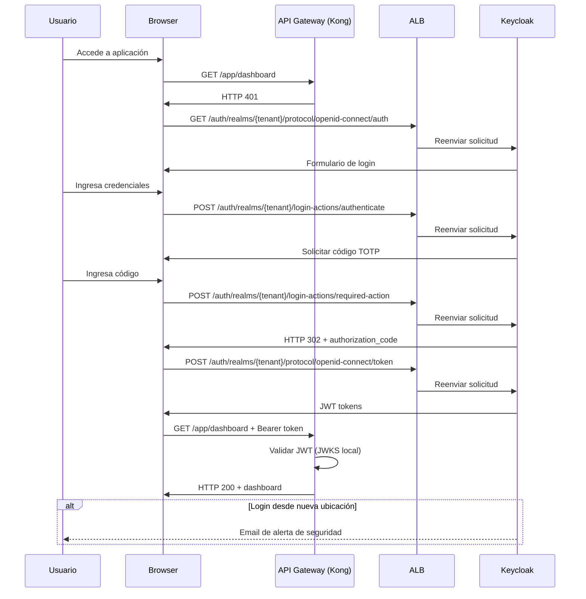
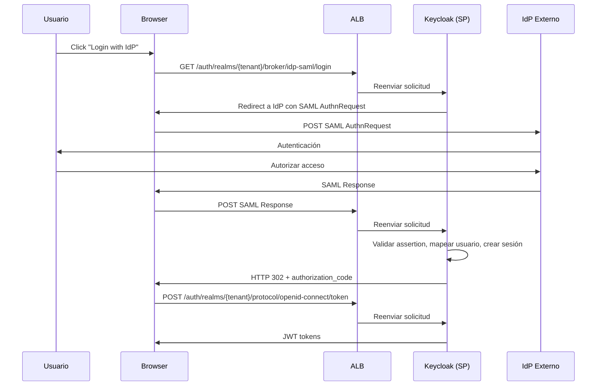
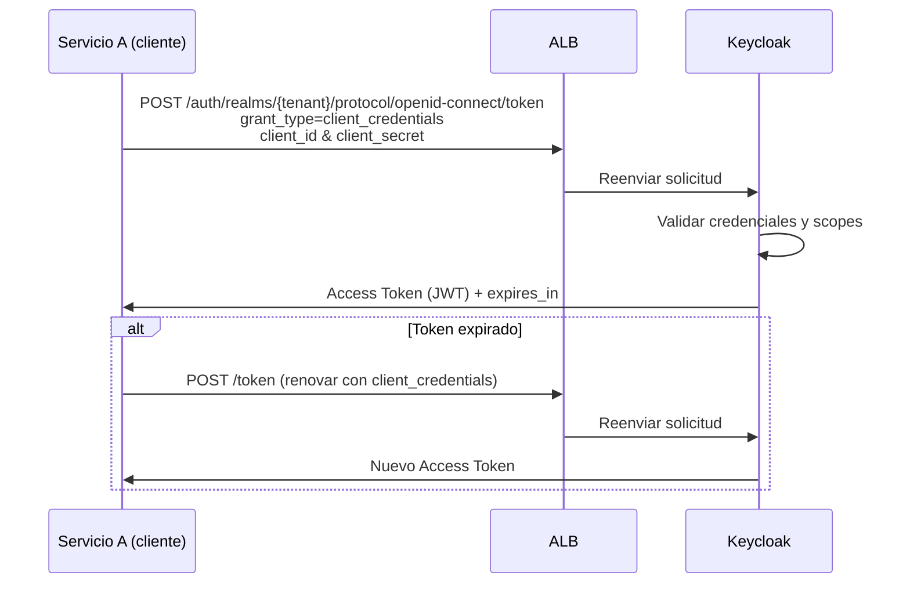

# 6. Vista de Tiempo de Ejecución

## Escenario: Autenticación con MFA



### Manejo de Errores

| Escenario             | Respuesta | Recuperación                            |
| --------------------- | --------- | --------------------------------------- |
| LDAP no disponible    | HTTP 503  | Fallback a usuarios locales             |
| MFA fallido (3 veces) | Lockout   | Email de desbloqueo                     |
| Audit Service caído   | Continuar | Almacenamiento local y replay posterior |

## Escenario: Federación SAML _(planificada)_

> Este flujo aplica cuando se configure federación con IdPs externos. Actualmente no hay Identity Providers configurados en los realms.



## Escenario: Generación de Token M2M (Client Credentials)

Flujo para servicios backend que se comunican entre sí sin intervención de un usuario (e.g., worker, microservicio, job).



### Ejemplo de solicitud HTTP

```http
POST /auth/realms/tlm-pe/protocol/openid-connect/token
Host: keycloak.talma.internal
Content-Type: application/x-www-form-urlencoded

grant_type=client_credentials
&client_id=gestal-pe-dev
&client_secret=<SECRET>
&scope=openid
```

**Respuesta:**

```json
{
  "access_token": "eyJhbGciOiJSUzI1NiIsInR5cCI6IkpXVCJ9...",
  "expires_in": 300,
  "token_type": "Bearer",
  "scope": "openid"
}
```

### Ejemplo en C# (.NET 8)

```csharp
public class KeycloakM2MTokenService(IHttpClientFactory httpClientFactory, IOptions<KeycloakOptions> options)
{
    private readonly KeycloakOptions _options = options.Value;

    public async Task<string> GetAccessTokenAsync(CancellationToken cancellationToken = default)
    {
        var client = httpClientFactory.CreateClient("keycloak");

        var body = new Dictionary<string, string>
        {
            ["grant_type"]    = "client_credentials",
            ["client_id"]     = _options.ClientId,
            ["client_secret"] = _options.ClientSecret,
            ["scope"]         = _options.Scopes,
        };

        var response = await client.PostAsync(
            $"/realms/{_options.Realm}/protocol/openid-connect/token",
            new FormUrlEncodedContent(body),
            cancellationToken);

        response.EnsureSuccessStatusCode();

        var payload = await response.Content.ReadFromJsonAsync<TokenResponse>(cancellationToken);
        return payload!.AccessToken;
    }
}
```

> **Nota:** el token debe cachearse por `expires_in - margen (p.ej. 30 s)` para evitar solicitudes innecesarias a Keycloak.

### Manejo de Errores

| Escenario                 | Respuesta HTTP  | Acción recomendada                                   |
| ------------------------- | --------------- | ---------------------------------------------------- |
| `client_secret` inválido  | 401             | Revisar configuración; no reintentar sin corrección  |
| Scope no autorizado       | 400             | Verificar roles/scopes del cliente en Keycloak       |
| Keycloak no disponible    | 503             | Reintentar con backoff exponencial (máx. 3 intentos) |
| Token expirado en uso     | 401 del recurso | Renovar token y reintentar la solicitud original     |
| `client_id` no encontrado | 401             | Verificar realm y nombre del cliente                 |
