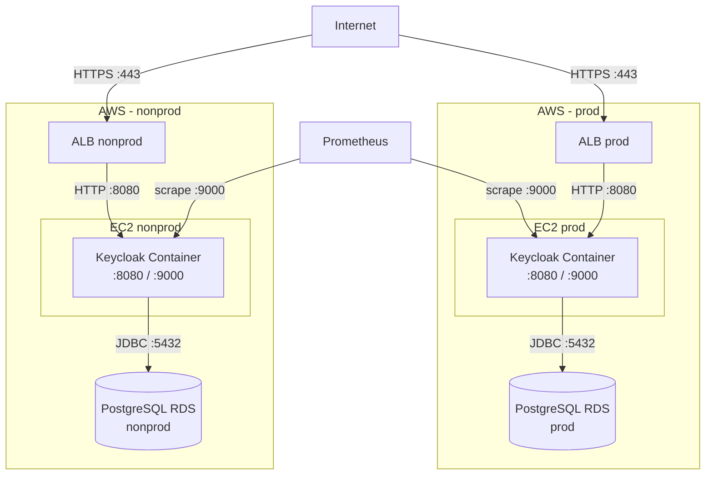

# 7. Vista de Despliegue



> Diagrama C4 detallado disponible en la imagen generada desde Structurizr: 

## Repositorio de Infraestructura

Todo el despliegue de Keycloak se gestiona en el repositorio `tlm-infra-keycloak`.

```
tlm-infra-keycloak/
├── .env.example                        # Variables de entorno (template)
├── docker-compose.yml                  # Configuración base
├── docker-compose.local.yml            # Override: ambiente local (con Postgres)
├── docker-compose.nonprod.yml          # Override: nonprod (DB externa)
├── docker-compose.prod.yml             # Override: producción (DB externa)
├── Makefile                            # Comandos de operación
├── keycloak/
│   ├── config/keycloak.conf            # Configuración del servidor
│   ├── realms/                         # Definición de realms (JSON)
│   │   ├── tlm-corp-realm.json
│   │   ├── tlm-pe-realm.json
│   │   └── tlm-mx-realm.json
│   └── themes/talma-theme/             # Tema personalizado
│       ├── account/                    # Portal de cuenta de usuario
│       ├── admin/                      # Consola de administración
│       └── login/                      # Pantalla de inicio de sesión
│           └── messages/               # i18n (es, en)
└── scripts/
    ├── import-realms.sh                # Importación manual de realms
    └── test-token.sh                   # Prueba de obtención de token
```

## Stack Técnico

| Componente    | Tecnología                                 | Ubicación                        |
| ------------- | ------------------------------------------ | -------------------------------- |
| `Keycloak`    | `quay.io/keycloak/keycloak:26.4.4`         | Contenedor Docker en EC2         |
| `PostgreSQL`  | `postgres:16-alpine` (local) / RDS (desplegado) | Contenedor local / AWS RDS  |
| Configuración | Variables de entorno (`.env`)               | Archivo local / Secrets Mgr      |
| Realms        | JSON exportado (`--import-realm`)           | `keycloak/realms/*.json`         |
| Tema          | `talma-theme`                              | `keycloak/themes/`               |

## Configuración del Servidor

Keycloak se configura mediante variables de entorno y `keycloak.conf`:

| Variable / Configuración | Valor                | Propósito                    |
| ------------------------ | -------------------- | ---------------------------- |
| `KC_HTTP_RELATIVE_PATH`  | `/auth`              | Ruta base de todos los endpoints |
| `KC_DB`                  | `postgres`           | Motor de base de datos       |
| `KC_PROXY`               | `edge`               | Modo proxy (TLS en ALB)      |
| `KC_LOCALE_DEFAULT`      | `es`                 | Idioma por defecto           |
| `KC_LOCALE_SUPPORTED`    | `es,en`              | Idiomas soportados           |
| `KC_METRICS_ENABLED`     | `true`               | Endpoint de métricas         |
| `KC_HEALTH_ENABLED`      | `true`               | Endpoint de health checks    |
| `KC_CACHE`               | `local`              | Caché local (sin clustering) |

### Puertos Expuestos

| Puerto | Protocolo | Uso                    |
| ------ | --------- | ---------------------- |
| `8080` | HTTP      | Tráfico de aplicación  |
| `8443` | HTTPS     | Tráfico seguro         |
| `9000` | HTTP      | Métricas y health      |

## Ambientes

Se manejan **3 ambientes lógicos** (dev, qa, prod) distribuidos en **2 ambientes de infraestructura** (nonprod, prod):

| Ambiente lógico | Infra       | Archivo override             | Compute               | Base de datos  | Uso                              |
| --------------- | ----------- | ---------------------------- | --------------------- | -------------- | -------------------------------- |
| `local`         | _local_     | `docker-compose.local.yml`   | Docker local           | Postgres (contenedor) | Desarrollo en máquina local |
| `dev`           | `nonprod`   | `docker-compose.nonprod.yml` | Contenedor en EC2     | PostgreSQL RDS | Desarrollo / integración         |
| `qa`            | `nonprod`   | `docker-compose.nonprod.yml` | Contenedor en EC2     | PostgreSQL RDS | QA y validación previa           |
| `prod`          | `prod`      | `docker-compose.prod.yml`    | Contenedor en EC2     | PostgreSQL RDS | Producción                       |

> Los ambientes `dev` y `qa` comparten la misma infraestructura (`nonprod`) diferenciándose por configuración (`KC_HOSTNAME`, base de datos, variables de entorno).

### Comandos de Operación (Makefile)

```bash
make start-local          # Levanta ambiente local (incluye Postgres)
make start-nonprod        # Levanta ambiente nonprod
make start-prod           # Levanta ambiente producción
make down-local           # Detiene ambiente local
make logs SERVICE=keycloak  # Logs del servicio
make shell                # Shell en contenedor keycloak
make ps                   # Estado de contenedores
```

## Health Check

```bash
# Verifica disponibilidad
GET /health/ready HTTP/1.1
# Intervalo: 30s, timeout: 10s, retries: 5, start_period: 60s
```

## Importación de Realms

Los realms se importan automáticamente al iniciar el contenedor (`--import-realm`).
Para importación manual contra una instancia en ejecución:

```bash
export KEYCLOAK_ADMIN_USER=admin
export KEYCLOAK_ADMIN_PASSWORD=<password>
./scripts/import-realms.sh
```

## Backup y Disaster Recovery

- Backups automáticos diarios de base de datos (`30 días prod`, `7 días nonprod`)
- Snapshots manuales antes de despliegues mayores
- Export de configuración de tenants (`realms`) como JSON en repositorio Git
- Plan de recuperación: `RTO < 4h`, `RPO < 15min`
