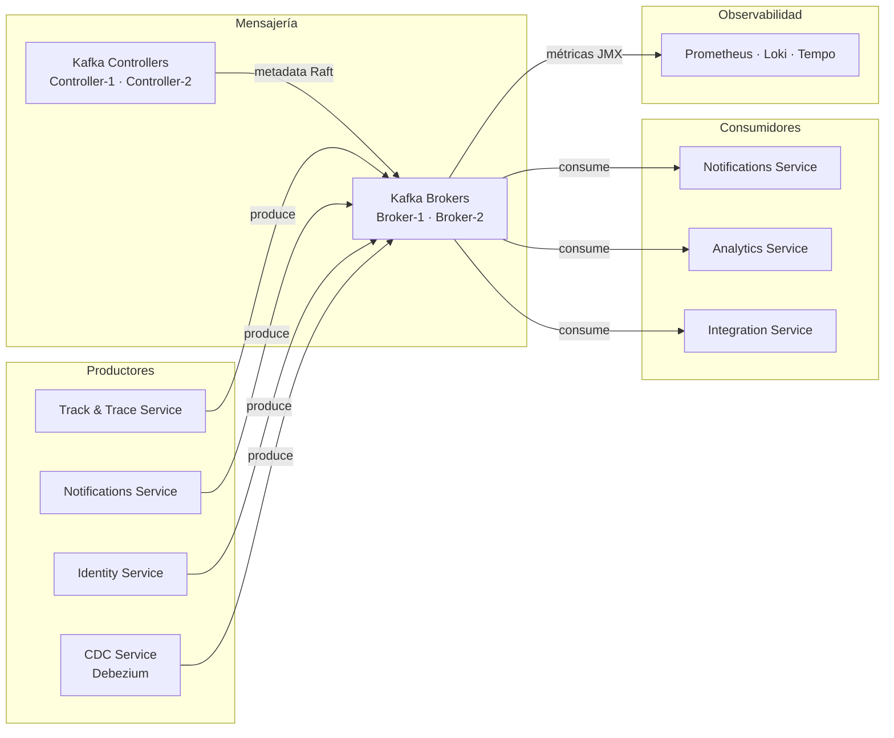

# 3. Contexto y Alcance

## Contexto del Sistema

La plataforma de mensajería actúa como bus de eventos corporativo. Los servicios productores publican eventos sin conocer a los consumidores. Los servicios consumidores leen eventos de forma independiente y con su propio ritmo mediante consumer groups.

## Contexto de Negocio

| Actor externo               | Interfaz                                   | Descripción                                                                   |
| --------------------------- | ------------------------------------------ | ----------------------------------------------------------------------------- |
| Servicios productores       | Kafka Producer API (TCP `:9092` o `:9093`) | Publican eventos de dominio (Track & Trace, Notifications, Identity, CDC)     |
| Servicios consumidores      | Kafka Consumer API (TCP `:9092` o `:9093`) | Consumen eventos con consumer groups; cada servicio mantiene su propio offset |
| Equipo de Plataforma        | Kafka Admin API + herramientas CLI         | Gestión de topics, ACLs, configuración del clúster                            |
| Equipo de Datos / Analytics | Kafka Consumer API                         | Consumo de eventos para ingesta en data lake y analítica                      |

## Contexto Técnico

| Interfaz                  | Protocolo           | Dirección | Descripción                                                           |
| ------------------------- | ------------------- | --------- | --------------------------------------------------------------------- |
| Productores → Brokers     | TCP `:9092` (SASL)  | Entrada   | Publicación de mensajes; autenticación SASL/SCRAM-SHA-512             |
| Consumidores → Brokers    | TCP `:9092` (SASL)  | Entrada   | Consumo de mensajes con gestión de offsets                            |
| Controllers ↔ Controllers | TCP `:9093` (Raft)  | Interna   | Consenso de metadatos KRaft entre controllers                         |
| Controllers → Brokers     | TCP `:9093`         | Interna   | Distribución de metadatos del clúster a brokers                       |
| Brokers → Prometheus      | HTTP `/metrics`     | Salida    | Métricas JMX exportadas vía `kafka-exporter` o JMX Exporter           |
| Brokers → Loki            | stdout → Fluent Bit | Salida    | Logs estructurados del broker recolectados por agente en la instancia |
| Admin → Kafka Admin API   | TCP `:9092`         | Entrada   | Gestión de topics, consumer groups, ACLs                              |

## Fuera de Alcance

- Lógica de negocio de los servicios productores y consumidores.
- Transformación o enriquecimiento de mensajes en tránsito (responsabilidad de Kafka Streams o servicios propios).
- Schema Registry (pendiente de evaluación — ver DT-03).
- Gestión de identidades de los productores/consumidores (responsabilidad de Keycloak + SASL).
