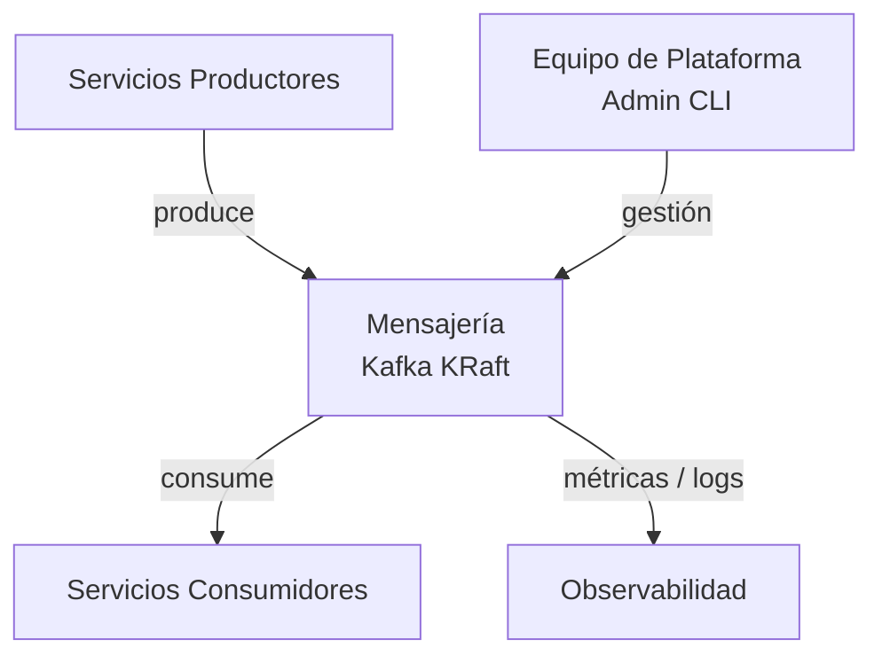
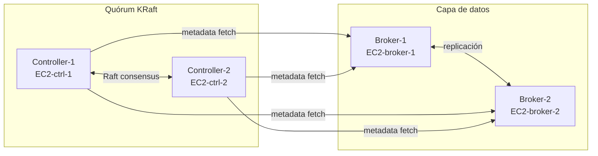

# 5. Vista de Bloques de Construcción

## Nivel 1: Sistema en Contexto

## Nivel 2: Componentes Internos del Clúster

| Componente       | Tecnología / Imagen                   | Responsabilidad                                                                   |
| ---------------- | ------------------------------------- | --------------------------------------------------------------------------------- |
| **Controller-1** | `apache/kafka:3.7` — rol `controller` | Participa en quórum KRaft; gestiona metadata log y elección de líder de partición |
| **Controller-2** | `apache/kafka:3.7` — rol `controller` | Réplica del quórum KRaft; garantiza disponibilidad de metadatos ante fallo        |
| **Broker-1**     | `apache/kafka:3.7` — rol `broker`     | Almacena particiones; atiende producers y consumers; replica hacia Broker-2       |
| **Broker-2**     | `apache/kafka:3.7` — rol `broker`     | Réplica de particiones de Broker-1; asume liderazgo ante fallo del otro broker    |
| **JMX Exporter** | `bitnami/jmx-exporter` (sidecar)      | Exporta métricas JMX de Kafka en formato Prometheus por cada instancia EC2        |
| **Fluent Bit**   | `fluent/fluent-bit` (agente en EC2)   | Recolecta stdout de contenedores Kafka y los envía a Loki                         |

## Relación Controller ↔ Broker

## Estructura de Topics

| Elemento              | Configuración        | Descripción                                                          |
| --------------------- | -------------------- | -------------------------------------------------------------------- |
| `partitions`          | `≥ 4` por topic      | Paralelismo de consumo; ajustable según throughput esperado          |
| `replication.factor`  | `2`                  | Una réplica por broker; sin pérdida de datos ante fallo de un broker |
| `min.insync.replicas` | `1`                  | Mínimo de réplicas en sincronía para aceptar escrituras              |
| `retention.ms`        | `604800000` (7 días) | Retención por defecto; configurable por topic                        |
| `cleanup.policy`      | `delete`             | Limpieza por tiempo/tamaño; `compact` para topics de estado          |
