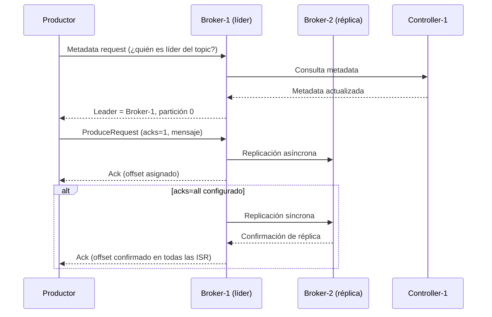
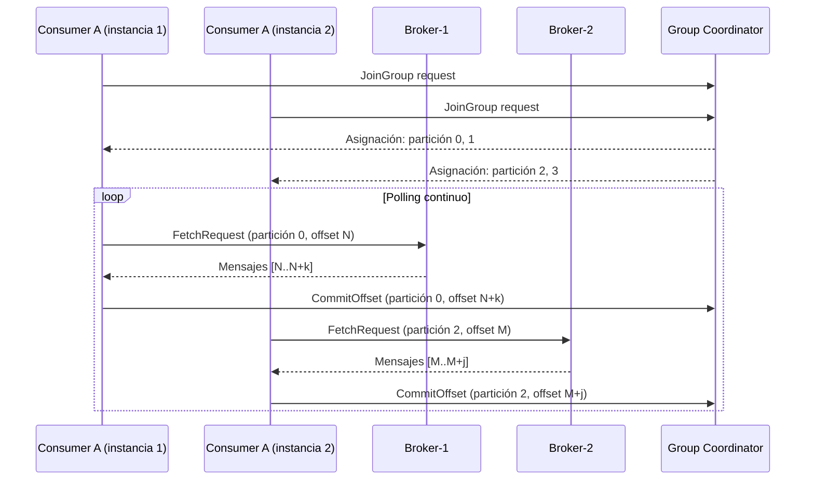
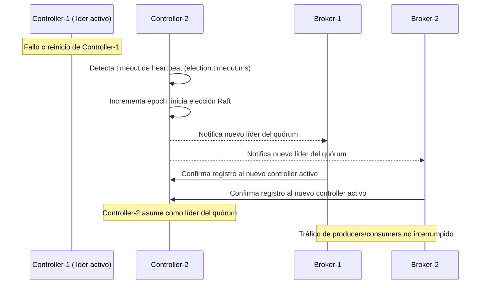

# 6. Vista de Tiempo de Ejecución

## Flujo 1: Publicación de Mensaje (Producer)

> `acks=1` es el valor por defecto. Para eventos críticos (pagos, auditoría) usar `acks=all` + `min.insync.replicas=2`.

## Flujo 2: Consumo de Mensajes (Consumer Group)

> Cada consumer group mantiene su propio offset por partición. Múltiples grupos pueden consumir el mismo topic de forma independiente.

## Flujo 3: Elección de Líder KRaft (Failover de Controller)

> La elección KRaft ocurre en el plano de control (metadatos). El tráfico de datos (produce/consume) continúa sin interrupción mientras haya al menos un broker disponible.

## Manejo de Errores por Flujo

| Escenario                         | Respuesta del Sistema                                                                   |
| --------------------------------- | --------------------------------------------------------------------------------------- |
| Broker-1 cae (partición líder)    | Controller promueve réplica en Broker-2 como líder; reconexión automática del productor |
| Fallo en replicación inter-broker | Réplica sale de ISR; broker degradado no recibe escrituras hasta resincronización       |
| Consumer falla sin commit         | Al reiniciar, retoma desde el último offset confirmado (at-least-once delivery)         |
| Quórum KRaft sin mayoría          | Clúster rechaza escrituras de metadatos; datos existentes siguen siendo legibles        |
| Disco lleno en broker             | Broker rechaza nuevas escrituras; alerta en Grafana por métrica `kafka_log_size`        |
