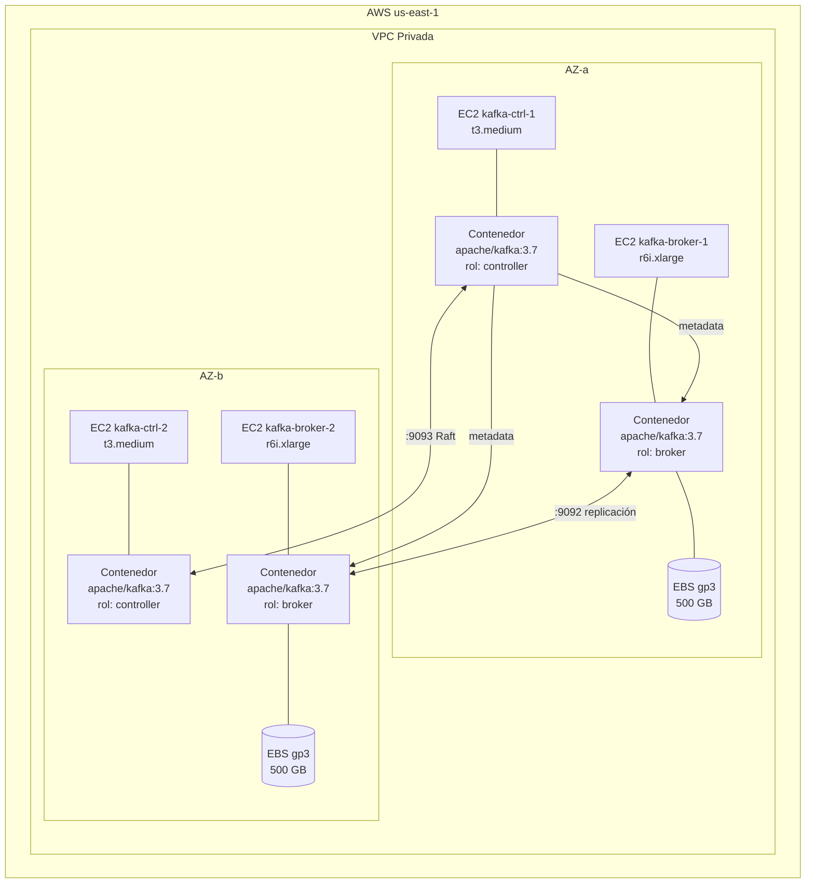

# 7. Vista de Despliegue

## Topología de Despliegue



> Controllers y Brokers se distribuyen en zonas de disponibilidad diferentes (AZ-a y AZ-b) para tolerancia a fallos a nivel de zona.

## Imagen Docker

```dockerfile
FROM apache/kafka:3.7
# Imagen oficial de Apache Kafka con soporte nativo KRaft.
# No se usa Confluent Platform ni Bitnami para mantener la
# imagen oficial sin capas adicionales.
EXPOSE 9092 9093
```

La diferenciación de rol (`controller` o `broker`) se realiza mediante la variable de entorno `KAFKA_PROCESS_ROLES` en cada instancia.

## Configuración de Contenedor por Rol

### Controller (`kafka-ctrl-1` y `kafka-ctrl-2`)

| Variable de Entorno               | Valor                         | Descripción                              |
| --------------------------------- | ----------------------------- | ---------------------------------------- |
| `KAFKA_PROCESS_ROLES`             | `controller`                  | Nodo exclusivo de control KRaft          |
| `KAFKA_NODE_ID`                   | `1` / `2`                     | ID único del nodo en el clúster          |
| `KAFKA_CONTROLLER_QUORUM_VOTERS`  | `1@ctrl-1:9093,2@ctrl-2:9093` | Dirección de todos los voters del quórum |
| `KAFKA_LISTENERS`                 | `CONTROLLER://:9093`          | Solo escucha protocolo de control        |
| `KAFKA_LOG_DIRS`                  | `/var/lib/kafka/data`         | Directorio del metadata log              |
| `KAFKA_CONTROLLER_LISTENER_NAMES` | `CONTROLLER`                  | Nombre del listener de control           |

### Broker (`kafka-broker-1` y `kafka-broker-2`)

| Variable de Entorno                | Valor                           | Descripción                                       |
| ---------------------------------- | ------------------------------- | ------------------------------------------------- |
| `KAFKA_PROCESS_ROLES`              | `broker`                        | Nodo exclusivo de datos                           |
| `KAFKA_NODE_ID`                    | `3` / `4`                       | ID único del nodo en el clúster                   |
| `KAFKA_CONTROLLER_QUORUM_VOTERS`   | `1@ctrl-1:9093,2@ctrl-2:9093`   | Referencia al quórum de controllers               |
| `KAFKA_LISTENERS`                  | `PLAINTEXT://:9092`             | Puerto de clientes (producers/consumers)          |
| `KAFKA_ADVERTISED_LISTENERS`       | `PLAINTEXT://<ip-privada>:9092` | Dirección anunciada a clientes (IP privada EC2)   |
| `KAFKA_LOG_DIRS`                   | `/mnt/kafka-data`               | Volumen EBS montado para datos de particiones     |
| `KAFKA_NUM_PARTITIONS`             | `4`                             | Particiones por defecto para nuevos topics        |
| `KAFKA_DEFAULT_REPLICATION_FACTOR` | `2`                             | Replicación por defecto para nuevos topics        |
| `KAFKA_MIN_INSYNC_REPLICAS`        | `1`                             | Mínimo de réplicas en ISR para aceptar escrituras |
| `KAFKA_LOG_RETENTION_HOURS`        | `168`                           | Retención de 7 días por defecto                   |

## Estructura del Repositorio de Infraestructura

```
infra/kafka/
├── terraform/
│   ├── ec2-controllers.tf    # Instancias EC2 para controllers
│   ├── ec2-brokers.tf        # Instancias EC2 para brokers
│   ├── ebs-volumes.tf        # Volúmenes EBS gp3 por broker
│   └── security-groups.tf   # Reglas de red (:9092, :9093)
├── ansible/
│   ├── setup-docker.yml      # Instalación Docker en EC2
│   ├── deploy-controller.yml # Despliegue del contenedor controller
│   └── deploy-broker.yml     # Despliegue del contenedor broker
└── config/
    ├── controller.env         # Variables de entorno por rol controller
    └── broker.env             # Variables de entorno por rol broker
```
