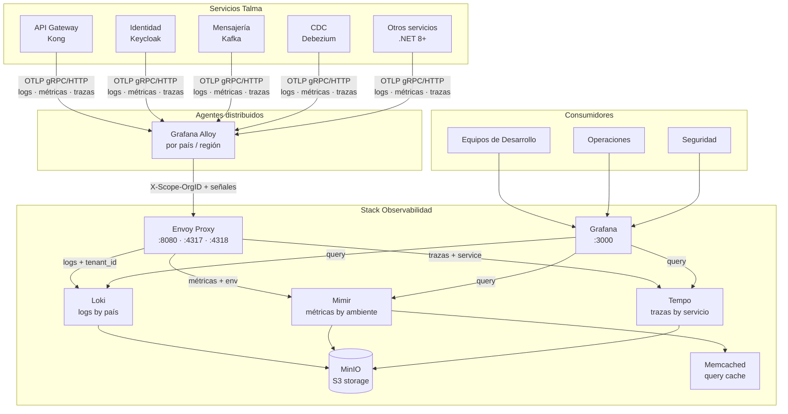

# 3. Contexto y Alcance

## Contexto del Sistema

## Contexto de Negocio

| Actor                 | Interacción con el sistema                                                    |
| --------------------- | ----------------------------------------------------------------------------- |
| Servicios .NET 8+     | Emiten telemetría via SDK OpenTelemetry hacia el agente Alloy local           |
| Equipo de Plataforma  | Configura tenants, dashboards, alertas y despliega nuevos agentes             |
| Equipos de Desarrollo | Consultan logs y trazas para troubleshooting; crean dashboards de servicio    |
| Equipo de Seguridad   | Audita accesos; revisa logs de autenticación en tenant `tlm-pe` / `tlm-mx`    |
| Operaciones           | Monitorea disponibilidad via dashboards de SLO; recibe alertas de degradación |

## Contexto Técnico

| Interfaz                    | Protocolo       | Puerto                | Descripción                                                |
| --------------------------- | --------------- | --------------------- | ---------------------------------------------------------- |
| OTLP gRPC (apps → Alloy)    | gRPC            | `14317` (Alloy local) | Aplicaciones .NET envían trazas y métricas al agente local |
| OTLP HTTP (apps → Alloy)    | HTTP/1.1        | `14318` (Alloy local) | Alternativa HTTP para apps sin soporte gRPC                |
| Alloy → Envoy (logs)        | HTTP/1.1        | `8080`                | Alloy reenvía logs al endpoint unificado de Envoy          |
| Alloy → Envoy (métricas)    | HTTP/1.1        | `8080`                | Alloy reenvía métricas al endpoint unificado de Envoy      |
| Alloy → Envoy (trazas gRPC) | gRPC            | `9090`                | Alloy reenvía trazas en protocolo de alto rendimiento      |
| Envoy → Loki                | HTTP/1.1        | `3100` (interno)      | Envoy enruta logs al backend con `X-Scope-OrgID`           |
| Envoy → Mimir               | HTTP/1.1        | `9009` (interno)      | Envoy enruta métricas al backend con `X-Scope-OrgID`       |
| Envoy → Tempo               | HTTP/1.1 / gRPC | `3200` (interno)      | Envoy enruta trazas al backend con `X-Scope-OrgID`         |
| Grafana → backends          | HTTP/1.1        | internos              | Grafana consulta Loki/Mimir/Tempo via data sources         |

## Fuera de Alcance

- Recolección de métricas de negocio (KPIs financieros): alimentados por procesos separados.
- APM de base de datos (query plans, slow queries): gestionado por herramientas de BD.
- Gestión de incidentes (ticketing): Grafana lanza alertas; el sistema de tickets es externo.
- SIEM / análisis de seguridad avanzado: los logs se almacenan en Loki pero el análisis SIEM es externo.
