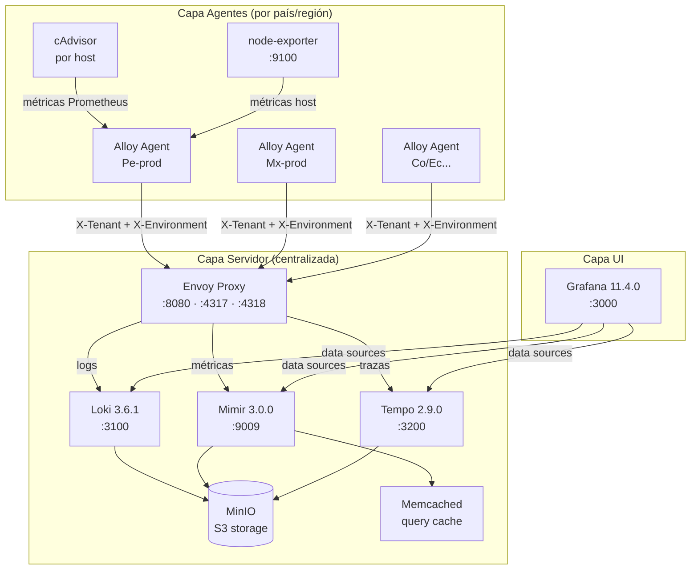

# 5. Vista de Bloques de Construcción

## Nivel 1: Capas del Stack

## Nivel 2: Componentes por Capa

### Capa Servidor

| Componente      | Imagen                              | Puerto                                                        | Responsabilidad                                                                                    |
| --------------- | ----------------------------------- | ------------------------------------------------------------- | -------------------------------------------------------------------------------------------------- |
| **Envoy Proxy** | `envoyproxy/envoy:v1.36.2`          | 8080 (HTTP), 4317 (OTLP gRPC), 4318 (OTLP HTTP), 9901 (admin) | Gateway unificado; Lua filter construye `X-Scope-OrgID` a partir de `X-Tenant` y `X-Environment`   |
| **Loki**        | `grafana/loki:3.6.1`                | 3100 (interno)                                                | Almacenamiento y consulta de logs; tenant = `logs-{TENANT_ID}-{ENVIRONMENT}`                       |
| **Mimir**       | `grafana/mimir:3.0.0`               | 9009 (interno)                                                | Almacenamiento de métricas escalable; tenant = `metrics-{ENVIRONMENT}`; ingestia vía Prometheus RW |
| **Tempo**       | `grafana/tempo:2.9.0`               | 3200 (interno)                                                | Almacenamiento de trazas distribuidas; tenant = `traces-{ENVIRONMENT}`                             |
| **MinIO**       | `minio/minio:RELEASE.2025-09-07...` | 9000 (API), 9001 (console)                                    | Backend S3-compatible; aloja los buckets de Loki, Mimir y Tempo                                    |
| **Memcached**   | `memcached:1.6.39-alpine`           | 11211 (interno)                                               | Caché de queries de Mimir para dashboards de largo plazo                                           |

### Capa Agentes (por instancia)

| Componente        | Imagen                             | Puerto                                           | Responsabilidad                                                                                     |
| ----------------- | ---------------------------------- | ------------------------------------------------ | --------------------------------------------------------------------------------------------------- |
| **Grafana Alloy** | `grafana/alloy:v1.11.3`            | 12345 (UI), 14317 (OTLP gRPC), 14318 (OTLP HTTP) | Recolecta logs Docker, métricas del sistema y trazas OTLP; envía al servidor con tenant configurado |
| **cAdvisor**      | `gcr.io/cadvisor/cadvisor:v0.52.0` | 8080 (interno)                                   | Expone métricas de contenedores Docker para que Alloy las ingeste (scrape 30s)                      |
| **node-exporter** | `prom/node-exporter:v1.10.2`       | 9100 (interno)                                   | Expone métricas del sistema operativo (CPU, memoria, disco, red) del host EC2 (scrape 30s)          |

### Capa UI

| Componente  | Imagen                   | Puerto | Responsabilidad                                                        |
| ----------- | ------------------------ | ------ | ---------------------------------------------------------------------- |
| **Grafana** | `grafana/grafana:11.4.0` | 3000   | Visualización unificada; data sources conectados a Loki, Mimir y Tempo |

## Pipelines de Alloy

El agente Alloy usa **13 archivos `.alloy` modulares** ubicados en `agents/config/alloy/`. Cada archivo encapsula una responsabilidad específica de colección o escritura:

| Archivo                       | Propósito                                                                                      |
| ----------------------------- | ---------------------------------------------------------------------------------------------- |
| `base.alloy`                  | Nivel de log de Alloy y live debugging                                                         |
| `otlp-receiver.alloy`         | Receptor OTLP gRPC `:14317` + HTTP `:14318`; rutas logs → Loki, trazas/métricas → procesadores |
| `otlp-processors.alloy`       | Inyección de atributos de recurso + batch processors para trazas y métricas                    |
| `logs-writer.alloy`           | `loki.write` con headers `X-Tenant`+`X-Environment`; WAL habilitado (`max_segment_age=2h`)     |
| `logs-docker.alloy`           | Scraping de logs Docker + rate-limit (1.000/s, burst 2.000) + filtro de seguridad              |
| `logs-journal.alloy`          | Recolección de logs del journal de systemd                                                     |
| `logs-syslog.alloy`           | Recolección de syslog                                                                          |
| `metrics-writer.alloy`        | `prometheus.remote_write` con headers `X-Tenant`+`X-Environment`; WAL habilitado               |
| `metrics-cadvisor.alloy`      | Scrape de cAdvisor `:8080` cada 30s con enriquecimiento de labels                              |
| `metrics-node-exporter.alloy` | Scrape de node-exporter `:9100` cada 30s con enriquecimiento de labels                         |
| `metrics-alloy-self.alloy`    | Auto-métricas de Alloy (runtime + proceso)                                                     |
| `traces-writer.alloy`         | Exportador OTLP gRPC a Envoy `:4317` con headers `X-Tenant`+`X-Environment`                    |

## Buckets MinIO

| Bucket               | Usado por | Contenido                           |
| -------------------- | --------- | ----------------------------------- |
| `loki-data`          | Loki      | Chunks y regla de logs por tenant   |
| `loki-ruler`         | Loki      | Reglas de alertas de Loki           |
| `mimir-blocks`       | Mimir     | Bloques TSDB de métricas por tenant |
| `mimir-ruler`        | Mimir     | Reglas de alertas de Mimir          |
| `mimir-alertmanager` | Mimir     | Config de Alertmanager por tenant   |
| `tempo-data`         | Tempo     | Bloques de trazas por tenant        |
