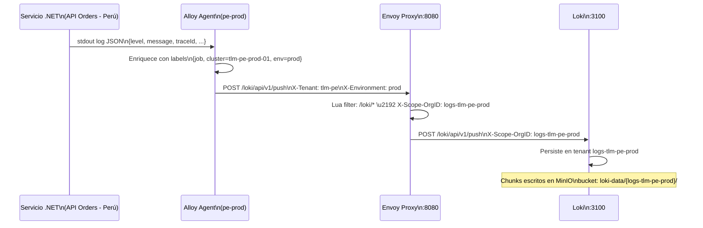
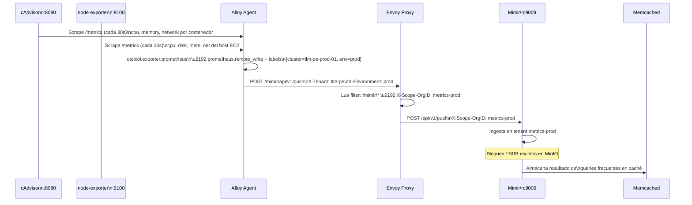
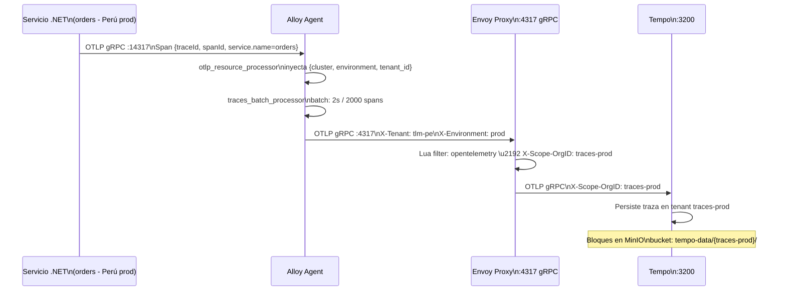
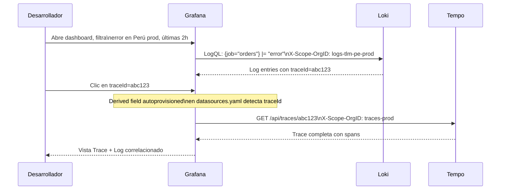

# 6. Vista de Tiempo de Ejecución

## Flujo 1: Ingestión de Logs desde Servicio .NET

## Flujo 2: Ingestión de Métricas de Infraestructura

## Flujo 3: Ingestión de Trazas OTLP desde .NET

## Flujo 4: Consulta con Correlación Log → Traza en Grafana

## Manejo de Errores

| Escenario                                                        | Comportamiento                                                                |
| ---------------------------------------------------------------- | ----------------------------------------------------------------------------- |
| Agente Alloy no alcanza a Envoy                                  | Reintento con backoff exponencial; logs en buffer interno de Alloy            |
| Envoy no alcanza a Loki/Mimir/Tempo                              | HTTP 503 al agente; Alloy reintenta hasta `max_retries`                       |
| MinIO no disponible                                              | Loki/Mimir/Tempo acumulan en WAL local hasta que MinIO recupere               |
| Tenant desconocido (falta `X-Tenant` o `X-Environment` en Alloy) | Envoy no puede construir `X-Scope-OrgID`; backend rechaza con HTTP 400        |
| Memcached no disponible                                          | Mimir responde queries directamente desde los bloques (mayor latencia)        |
| Grafana sin datos en tenant                                      | Query vacía; no hay error si el tenant existe pero no tiene datos en el rango |
