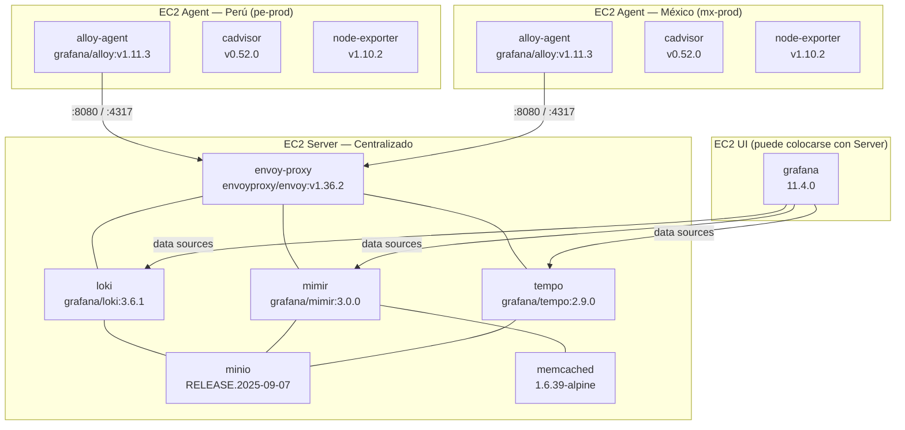

# 7. Vista de Despliegue

## Topología de Despliegue



> Los agentes y el servidor se despliegan en hosts EC2 independientes. La capa UI puede co-existir con el servidor en el mismo host o estar en un EC2 separado.

## Red Docker

```
observability-backend (172.20.0.0/16)
├── envoy-proxy
├── loki        (alias: loki-memberlist)
├── mimir       (alias: mimir-memberlist)
├── tempo
├── minio
├── memcached
└── alloy-agent (también en observability-backend para comunicación local)
```

> La red sólo es externa en los puertos expuestos por Envoy y Alloy. Los backends (Loki, Mimir, Tempo, MinIO) son exclusivamente internos.

## Puertos Expuestos por Capa

### Server Layer

| Puerto | Protocolo | Servicio      | Uso                                               |
| ------ | --------- | ------------- | ------------------------------------------------- |
| `8080` | HTTP/1.1  | Envoy         | API unificada (Loki push, Mimir push, Tempo HTTP) |
| `4317` | gRPC      | Envoy         | OTLP gRPC para trazas (apps/agentes → Envoy)      |
| `4318` | HTTP/1.1  | Envoy         | OTLP HTTP endpoint                                |
| `9901` | HTTP/1.1  | Envoy Admin   | Dashboard de administración de Envoy              |
| `9001` | HTTP/1.1  | MinIO Console | Gestión de buckets (acceso restringido)           |

### Agent Layer

| Puerto  | Protocolo | Servicio | Uso                                      |
| ------- | --------- | -------- | ---------------------------------------- |
| `12345` | HTTP/1.1  | Alloy UI | Dashboard y API de estado del agente     |
| `14317` | gRPC      | Alloy    | OTLP gRPC receiver (apps → agente local) |
| `14318` | HTTP/1.1  | Alloy    | OTLP HTTP receiver (apps → agente local) |

### UI Layer

| Puerto | Protocolo | Servicio | Uso                                  |
| ------ | --------- | -------- | ------------------------------------ |
| `3000` | HTTP/1.1  | Grafana  | Interfaz web de dashboards y alertas |

## Estructura del Repositorio

```
tlm-observability-stack/
├── server/
│   ├── docker-compose.yml          # Orquesta los 3 compose files de servidor
│   ├── compose-backends.yml        # Loki + Mimir + Tempo
│   ├── compose-storage.yml         # MinIO + Memcached
│   ├── compose-proxy.yml           # Envoy Proxy
│   ├── .env.example                # Variables de entorno del servidor
│   └── config/
│       ├── envoy/envoy-multitenancy.yaml  # Lua filters de tenant routing
│       ├── loki/monolithic-mode-logs.yaml
│       ├── mimir/monolithic-mode-metrics.yaml
│       └── tempo/                         # Config de Tempo
├── agents/
│   ├── docker-compose.yml          # Alloy + cAdvisor
│   ├── .env.example                # Variables TENANT_ID, ENVIRONMENT, SERVICE_NAME
│   └── config/alloy/               # Pipelines .alloy por señal
├── ui/
│   ├── docker-compose.yml          # Grafana
│   ├── compose-grafana.yml
│   └── config/                     # Provisioning de data sources y dashboards
└── docs/
    ├── ARCHITECTURE.txt
    ├── MULTITENANCY.md
    ├── DEPLOYMENT.md
    └── SECURITY.md
```

## Variables de Entorno del Agente

| Variable                  | Ejemplo                            | Descripción                                                                           |
| ------------------------- | ---------------------------------- | ------------------------------------------------------------------------------------- |
| `SERVER_ENVOY_LOKI`       | `http://10.2.0.134:8080/loki/...`  | Endpoint Envoy para push de logs                                                      |
| `SERVER_ENVOY_MIMIR`      | `http://10.2.0.134:8080/mimir/...` | Endpoint Envoy para push de métricas (Prometheus Remote Write)                        |
| `SERVER_ENVOY_TEMPO_GRPC` | `10.2.0.134:4317`                  | Endpoint Envoy gRPC para trazas OTLP                                                  |
| `SERVER_HTTP_PORT`        | `8080`                             | Puerto HTTP de Envoy                                                                  |
| `SERVER_OTLP_GRPC_PORT`   | `4317`                             | Puerto gRPC de Envoy para OTLP                                                        |
| `TENANT_ID`               | `tlm-pe`                           | Identificador de país/org. Parte del tenant de logs: `logs-{TENANT_ID}-{ENVIRONMENT}` |
| `ENVIRONMENT`             | `prod`                             | Ambiente. Define tenant de métricas (`metrics-prod`) y trazas (`traces-prod`)         |
| `SERVICE_NAME`            | `orders`                           | Nombre del agente/servicio; label en métricas y enriquecimiento de spans              |
| `COMPONENT`               | `infra`                            | Clasificación: `infra`, `application`, `middleware`, `agent`                          |
| `CLUSTER_NAME`            | `tlm-pe-prod-01`                   | Identificador del clúster; label en métricas y logs                                   |
| `ALLOY_LOG_LEVEL`         | `info`                             | Nivel de log del proceso Alloy (`debug`, `info`, `warn`, `error`)                     |
| `ALLOY_DEBUG_ENABLED`     | `false`                            | Activa el Live Debugging de Alloy (consumo adicional de CPU)                          |
