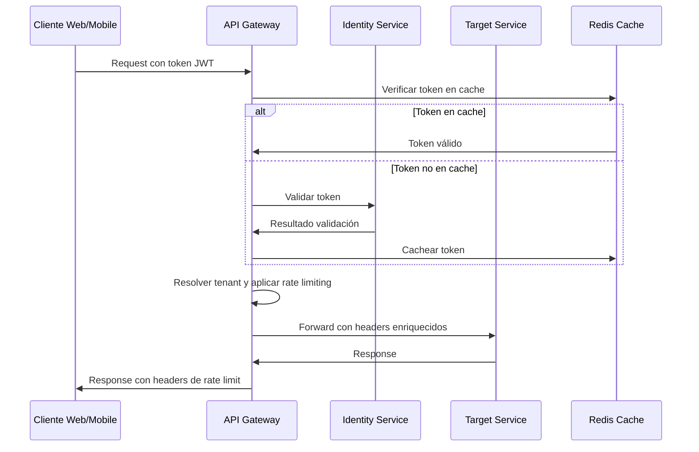
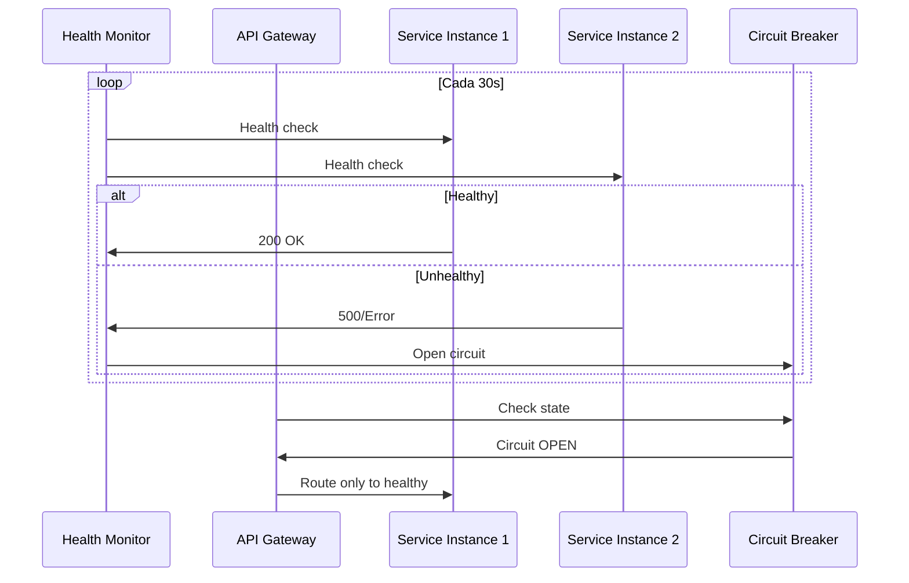
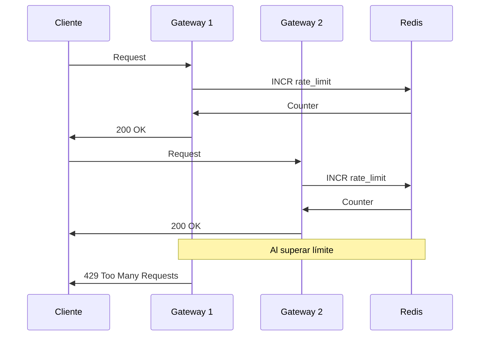
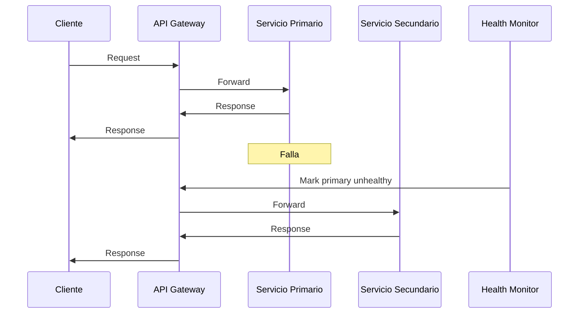
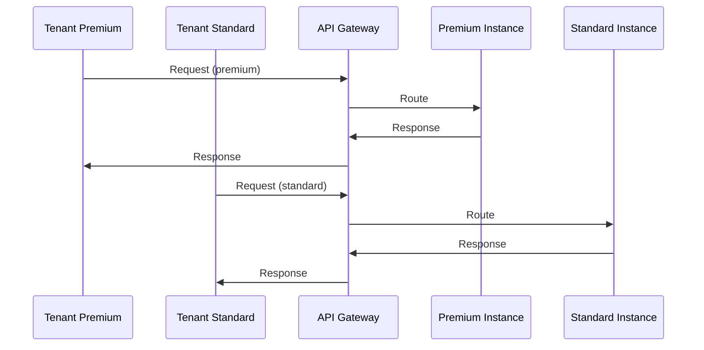
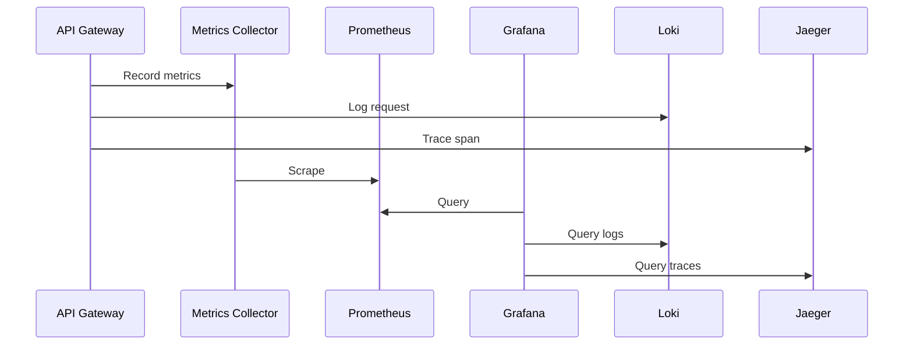

# 6. Vista De Tiempo De Ejecución

## 6.1 Escenarios Principales

| Escenario                  | Flujo principal                                      | Componentes involucrados                |
|----------------------------|-----------------------------------------------------|-----------------------------------------|
| Proxy request              | Cliente → Gateway → Backend                         | `YARP`, `ALB`, `.NET 8`                |
| Autenticación              | Validación JWT → Claims                             | `Auth Middleware`, `Keycloak`           |
| Rate limiting              | Request → `Redis` → Allow/Deny                     | `Rate Limiter`, `Redis`                 |
| Circuit breaker            | Proxy → `Polly` → Servicio/Fallback                 | `Polly`, `YARP`                        |
| Observabilidad             | Request → Logging/Metrics/Tracing                   | `Serilog`, `Loki`, `Prometheus`, `Jaeger` |

## 6.2 Flujos De Interacción Y Patrones

- Autenticación y enrutamiento: validación de token `JWT` (cache en `Redis`), resolución de tenant, rate limiting y enrutamiento al backend, enriqueciendo headers con información relevante.
- Health checks y circuit breaker: monitoreo activo, apertura/cierre de circuitos y failover automático.
- Rate limiting distribuido: ventana deslizante de `1 minuto`, sincronización vía `Redis`, headers estándar en respuesta.
- Failover y degradación: switchover automático, degradación controlada bajo sobrecarga, priorización de clientes premium.
- Multi-tenancy: resolución de tenant vía claims `JWT`, `API Key`, subdominio o query param; routing inteligente por tier y país.
- Observabilidad: trazabilidad distribuida (`Jaeger`), métricas en tiempo real (`Prometheus`), logs estructurados (`Loki`), dashboards y alertas (`Grafana`).

## 6.3 Ejemplos De Ejecución (Diagramas De Secuencia)

### 6.3.1 Flujo De Autenticación Y Enrutamiento

### 6.3.2 Health Check Y Circuit Breaker

### 6.3.3 Rate Limiting Distribuido

### 6.3.4 Failover Automático Y Degradación

### 6.3.5 Multi-Tenancy Y Routing Inteligente

### 6.3.6 Observabilidad Y Monitoreo

## 6.4 Objetivos De Rendimiento Y SLA

| Operación                  | Target           | Timeout | SLA    |
|----------------------------|------------------|---------|--------|
| Token validation (cache)   | `< 10ms`         | `100ms` | `99.9%`  |
| Token validation (fresh)   | `< 100ms`        | `500ms` | `99.5%`  |
| Request routing            | `< 5ms`          | `50ms`  | `99.9%`  |
| Health check               | `< 200ms`        | `5s`    | `95%`    |
| Rate limit check           | `< 5ms`          | `100ms` | `99.9%`  |
| Config reload              | `< 1s`           | `30s`   | `99%`    |
| Circuit breaker            | `< 100ms`        | `500ms` | `99%`    |

## 6.5 Manejo De Errores Y Resiliencia

- Timeout downstream: `30s`, `3 reintentos` con backoff, circuit breaker tras `5 fallos`, responde `504` con `retry-after`.
- Identity service caído: cache de tokens extendido `1h`, solo requests con tokens válidos, responde `503` para nuevas autenticaciones.
- Degradación bajo carga: priorización de clientes premium, cola para estándar, `503` si no hay capacidad.

---
