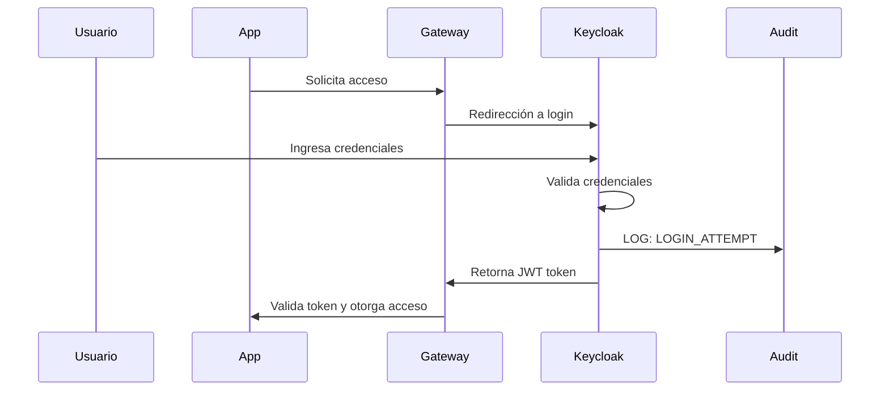
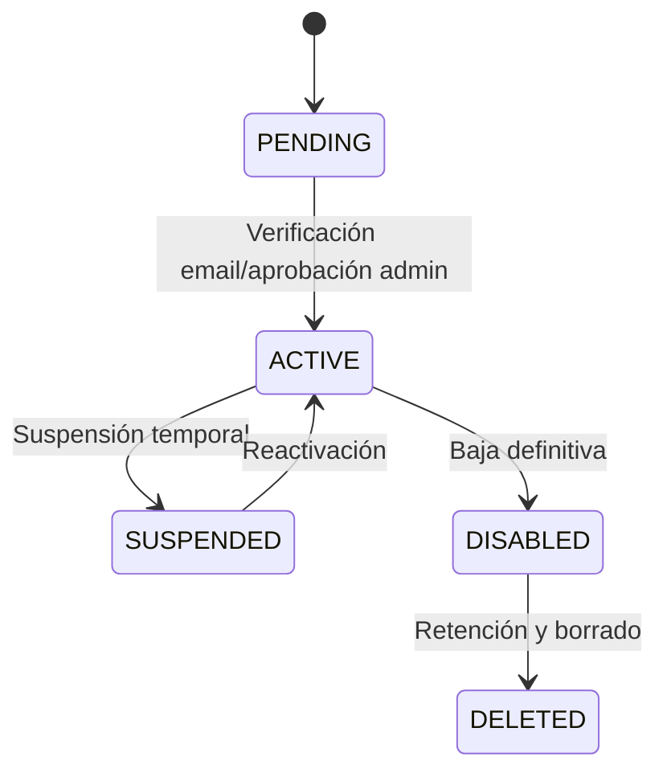

# 1. Introducción Y Objetivos Del Servicio De Identidad

El Servicio de Identidad gestiona autenticación, autorización y federación para servicios corporativos multipaís. Implementa aislamiento multi-tenant (un tenant (realm) por país), integración con sistemas cloud y legacy, y cumplimiento normativo internacional.

## 1.1 Propósito Y Visión

Proveer un núcleo de identidad seguro, escalable y centralizado, soportando gestión de usuarios, autenticación federada, control de acceso basado en roles y observabilidad integral.

## 1.2 Funcionalidades Clave

| Funcionalidad   | Descripción técnica |
|-----------------|--------------------|
| SSO             | Single Sign-On (`OAuth2`/`OIDC`, `JWT`) |
| Multi-tenant    | Aislamiento y gestión por tenant (realm) |
| Federación      | Integración con IdPs externos (`SAML`, `OIDC`, `LDAP`) |
| RBAC            | Control de acceso centralizado |
| MFA             | Autenticación multi-factor |
| Auditoría       | Logging estructurado, cumplimiento |
| Observabilidad  | Métricas (`Prometheus`), trazas (`Jaeger`), logs (`Loki`, `Serilog`) |
| API Gateway     | Validación de tokens, forwarding seguro |

## 1.3 Atributos De Calidad

| Atributo         | Objetivo           | Métrica |
|------------------|-------------------|---------|
| Disponibilidad   | Alta disponibilidad| 99.9% uptime |
| Rendimiento      | Baja latencia      | p95 < 200ms |
| Escalabilidad    | Soporte masivo     | 10,000+ usuarios |
| Seguridad        | Zero trust, GDPR   | 100% eventos auditados |
| Usabilidad       | SSO fluido         | < 3 clics acceso |
| Mantenibilidad   | Gestión ágil       | Self-service > 80% |

## 1.4 Escenario Principal De Autenticación



## 1.5 Multi-Tenancy Y Ciclo De Vida

| Aspecto           | Implementación                        | Beneficio                        |
|-------------------|---------------------------------------|----------------------------------|
| Tenant (realm)    | Un tenant (realm) por país            | Aislamiento total de datos       |
| Delegación        | Roles admin por tenant (realm)         | Gestión descentralizada          |
| Branding          | Temas personalizados por tenant (realm)| UX específica por tenant (realm) |
| Federación        | IdP configurable por tenant (realm)    | Flexibilidad de integración      |
| Policies          | Seguridad y compliance por tenant (realm)| Cumplimiento normativo local  |

### Ciclo De Vida De Usuarios



### Integración Corporativa

| Sistema             | Tipo Integración     | Protocolo     | Datos Sincronizados                |
|---------------------|---------------------|--------------|------------------------------------|
| LDAP Corporate      | User Federation     | LDAP/LDAPS   | Usuarios, grupos, atributos        |
| Google Workspace    | Identity Federation | OIDC         | Autenticación                      |
| Microsoft AD        | User Federation     | LDAP + OIDC  | Usuarios, grupos, autenticación    |
| HRIS System         | User Provisioning   | SCIM 2.0     | Datos empleados, roles             |
| Audit System        | Event Streaming     | Kafka        | Eventos de autenticación, cambios  |

## 1.6 Tipos De Usuarios Y Roles

| Tipo Usuario        | Descripción                  | Roles Típicos           | MFA |
|---------------------|-----------------------------|-------------------------|-----|
| Operators           | Operativo aeroportuario      | Operator, Supervisor    | No  |
| Managers            | Gestión y administración     | Manager, Admin          | Sí  |
| IT Staff            | Técnico y desarrollo         | Developer, SysAdmin     | Sí  |
| Executives          | Alta gerencia                | Executive, C-Level      | Sí  |
| External Partners   | Aerolíneas, proveedores      | Partner-Read, Write     | Sí  |
| Service Accounts    | Servicios/APIs               | System, Integration     | No (certificado) |

## 1.7 Stakeholders

| Rol                        | Responsabilidades                | Expectativas                  |
|----------------------------|----------------------------------|-------------------------------|
| CISO                       | Políticas, compliance            | Seguridad robusta             |
| HR Directors               | Ciclo de vida usuarios           | Gestión simple, roles correctos|
| IT Directors               | Estándares técnicos, infraestructura | Servicio confiable        |
| Compliance Officers        | Cumplimiento regulatorio         | Auditoría completa            |
| Operations Managers        | Acceso diario, productividad     | Autenticación rápida          |

## 1.8 Referencias

- [Keycloak Documentation](https://www.keycloak.org/documentation)
- [OAuth 2.1 Security Mejores Prácticas](https://datatracker.ietf.org/doc/html/draft-ietf-oauth-security-topics)
- [OpenID Connect Core 1.0](https://openid.net/specs/openid-connect-core-1_0.html)
- [Arc42 - Introducción y objetivos](https://docs.arc42.org/section-1/)
- [C4 Model - Context & Container](https://c4model.com/)
- [Structurizr DSL](https://structurizr.com/dsl)

---

## 1.9 Buenas Prácticas y Fragmentos Reutilizables

### Ejemplo de JWT emitido por Keycloak (tenant/realm)

```json
{
  "sub": "1234567890",
  "name": "John Doe",
  "tenant": "talma-pe",
  "realm": "talma-pe",
  "roles": ["Operator", "Admin"],
  "exp": 1712345678
}
```

### Fragmento de configuración multi-tenant (realm) en .NET

```csharp
services.AddAuthentication(options =>
{
    options.DefaultScheme = JwtBearerDefaults.AuthenticationScheme;
})
.AddJwtBearer(options =>
{
    options.Authority = $"https://keycloak.example.com/realms/{tenant}";
    options.Audience = "api-service";
    options.TokenValidationParameters = new TokenValidationParameters
    {
        ValidateIssuer = true,
        ValidIssuer = $"https://keycloak.example.com/realms/{tenant}",
        ValidateAudience = true,
        ValidAudience = "api-service",
        ValidateLifetime = true
    };
});
```
