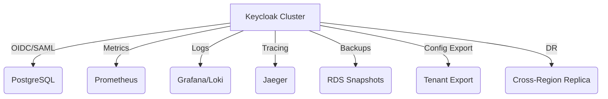

# 2. Restricciones de la Arquitectura del Servicio de Identidad

Esta sección documenta todas las limitaciones técnicas, organizativas, de proceso y de cumplimiento que condicionan el diseño y la evolución del Servicio de Identidad. Las restricciones aquí descritas son obligatorias y deben ser consideradas en cada decisión arquitectónica.

## 2.1 Restricciones Técnicas y de Plataforma

| Categoría      | Restricción                  | Impacto en la arquitectura |
|---------------|------------------------------|---------------------------|
| Plataforma     | Keycloak 23+                 | Define IdP, APIs y federación |
| Base de datos  | PostgreSQL                   | Esquema multi-tenant, alta disponibilidad |
| Contenedores   | Docker                       | Portabilidad y despliegue |
| Orquestación   | AWS ECS + Terraform          | Infraestructura como código, escalabilidad |
| Protocolos     | OAuth2/OIDC, SAML            | Interoperabilidad y seguridad |

## 2.2 Restricciones de Rendimiento y Disponibilidad

| Métrica                | Objetivo         | Justificación |
|------------------------|------------------|---------------|
| Usuarios concurrentes  | 10,000+          | Escalabilidad regional |
| Latencia               | < 100ms          | Experiencia usuario |
| Disponibilidad         | 99.9%            | SLA corporativo |
| Failover               | < 2 minutos      | Resiliencia ante fallos |

## 2.3 Restricciones de Seguridad y Compliance

| Aspecto         | Requerimiento           | Referencia |
|-----------------|------------------------|------------|
| Cumplimiento    | GDPR, ISO 27001, SOX   | Ver referencias finales |
| MFA             | Obligatorio admin       | Seguridad acceso crítico |
| Cifrado         | TLS 1.3, AES-256       | Protección datos en tránsito y reposo |
| Token           | JWT RS256              | Integridad y autenticidad |

## 2.4 Restricciones Organizacionales y Operativas

| Área             | Restricción                  | Impacto |
|------------------|-----------------------------|---------|
| Operaciones      | DevOps 24/7                 | Soporte continuo |
| Multi-tenancy    | Aislamiento por tenant      | Independencia de clientes |
| Documentación    | Arc42 + ADR                 | Trazabilidad de decisiones |
| Automatización   | Terraform, CI/CD            | Despliegue seguro y repetible |

## 2.5 Restricciones de Monitoreo y Observabilidad

| Tool         | Propósito              | Integración                |
|--------------|-----------------------|----------------------------|
| Prometheus   | App metrics           | Keycloak metrics export    |
| Grafana      | Visualización         | Multi-tenant dashboards    |
| Loki         | Centralized logging   | Structured logging         |
| Jaeger       | Distributed tracing   | OTLP export (OpenTelemetry)|
| CloudWatch   | Infra monitoring      | ECS, RDS, ALB metrics      |

## 2.6 Otras Restricciones Específicas

- **Backup y Disaster Recovery:** RDS backups automáticos, exportación de configuración por tenant, DR cross-region.
- **Versionado y Ciclo de Vida:** Solo versiones LTS, upgrades planificados, compatibilidad N-1.
- **Seguridad avanzada:** Scans de vulnerabilidad, pentesting, auditorías SOC2, cumplimiento SOX e ISO 27001.
- **Multi-tenant y federación:** Aislamiento total, personalización por tenant, prohibido acceso cross-tenant.
- **Alta disponibilidad:** Clustering activo-activo, balanceo de carga, almacenamiento replicado.
- **Optimización de performance:** Indexado, caching, tuning de conexiones y JVM.
- **Restricciones Keycloak:** Un tenant (realm) por país, master realm solo para administración global.

## 2.7 Referencias y Normativas

- [Keycloak Server Installation Guide](https://www.keycloak.org/docs/latest/server_installation/)
- [Keycloak High Disponibilidad Guide](https://www.keycloak.org/docs/latest/server_installation/#_clustering)
- [Keycloak Security Hardening](https://www.keycloak.org/docs/latest/server_installation/#_hardening)
- [OAuth 2.0 RFC 6749](https://tools.ietf.org/html/rfc6749)
- [OpenID Connect Core 1.0](https://openid.net/specs/openid-connect-core-1_0.html)
- [JWT RFC 7519](https://tools.ietf.org/html/rfc7519)
- [SAML 2.0 Core](https://docs.oasis-open.org/security/saml/v2.0/saml-core-2.0-os.pdf)
- [GDPR Regulation (EU) 2016/679](https://gdpr-info.eu/)
- [Sarbanes-Oxley Act](https://www.congress.gov/bill/107th-congress/house-bill/3763)
- [ISO/IEC 27001:2013](https://www.iso.org/standard/54534.html)
- [Arc42 - Restricciones](https://docs.arc42.org/section-2/)
- [C4 Model - Context & Container](https://c4model.com/)
- [Structurizr DSL](https://structurizr.com/dsl)
