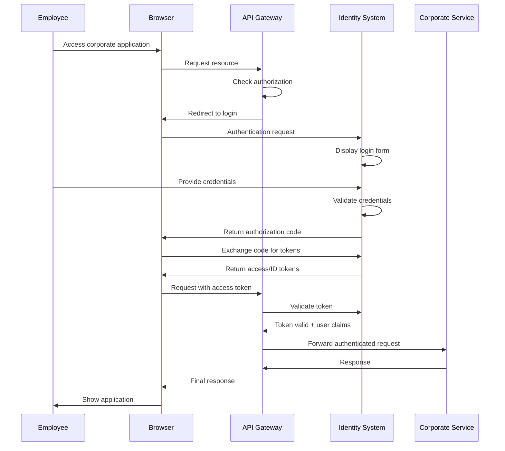

# 3. Contexto Y Alcance Del Servicio De Identidad

## 3.1 Contexto De Negocio

El Servicio de Identidad centraliza autenticación, autorización y federación para servicios corporativos multipaís, con enfoque en seguridad, SSO, eficiencia operativa, cumplimiento y escalabilidad multi-tenant (realm).

| Stakeholder         | Rol                        | Responsabilidad                        | Expectativa                        |
|---------------------|----------------------------|----------------------------------------|------------------------------------|
| CISO                | Seguridad                  | Políticas, cumplimiento                | Sistema seguro                     |
| RH                  | Recursos Humanos           | Gestión de usuarios, onboarding        | Proceso eficiente                  |
| TI                  | Operaciones TI             | Mantenimiento, soporte                 | Administración estable             |
| Compliance          | Auditoría, regulaciones    | Trazabilidad, reportes                 | Cumplimiento normativo             |
| Usuarios Finales    | Usuarios                   | Acceso a aplicaciones                  | Experiencia fluida                 |

## 3.2 Contexto Técnico

```mermaid
graph TD
    A[Identity Providers Externos]
    A1[Google Workspace]
    A2[Microsoft AD]
    A3[Corporate LDAP]
    A4[Gov PKI]
    A -->|SAML/OIDC| B(IDENTITY SYSTEM - Keycloak)
    B -->|OAuth2/OIDC, JWT| C(API GATEWAY - YARP)
    C -->|Authenticated Requests| D(CORPORATE SERVICES ECOSYSTEM)
    D1[Notification]
    D2[Track&Trace]
    D3[SITA Messaging]
    D4[Web Apps]
    D --> D1
    D --> D2
    D --> D3
    D --> D4
    B1[Peru Tenant (realm)]
    B2[Ecuador Tenant (realm)]
    B3[Colombia Tenant (realm)]
    B4[Mexico Tenant (realm)]
    B --> B1
    B --> B2
    B --> B3
    B --> B4
```

## 3.3 Fronteras Y Alcance

### Dentro Del Alcance

| Componente                  | Descripción                | Responsabilidad                  |
|-----------------------------|----------------------------|----------------------------------|
| Keycloak                    | IdP central                | Autenticación, autorización, gestión usuarios |
| Gestión De Tenants (realms) | Multi-tenant (realm)       | Aislamiento por país             |
| Federación De Usuarios      | Integración IdP externos   | LDAP, SAML, OIDC                 |
| Gestión De Tokens           | Ciclo de vida JWT          | Generación, validación, renovación|
| Consola De Administración   | Interfaz de gestión        | Administración usuarios/roles    |
| APIs Programáticas          | APIs REST                  | Gestión programática usuarios    |
| Auditoría Y Logging         | Eventos de seguridad       | Rastro de auditoría completo     |

### Fuera Del Alcance

| Componente                  | Razón De Exclusión         | Responsable                      |
|-----------------------------|----------------------------|----------------------------------|
| IdPs Externos               | Sistemas de terceros       | Google, Microsoft, TI            |
| Aplicaciones Cliente        | Consumidores de servicios  | Equipos de servicios             |
| Infraestructura De Red      | Capa de infraestructura    | Equipo de infraestructura        |
| Gestión De Certificados     | Infraestructura PKI        | Equipo de seguridad              |
| Plataforma De Monitoreo     | Observabilidad             | Equipo DevOps                    |

## 3.4 Interfaces Externas

| Actor                  | Tipo    | Descripción                        | Interacciones                       |
|------------------------|---------|------------------------------------|-------------------------------------|
| System Administrator   | Humano  | Admin global                       | Configuración tenants (realms), políticas     |
| Tenant (realm) Admin   | Humano  | Admin por país/tenant (realm)      | Gestión usuarios, roles específicos |
| End User               | Humano  | Usuario final                      | Login, gestión perfil, reset pass   |
| API Gateway            | Sistema | Proxy de servicios                 | Token validation, user context      |
| Corporate Services     | Sistema | Servicios de negocio               | Authentication, authorization       |
| External IdP           | Sistema | Proveedores de identidad externos  | User federation, SSO                |
| HRIS System            | Sistema | Recursos humanos                   | User provisioning, role sync        |
| Monitoring System      | Sistema | Observabilidad                     | Metrics, logs, health checks        |

### Canales De Comunicación

| Interface           | Protocol | Port | Purpose                | Security                |
|---------------------|----------|------|------------------------|-------------------------|
| Admin Console       | HTTPS    | 8443 | Admin web              | TLS 1.3, session auth   |
| Account Console     | HTTPS    | 8443 | User portal            | TLS 1.3, user auth      |
| Login Forms         | HTTPS    | 8443 | Auth UI                | TLS 1.3, CSRF protection|

| Endpoint              | Protocol    | Purpose                | Authentication | Rate Limit    |
|-----------------------|------------|------------------------|----------------|--------------|
| Admin REST API        | HTTPS/REST | Admin ops              | Bearer token   | 100 req/min   |
| User Account API      | HTTPS/REST | User self-service      | Bearer token   | 60 req/min    |
| OpenID Connect        | HTTPS/JSON | Token endpoints        | Client auth    | 1000 req/min  |
| SAML 2.0              | HTTPS/XML  | Federation             | SAML assertion | 500 req/min   |

| System                | Protocol      | Data Flow             | Frequency     | Format        |
|-----------------------|--------------|-----------------------|---------------|--------------|
| LDAP Directory        | LDAP v3      | User import/sync      | Real-time     | LDAP attrs    |
| Google Workspace      | SAML/OIDC    | Federation            | Per login     | SAML/JWT      |
| HRIS Database         | REST API     | User provisioning     | Daily batch   | JSON          |
| Audit System          | syslog/JSON  | Event streaming       | Real-time     | Structured logs|

## 3.5 Casos De Uso Principales



## 3.6 Requisitos Funcionales Y No Funcionales

### Funcionales

- MFA obligatorio para admins, soporte TOTP/WebAuthn, SMS backup.
- SSO cross-service, gestión de sesiones, remember device.
- Gestión de usuarios: self-service, lockout, import/export.
- RBAC jerárquico, permisos granulares, delegación temporal.

### No Funcionales

- Latencia p95 < 200ms login, < 50ms validación token.
- 10,000 usuarios concurrentes, 1,000 req/sec.
- Uptime 99.9%, RTO 4h, RPO 15min.
- Cifrado AES-256/TLS 1.3, auditoría completa, CVSS 7+ patched < 72h.

## 3.7 Compliance Y Regulaciones

| Regulation | Scope | Key Requirements | Implementation |
|------------|-------|------------------|----------------|
| GDPR (EU)  | European users | Consent, data minimization, right to deletion | Consent management, data retention policies |
| LGPD (Brazil) | Brazilian operations | Data processing lawfulness | Privacy by design |
| CCPA (California) | California residents | Data transparency, opt-out rights | Privacy controls |
| Local Laws | Peru, Ecuador, Colombia, Mexico | Data residency, local compliance | Regional deployment |

| Standard | Requirement | Implementation | Certification |
|----------|-------------|----------------|---------------|
| ISO 27001 | Information Security Management | ISMS implementation | Annual audit |
| SOC 2 Type II | Security controls | Control effectiveness | Quarterly assessment |
| NIST Framework | Cybersecurity framework | Risk management | Self-assessment |
| OAuth 2.1 | Modern authorization | Security mejores prácticas | Compliance testing |

## 3.8 Alcance Funcional

| Función | Descripción | Usuarios Objetivo | Prioridad |
|---------|-------------|-------------------|-----------|
| Multi-tenant Authentication | Autenticación aislada por tenant (realm)/país | Todos los usuarios | Alta |
| Single Sign-On (SSO) | Acceso unificado a aplicaciones | End users | Alta |
| Role-Based Access Control | Autorización granular basada en roles | Administradores, end users | Alta |
| Identity Federation | Integración con IdPs externos | Usuarios federados | Alta |
| Gestión De Ciclo De Vida De Usuario | CRUD completo de usuarios | HR administrators | Media |
| Portal De Autoservicio | Gestión autónoma de perfiles | End users | Media |
| Autenticación Multi-Factor | Seguridad adicional para roles críticos | Usuarios privilegiados | Media |
| Gestión De Sesiones | Control de sesiones y timeouts | Todos los usuarios | Media |
| Audit & Compliance | Logging y reportes de seguridad | Compliance officers | Baja |

| Función | Razón De Exclusión | Alternativa |
|---------|-------------------|-------------|
| Certificate Authority | Fuera del dominio de identidad | External PKI systems |
| Email Server | No es responsabilidad de identidad | Corporate email systems |
| LDAP Server | Federación, no hosting | External LDAP directories |
| Application Authorization | Responsabilidad de aplicaciones | Application-level RBAC |
| Data Storage | Solo metadata de usuario | Business data in applications |

## 3.9 Atributos De Calidad

| Atributo | Métrica | Target | Medición |
|----------|---------|--------|----------|
| Authentication Latency | Response time | p95 < 100ms | APM monitoring |
| Token Validation | Validation time | p95 < 50ms | API monitoring |
| Concurrent Users | Simultaneous sessions | 10,000 users | Load testing |
| Capacidad De Procesamiento | Authentications/second | 1,000 auth/sec | Performance testing |
| Security Incidents | Breaches per year | Zero incidents | Security monitoring |
| Token Security | Compromised tokens | Zero compromises | Token monitoring |
| Failed Login Attempts | Brute force attacks | < 0.1% success rate | Authentication monitoring |
| Audit Completeness | Events logged | 100% coverage | Audit verification |
| System Uptime | Service disponibilidad | 99.9% | Health monitoring |
| Recovery Time | RTO | < 4 hours | Disaster recovery testing |
| Data Loss | RPO | < 15 minutes | Backup validation |
| Mean Time To Recovery | MTTR | < 30 minutes | Incident response |

## Referencias

- [OAuth 2.0 Authorization Framework (RFC 6749)](https://tools.ietf.org/html/rfc6749)
- [OpenID Connect Core 1.0](https://openid.net/specs/openid-connect-core-1_0.html)
- [SAML 2.0 Core Specification](https://docs.oasis-open.org/security/saml/v2.0/saml-core-2.0-os.pdf)
- [Keycloak Server Administration Guide](https://www.keycloak.org/docs/latest/server_admin/)
- [Keycloak Securing Applications Guide](https://www.keycloak.org/docs/latest/securing_apps/)
- [Arc42 Context Template](https://docs.arc42.org/section-3/)
- [C4 Model for Software Architecture](https://c4model.com/)

---
