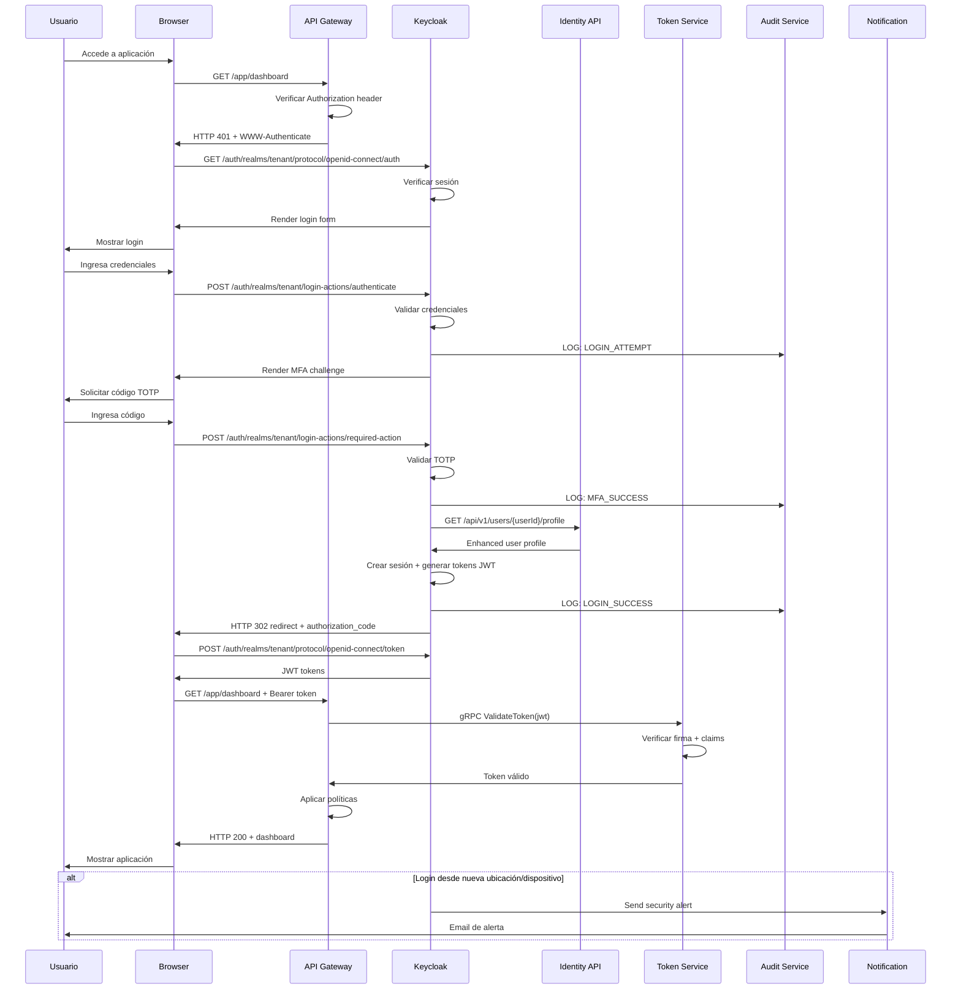
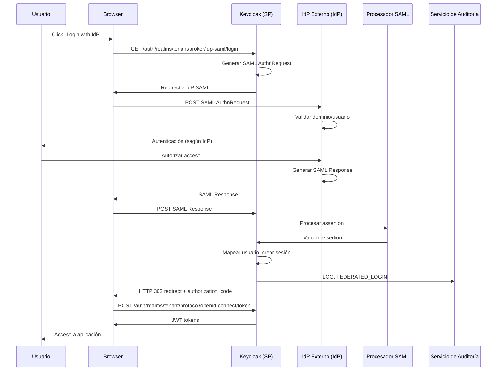

# 6. Vista De Tiempo De Ejecución

## 6.1 Escenarios Principales

| Escenario         | Flujo                                 | Componentes           |
|-------------------|---------------------------------------|-----------------------|
| Autenticación     | Usuario → `Keycloak` → `JWT`          | Keycloak Core         |
| Validación Token  | Servicio → `Keycloak` → Validación    | JWT Validation        |
| Federación        | IdP externo → `Keycloak` → Usuario    | Federation Connectors |

## 6.2 Patrones De Interacción

| Patrón        | Descripción                | Tecnología |
|---------------|---------------------------|------------|
| OAuth2/OIDC   | Flujo de autenticación    | Estándar   |
| JWT           | Tokens de acceso          | RS256      |
| SAML          | Federación legacy         | SAML 2.0   |

## 6.3 Escenario: Autenticación De Usuario Con MFA

### Participantes

- User Browser
- API Gateway (`YARP`)
- `Keycloak` (`tenant`/`realm`)
- Identity Management API
- Token Validation Service
- Audit Service
- Notification Service

### Flujo De Ejecución

### Métricas De Performance

| Fase                        | Target     | Medición           | Monitoreo           |
|-----------------------------|------------|--------------------|---------------------|
| Redirección inicial         | `< 50ms`   | Gateway latency    | `Prometheus`        |
| Render login form           | `< 200ms`  | Keycloak response  | Application metrics |
| Validación credenciales     | `< 300ms`  | LDAP/DB query      | Custom metrics      |
| Validación MFA              | `< 100ms`  | TOTP algorithm     | Auth metrics        |
| Token generation            | `< 200ms`  | JWT creation       | Session metrics     |
| Token validation            | `< 10ms`   | gRPC/cache         | Token metrics       |
| Flujo completo              | `< 2s`     | End-to-end         | Synthetic monitoring|

### Manejo De Errores Y Resiliencia

| Escenario Error         | Respuesta      | Acción De Recuperación                |
|------------------------|----------------|---------------------------------------|
| LDAP Unavailable       | HTTP 503       | Fallback a usuarios locales           |
| MFA Failure (3x)       | Lockout        | Email de desbloqueo + notificación    |
| Token Service Down     | HTTP 503       | Circuit breaker + validación local    |
| Audit Service Down     | Continuar      | Store local + replay posterior        |

## 6.4 Escenario: Federación Con IdP SAML

### Participantes

- Usuario Corporativo
- `Keycloak` (SP)
- IdP Externo (IdP)
- Procesador SAML
- Servicio de Auditoría

### Flujo De Ejecución

> Este escenario describe la federación SAML entre un IdP externo corporativo y `Keycloak` en arquitectura multi-tenant. El flujo refleja la integración real, trazabilidad y auditoría, sin pasos ni componentes ajenos.

## 6.5 Métricas Y Monitoreo De Escenarios

- Todas las fases instrumentadas con `Prometheus`, `Grafana` y logs estructurados.
- Trazas distribuidas para flujos críticos (`OpenTelemetry`, `Jaeger`).
- Alertas automáticas ante degradación de performance o fallos de integración.

## 6.6 Referencias

- [Keycloak Server Administration Guide](https://www.keycloak.org/docs/latest/server_admin/)
- [OAuth 2.0 RFC 6749](https://tools.ietf.org/html/rfc6749)
- [OpenID Connect Core 1.0](https://openid.net/specs/openid-connect-core-1_0.html)
- [Arc42 Runtime View](https://docs.arc42.org/section-6/)
- [C4 Model for Software Architecture](https://c4model.com/)

---
