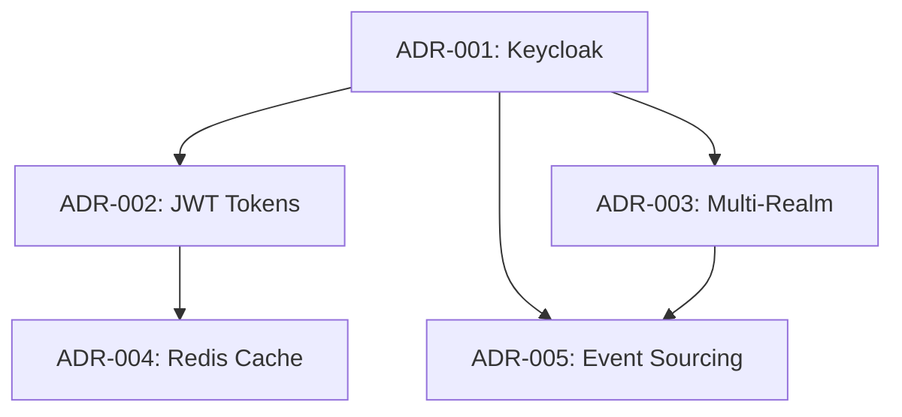

# 9. Decisiones de Arquitectura

Esta sección documenta las decisiones arquitectónicas clave del **Sistema de Identidad**, siguiendo el formato ADR (Architecture Decision Record) y alineando cada decisión a los principios de portabilidad, estándares abiertos, multi-tenant y operación cloud-agnostic.

## 9.1 Decisiones Principales

| ADR     | Decisión                        | Estado    | Justificación         |
|---------|----------------------------------|-----------|----------------------|
| ADR-001 | Keycloak como IdP                | Aceptado  | Open source maduro   |
| ADR-002 | Multi-tenant (realm) por país    | Aceptado  | Aislamiento total    |
| ADR-003 | PostgreSQL backend               | Aceptado  | Robustez             |
| ADR-004 | Federación híbrida               | Aceptado  | Flexibilidad         |

## 9.2 Alternativas Evaluadas

| Componente   | Alternativas           | Selección | Razón         |
|--------------|-----------------------|-----------|---------------|
| IdP          | Auth0, Okta, Keycloak | Keycloak  | Control total |
| Base de datos| MySQL, PostgreSQL     | PostgreSQL| Compatibilidad|
| Deployment   | VM, Container, K8s    | Container | Portabilidad  |
| Federación   | Full, None, Híbrida   | Híbrida   | Gradual       |

> Todas las decisiones siguen los principios: agnóstico de nube, sin desarrollo personalizado, basado en estándares, multi-tenant (realm), contenedores primero, sin dependencia de proveedor. Cada ADR documenta contexto, justificación y consecuencias.

## 9.3 Resumen de Decisiones

| #       | Decisión                    | Estado     | Impacto | Fecha       |
|---------|-----------------------------|------------|---------|-------------|
| ADR-001 | Keycloak Containerizado     | Aprobado   | Alto    | 2024-01-15  |
| ADR-002 | Multi-tenant (realm)        | Aprobado   | Alto    | 2024-01-20  |
| ADR-003 | Database-backed Sessions    | Aprobado   | Medio   | 2024-01-25  |
| ADR-004 | OAuth2 + OIDC Standard      | Aprobado   | Alto    | 2024-01-30  |

## 9.4 Principios Arquitectónicos

- **Portabilidad entre nubes:** Keycloak y PostgreSQL desplegables en AWS, Azure, GCP o on-premise
- **Sin desarrollo personalizado:** Uso de Keycloak y PostgreSQL listos para usar
- **Estándares abiertos:** OAuth2, OIDC, SAML 2.0 para máxima interoperabilidad
- **Multi-tenant (realm) por país:** Aislamiento total de datos y configuración
- **Contenedores y orquestación:** Docker/Kubernetes como base de despliegue
- **Independencia de proveedor:** Sin lock-in, migración sencilla

## 9.5 Referencias

- [Arc42 ADR Template](https://docs.arc42.org/section-9/)
- [Keycloak Architecture](https://www.keycloak.org/architecture/)
- [C4 Model for Software Architecture](https://c4model.com/)

---

# 9. Decisiones de arquitectura (Detalle ADR)

## 9.1 Decisiones principales

| ADR | Decisión | Estado | Justificación |
|-----|----------|--------|---------------|
| **ADR-001** | Keycloak como IdP | Aceptado | Open source maduro |
| **ADR-002** | Multi-realm por país | Aceptado | Aislamiento completo |
| **ADR-003** | PostgreSQL backend | Aceptado | Robustez |
| **ADR-004** | Federación híbrida | Aceptado | Flexibilidad |

## 9.2 Alternativas evaluadas

| Componente | Alternativas | Selección | Razón |
|------------|-------------|-----------|--------|
| **IdP** | Auth0, Okta, Keycloak | Keycloak | Control total |
| **Base datos** | MySQL, PostgreSQL | PostgreSQL | Compatibilidad |
| **Deployment** | VM, Container, K8s | Container | Portabilidad |
| **Federación** | Full, None, Híbrida | Híbrida | Gradual |

Esta sección documenta las decisiones arquitectónicas más importantes del **Sistema de Identidad** utilizando el formato ADR (Architecture Decision Record), proporcionando contexto, justificación y consecuencias de cada decisión.

*[INSERTAR AQUÍ: Diagrama C4 - Architecture Decision Dependencies]*

## Resumen de Decisiones Arquitectónicas

| # | Decisión | Estado | Impacto | Fecha |
|---|----------|--------|---------|-------|
| ADR-001 | Keycloak Containerizado | ✅ Aprobado | Alto | 2024-01-15 |
| ADR-002 | Multi-realm Strategy | ✅ Aprobado | Alto | 2024-01-20 |
| ADR-003 | Database-backed Sessions | ✅ Aprobado | Medio | 2024-01-25 |
| ADR-004 | OAuth2 + OIDC Standard | ✅ Aprobado | Alto | 2024-01-30 |

### Principios Arquitectónicos

Las decisiones arquitectónicas del Sistema de Identidad siguen los principios de:

- **Agnóstico de Nube:** Keycloak contenedorizado portable entre AWS, Azure y GCP
- **Cero Desarrollo Personalizado:** Uso de Keycloak listo para usar sin modificaciones
- **Basado en Estándares:** OAuth2, OIDC, SAML 2.0 para máxima interoperabilidad
- **Multi-tenant:** Realms separados por país/tenant
- **Contenedores Primero:** Optimizado para Kubernetes y Docker
- **Sin Dependencia de Proveedor:** Libertad completa para moverse entre proveedores de nube

## ADR-001: Keycloak Containerizado como Identity Provider Central

| Campo | Valor |
|-------|-------|
| **Estado** | ✅ Aprobado |
| **Fecha** | 2024-01-15 |
| **Decidido por** | Equipo de Arquitectura + CISO |
| **Interesados** | Equipos de Desarrollo, Equipo de Seguridad, Operaciones |

### Contexto

La organización requiere centralizar la gestión de identidades para múltiples aplicaciones corporativas distribuidas en 4 países (Perú, Ecuador, Colombia, México), con enfoque en **portabilidad agnóstica de nube** y sin desarrollo personalizado dentro del servicio de identidad.

**Requisitos específicos:**

- Solución contenedorizada lista para usar
- Soporte para OAuth2/OIDC y SAML 2.0
- Multi-tenancy con aislamiento por país
- Federación con Google Workspace y Active Directory
- Cumplimiento con GDPR, SOX y regulaciones locales
- **Agnóstico de nube:** Portable entre AWS, Azure, GCP
- **Cero desarrollo personalizado:** Usar Keycloak listo para usar

### Alternativas Consideradas

| Solución | Portabilidad | Desarrollo Custom | Costo/Año | Vendor Lock-in |
|----------|--------------|-------------------|------------|----------------|
| **Keycloak Container** | ✅ Full | ❌ None required | $50K | ❌ None |
| **Auth0** | ⚠️ Limited | ❌ API only | $180K | ✅ High |
| **AWS Cognito** | ❌ AWS only | ⚠️ Some custom | $120K | ✅ Complete |
| **Azure AD B2C** | ❌ Azure only | ⚠️ Some custom | $150K | ✅ Complete |
| **Custom Identity Service** | ✅ Full | ✅ Extensive | $200K+ | ❌ None |

### Decisión

**Adoptar Keycloak containerizado como proveedor de identidad central** con deployment cloud-agnostic usando Docker/Kubernetes.

### Arquitectura Containerizada

```yaml
# Keycloak Container Stack
version: '3.8'
services:
  keycloak:
    image: quay.io/keycloak/keycloak:23.0
    environment:
      - KEYCLOAK_ADMIN=admin
      - KEYCLOAK_ADMIN_PASSWORD=${ADMIN_PASSWORD}
      - KC_DB=postgres
      - KC_DB_URL=${DATABASE_URL}
      - KC_DB_USERNAME=${DB_USERNAME}
      - KC_DB_PASSWORD=${DB_PASSWORD}
      - KC_HOSTNAME=${KEYCLOAK_HOSTNAME}
      - KC_PROXY=edge
    command:
      - start
      - --optimized
      - --spi-theme-static-max-age=-1
      - --spi-theme-cache-themes=false
    ports:
      - "8080:8080"
    depends_on:
      - postgres
    volumes:
      - ./themes:/opt/keycloak/themes
      - ./providers:/opt/keycloak/providers

  postgres:
    image: postgres:15-alpine
    environment:
      - POSTGRES_DB=keycloak
      - POSTGRES_USER=${DB_USERNAME}
      - POSTGRES_PASSWORD=${DB_PASSWORD}
    volumes:
      - postgres_data:/var/lib/postgresql/data

volumes:
  postgres_data:
```

### Configuración Multi-tenant (Realms)

```yaml
# Realm Configuration per Country
Realms:
  peru-realm:
    enabled: true
    users: 15000
    external_idp: google-workspace-peru
    compliance: GDPR, Local Peruvian Regulations

  ecuador-realm:
    enabled: true
    users: 8000
    external_idp: google-workspace-ecuador
    compliance: GDPR, Local Ecuadorian Regulations

  colombia-realm:
    enabled: true
    users: 12000
    external_idp: microsoft-ad-colombia
    compliance: GDPR, Local Colombian Regulations

  mexico-realm:
    enabled: true
    users: 20000
    external_idp: google-workspace-mexico
    compliance: GDPR, Local Mexican Regulations
```

### Justificación

#### Portabilidad y Vendor Independence

- **Cloud Agnostic:** Funciona en cualquier plataforma de containers
- **Zero Lock-in:** Open source, migratable a cualquier cloud

- **Standard Protocols:** OAuth2, OIDC, SAML - ampliamente soportados
- **Container-first:** Deploy en Kubernetes, Docker Swarm, o ECS

#### Zero Custom Development

- **Out-of-the-box Features:** Todo lo requerido está incluido
- **Configuration-only:** Solo archivos YAML y environment variables
- **Theme Customization:** Branding via templates, no código

- **SPI Plugins:** Extensiones disponibles sin desarrollo

#### Operacional Simplicity

- **Infraestructura como Código:** Reproducible deployments
- **Health Checks:** Built-in readiness/liveness probes
- **Monitoring:** Metrics endpoint para Prometheus
- **Backup/Restore:** Database backup strategy

### Implementación Cloud-Agnostic

```yaml
# Kubernetes Deployment (portable across clouds)
apiVersion: apps/v1
kind: Deployment
metadata:
  name: keycloak
  namespace: identity
spec:
  replicas: 3
  selector:
    matchLabels:
      app: keycloak
  template:
    metadata:
      labels:
        app: keycloak
    spec:
      containers:
      - name: keycloak
        image: quay.io/keycloak/keycloak:23.0
        env:
        - name: KEYCLOAK_ADMIN
          valueFrom:
            secretKeyRef:
              name: keycloak-secrets
              key: admin-username
        - name: KEYCLOAK_ADMIN_PASSWORD
          valueFrom:
            secretKeyRef:
              name: keycloak-secrets
              key: admin-password
        - name: KC_DB
          value: "postgres"
        - name: KC_DB_URL
          valueFrom:
            configMapKeyRef:
              name: keycloak-config
              key: database-url
        ports:
        - containerPort: 8080
        readinessProbe:
          httpGet:
            path: /health/ready
            port: 8080
          initialDelaySeconds: 30
          periodSeconds: 10
        livenessProbe:
          httpGet:
            path: /health/live
            port: 8080
          initialDelaySeconds: 60
          periodSeconds: 30
```

### Consecuencias

#### Positivas

- ✅ **Cero desarrollo:** No se requiere código personalizado
- ✅ **Portabilidad de nube:** Ejecutar donde sea que se soporten contenedores
- ✅ **Rentable:** $50K/año vs $180K+ soluciones administradas
- ✅ **Control completo:** Flexibilidad de configuración completa
- ✅ **Basado en estándares:** Cumplimiento OAuth2, OIDC, SAML
- ✅ **Listo para empresa:** Multi-tenancy, federación, rastros de auditoría

#### Negativas

- ❌ **Responsabilidad operacional:** Infraestructura auto-administrada
- ❌ **Expertise requerido:** El equipo necesita conocimiento de Keycloak
- ❌ **Overhead de mantenimiento:** Actualizaciones, parches, monitoreo
- ❌ **Sin soporte de proveedor:** Solo soporte de comunidad (a menos que suscripción Red Hat)

#### Mitigaciones

- 🔧 **Automatización de infraestructura:** Terraform, Helm charts para despliegue
- 🔧 **Stack de monitoreo:** Prometheus, Grafana para observabilidad
- 🔧 **Estrategia de respaldo:** Respaldos automáticos de base de datos
- 🔧 **Capacitación del equipo:** Certificación de administración de Keycloak
- 🔧 **Opción de soporte:** Suscripción Red Hat para soporte de producción
- 🔧 **Documentación:** Manuales operacionales completos

---

## ADR-002: JWT con RS256 como Formato de Token Estándar

| Campo | Valor |
|-------|-------|

| **Estado** | ✅ Aprobado |
| **Fecha** | 2024-01-20 |
| **Decidido por** | Equipo de Seguridad + Engineering Lead |
| **Relacionado con** | ADR-001 (Keycloak), ADR-004 (Token Caching) |

### Contexto

Los microservicios requieren un mecanismo de autenticación/autorización que sea:

- **Stateless:** Sin dependency en session storage
- **Performant:** Validación rápida sin round-trips
- **Secure:** Integridad y no-repudiation
- **Standard:** Amplio soporte en librerías

### Alternativas Consideradas

| Formato | Pros | Contras | Decisión |
|---------|------|---------|----------|
| **JWT RS256** | Stateless, signature verification, standard | Larger size, key management | ✅ **Seleccionado** |
| **Opaque Tokens** | Small size, easy revocation | Requires introspection endpoint | ❌ Rechazado |
| **JWT HS256** | Smaller, symmetric | Shared secret distribution | ❌ Rechazado |
| **PASETO** | Modern, secure by default | Limited library support | ❌ Rechazado |

### Decisión

**Utilizar JWT (JSON Web Tokens) con algoritmo de firma RS256** para todos los access tokens.

### Justificación

#### Seguridad

- **Firmas asimétricas:** Verificación de clave pública, firma de clave privada
- **No repudio:** Prueba criptográfica de autenticidad del token
- **Sin secretos compartidos:** Elimina problemas de distribución de secretos
- **Cumplimiento de estándares:** RFC 7519, mejores prácticas de la industria

#### Rendimiento

- **Validación sin estado:** No se requiere búsqueda en base de datos
- **Verificación local:** Cada servicio valida independientemente
- **Amigable con caché:** Claves públicas cacheadas con TTL largo

#### Operacional

- **Herramientas estándar:** Amplio soporte de bibliotecas (.NET, Java, Node.js)
- **Amigable para debugging:** Payload legible para humanos
- **Basado en claims:** Contexto rico en payload del token

### Token Structure

```json
{
  "header": {
    "alg": "RS256",
    "typ": "JWT",
    "kid": "realm-key-id"
  },
  "payload": {
    "iss": "https://identity.talma.pe/auth/realms/peru",
    "sub": "user-uuid",
    "aud": ["notification-api", "track-trace-api"],
    "exp": 1640995200,
    "iat": 1640991600,
    "jti": "token-uuid",
    "tenant": "peru",
    "roles": ["employee", "notification-user"],
    "scope": "openid profile email",
    "department": "IT",
    "country": "PE"
  }
}
```

### Key Management Strategy

```yaml
Key Rotation Policy:
  Primary Key:
    - Lifetime: 90 days
    - Algorithm: RSA-2048
    - Auto-rotation: Yes

  Secondary Key:
    - Lifetime: 30 days overlap
    - Purpose: Validation during rotation

  Emergency Key:
    - Purpose: Security incident response
    - Manual activation only
```

### Consecuencias

#### Positivas

- ✅ **Alto rendimiento:** Tiempos de validación sub-10ms
- ✅ **Escalabilidad:** Sin cuello de botella central de validación
- ✅ **Seguridad:** Protección criptográfica estándar de la industria
- ✅ **Experiencia del desarrollador:** Contexto rico disponible localmente

#### Negativas

- ❌ **Tamaño de token:** ~2KB vs 32 bytes para tokens opacos
- ❌ **Complejidad de revocación:** Sin capacidad de revocación inmediata
- ❌ **Gestión de claves:** Complejidad de rotación de claves RSA

#### Mitigaciones

- 🔧 **Compresión:** Compresión gzip para transporte HTTP
- 🔧 **TTL corto:** Tiempo de vida del token de 15 minutos
- 🔧 **Caché de lista negra:** Redis lista negra para tokens revocados
- 🔧 **Rotación automatizada:** AWS KMS para gestión de claves

---

## ADR-003: Multi-Realm Strategy para Aislamiento Multi-Tenant

| Campo | Valor |
|-------|-------|
| **Estado** | ✅ Aprobado |
| **Fecha** | 2024-02-01 |
| **Decidido por** | Product Team + Compliance Officer |
| **Impacto** | High - Affects all tenant operations |

### Contexto

La organización opera en 4 países con requisitos específicos:

- **Data residency:** Regulaciones locales de protección de datos
- **Custom branding:** Identidad visual por país
- **Different integrations:** LDAP/AD específicos por región
- **Isolated user management:** Administradores locales por país
- **Compliance:** Auditorías independientes por jurisdicción

### Alternativas Consideradas

| Estrategia | Isolation Level | Pros | Contras | Decisión |
|------------|----------------|------|---------|----------|
| **Single Realm + Groups** | Logical | Simple management | Limited isolation | ❌ Rechazado |
| **Multiple Realms** | Complete | Full isolation | Complex operations | ✅ **Seleccionado** |
| **Separate Keycloak Instances** | Physical | Ultimate isolation | High operational cost | ❌ Rechazado |
| **Hybrid (Master + Country realms)** | Mixed | Balanced approach | Complex design | ❌ Rechazado |

### Decisión

**Implementar un realm Keycloak separado por tenant/país** con configuración independiente.

### Arquitectura de Realms

```yaml
Keycloak Realm Structure:
  master:
    purpose: "Administrative realm only"
    users: "System administrators"
    access: "Super-admin operations"

  peru-realm:
    display_name: "Talma Perú"
    users: 2000
    integrations: ["peru-ad.talma.pe", "Google Workspace @talma.pe"]
    locale: "es-PE"
    currency: "PEN"

  ecuador-realm:
    display_name: "Talma Ecuador"
    users: 800
    integrations: ["ecuador-ad.talma.ec"]
    locale: "es-EC"
    currency: "USD"

  colombia-realm:
    display_name: "Talma Colombia"
    users: 1500
    integrations: ["colombia-ad.talma.co"]
    locale: "es-CO"
    currency: "COP"

  mexico-realm:
    display_name: "Talma México"
    users: 1200
    integrations: ["mexico-ad.talma.mx"]
    locale: "es-MX"
    currency: "MXN"
```

### Tenant Resolution Strategy

```csharp
public class TenantResolver
{
    public string ResolveTenant(HttpContext context)
    {
        // Priority: JWT claim > Header > Subdomain > Default
        var jwtTenant = context.User?.FindFirst("tenant")?.Value;
        if (!string.IsNullOrEmpty(jwtTenant)) return jwtTenant;

        var headerTenant = context.Request.Headers["X-Tenant-ID"].FirstOrDefault();
        if (!string.IsNullOrEmpty(headerTenant)) return headerTenant;

        var host = context.Request.Host.Host;
        if (host.StartsWith("peru.")) return "peru";
        if (host.StartsWith("ecuador.")) return "ecuador";
        if (host.StartsWith("colombia.")) return "colombia";

        if (host.StartsWith("mexico.")) return "mexico";

        return "default";
    }
}


```

### Justificación

#### Compliance

- **Data residency:** Complete data isolation per country
- **Audit trails:** Independent audit logs per jurisdiction
- **Local administration:** Country-specific admin privileges
- **Regulatory compliance:** GDPR, local data protection laws

#### Operational

- **Independent configuration:** Separate authentication policies
- **Custom branding:** Country-specific themes and localization
- **Isolated failures:** Issues in one realm don't affect others
- **Scalable management:** Dedicated administrators per country

#### Security

- **Blast radius limitation:** Security incidents contained per realm
- **Independent credentials:** No cross-tenant credential sharing
- **Separate certificates:** Country-specific SSL certificates

- **Isolated integrations:** Different LDAP/AD per country

### Consecuencias

#### Positivas

- ✅ **Perfect isolation:** Zero data cross-contamination
- ✅ **Compliance ready:** Meets all regulatory requirements
- ✅ **Customization freedom:** Independent configuration per tenant

- ✅ **Scalable growth:** Linear scaling per country

#### Negativas

- ❌ **Operational complexity:** 4x management overhead
- ❌ **Resource overhead:** Separate connection pools, caches
- ❌ **Cross-tenant queries:** Complex reporting across realms
- ❌ **Configuration drift:** Potential inconsistencies

#### Mitigaciones

- 🔧 **Automation:** Terraform modules for realm provisioning
- 🔧 **Configuration templates:** Standardized base configurations
- 🔧 **Monitoring:** Unified monitoring across all realms
- 🔧 **Documentation:** Comprehensive operational procedures

---

## ADR-004: Redis Cluster para Token Validation Caching

| Campo | Valor |
|-------|-------|
| **Estado** | ✅ Aprobado |
| **Fecha** | 2024-02-10 |
| **Decidido por** | Performance Team + Site Reliability |
| **Relacionado con** | ADR-002 (JWT Tokens) |

### Contexto

Initial performance testing reveló:

- **JWT validation:** 45-60ms per token (RSA signature verification)
- **Target latency:** `<10ms` for token validation
- **Peak load:** 10,000 validations/second
- **Disponibilidad requirement:** 99.9% uptime

### Problema

```
Without caching:
- CPU intensive: RSA signature verification
- Network latency: JWKS endpoint calls
- Scalability issue: Linear degradation with load
- Cost impact: Higher compute requirements
```

### Alternativas Consideradas

| Solution | Pros | Contras | Performance | Decisión |
|----------|------|---------|-------------|----------|
| **No caching** | Simple | Poor performance | 60ms | ❌ Rechazado |
| **In-memory cache** | Fast | No sharing across instances | 5ms | ❌ Rechazado |
| **Redis single** | Distributed | Single point of failure | 8ms | ❌ Rechazado |
| **Redis Cluster** | HA + distributed | Complex setup | 7ms | ✅ **Seleccionado** |
| **DynamoDB** | Managed | Higher latency | 15ms | ❌ Rechazado |

### Decisión

**Implementar Redis Cluster para distributed caching** de metadatos de validación de tokens.

### Cache Strategy

```yaml
Caching Layers:
  L1_Local_Memory:
    - Technology: .NET MemoryCache
    - TTL: 5 minutes
    - Size: 100MB per instance
    - Purpose: Hot token validation

  L2_Distributed_Redis:
    - Technology: Redis Cluster (3 masters, 3 replicas)
    - TTL: Token expiration time
    - Size: 2GB total
    - Purpose: Cross-instance sharing

Cache Keys:
  - jwt_signature:{token_hash} -> validation_result
  - jwks_keys:{realm}:{kid} -> public_key
  - user_context:{user_id} -> enriched_claims
```

### Implementation

```csharp
public class TokenValidationCache
{
    private readonly IMemoryCache _localCache;
    private readonly IDistributedCache _distributedCache;

    public async Task<ValidationResult> GetValidationResultAsync(string tokenHash)
    {
        // L1 Cache
        if (_localCache.TryGetValue($"jwt:{tokenHash}", out ValidationResult localResult))
        {
            return localResult;
        }

        // L2 Cache
        var serializedResult = await _distributedCache.GetStringAsync($"jwt:{tokenHash}");
        if (serializedResult != null)
        {
            var distributedResult = JsonSerializer.Deserialize<ValidationResult>(serializedResult);

            // Populate L1
            _localCache.Set($"jwt:{tokenHash}", distributedResult, TimeSpan.FromMinutes(5));

            return distributedResult;
        }

        return null; // Cache miss
    }

    public async Task SetValidationResultAsync(string tokenHash, ValidationResult result, TimeSpan ttl)
    {
        var serialized = JsonSerializer.Serialize(result);

        // Set in both caches
        await _distributedCache.SetStringAsync($"jwt:{tokenHash}", serialized, new DistributedCacheEntryOptions
        {
            AbsoluteExpirationRelativeToNow = ttl
        });

        _localCache.Set($"jwt:{tokenHash}", result, TimeSpan.FromMinutes(5));
    }
}
```

### Infrastructure Configuration

```yaml
Redis Cluster:
  Masters: 3

  Replicas: 3
  Instance_Type: cache.r6g.large
  Memory: 12.93 GB per node

  Configuration:
    maxmemory-policy: allkeys-lru

    tcp-keepalive: 60
    timeout: 300

  Backup:
    automatic_backup: true
    backup_retention: 5 days

    backup_window: "03:00-05:00"


  Monitoring:
    cloudwatch_metrics: enabled
    slowlog_enabled: true
    cpu_threshold: 80%


    memory_threshold: 85%
```

### Justificación

#### Performance Impact

- **Latency improvement:** 60ms → 7ms (88% reduction)

- **Capacidad de procesamiento increase:** 10x higher req/sec capacity
- **CPU savings:** 70% reduction in validation CPU usage
- **Cost optimization:** Smaller instance types needed

#### Reliability

- **High disponibilidad:** Redis Cluster automatic failover
- **Data persistence:** AOF + RDB backup strategies
- **Graceful degradation:** Fallback to direct validation
- **Monitoring:** Comprehensive CloudWatch metrics

### Consecuencias

#### Positivas

- ✅ **Dramatic performance improvement:** Sub-10ms validation
- ✅ **Cost optimization:** Reduced compute requirements
- ✅ **Scalability:** Handles peak loads efficiently
- ✅ **High disponibilidad:** Cluster resilience

#### Negativas

- ❌ **Additional complexity:** Cache invalidation logic
- ❌ **Operational overhead:** Redis cluster management
- ❌ **Dependency risk:** Cache unavailability impact
- ❌ **Memory costs:** Additional infrastructure costs

#### Mitigaciones

- 🔧 **Fallback logic:** Direct validation when cache unavailable
- 🔧 **Health checks:** Proactive cache monitoreo de salud
- 🔧 **Automated scaling:** Auto-scaling based on memory usage
- 🔧 **Runbooks:** Detailed operational procedures

---

## ADR-005: Event Sourcing para Audit Trail Compliance

| Campo | Valor |
|-------|-------|
| **Estado** | ✅ Aprobado |
| **Fecha** | 2024-02-15 |
| **Decidido por** | Compliance Officer + Data Architect |
| **Regulatory drivers** | GDPR, SOX, ISO 27001 |

### Contexto

Compliance requirements demandan:

- **Complete audit trail:** Every identity operation must be logged
- **Immutable records:** Audit logs cannot be modified
- **Long-term retention:** 7 years for financial compliance
- **Real-time monitoring:** Immediate security event detection
- **Forensic analysis:** Detailed investigation capabilities

### Traditional vs Event Sourcing

| Aspect | Traditional Logging | Event Sourcing | Decision |
|--------|-------------------|----------------|----------|
| **Immutability** | Files can be modified | Events are immutable | ✅ Event Sourcing |
| **Completeness** | Limited to what's logged | Complete state changes | ✅ Event Sourcing |
| **Time travel** | Not possible | Full history replay | ✅ Event Sourcing |
| **Compliance** | Basic | Full auditability | ✅ Event Sourcing |
| **Complexity** | Simple | More complex | Acceptable trade-off |

### Decisión

**Implementar Event Sourcing pattern** para audit trail y compliance reporting.

### Event Store Architecture

```yaml
Event Store:
  Primary: PostgreSQL with JSONB events
  Stream: Event Bus agnóstico para procesamiento en tiempo real
  Archive: AWS S3 for long-term storage
  Analytics: AWS Athena for querying archived events

Event Categories:
  Authentication:
    - UserLoginAttempted
    - UserLoggedIn
    - UserLogoutInitiated
    - MfaChallengeSent
    - MfaChallengeCompleted

  Authorization:
    - PermissionGranted
    - PermissionDenied
    - RoleAssigned
    - RoleRevoked

  Administration:
    - UserCreated
    - UserModified
    - UserDeactivated
    - ConfigurationChanged

  Compliance:
    - DataExported
    - DataDeleted
    - ConsentGranted
    - ConsentRevoked
```

### Event Schema Design

```csharp
public abstract class IdentityEvent
{
    public Guid EventId { get; init; } = Guid.NewGuid();
    public string StreamId { get; init; } // User ID or Admin ID
    public string EventType { get; init; }
    public DateTime Timestamp { get; init; } = DateTime.UtcNow;
    public string TenantId { get; init; }
    public string UserId { get; init; }
    public string SessionId { get; init; }
    public string ClientIP { get; init; }
    public string UserAgent { get; init; }
    public object Metadata { get; init; }
    public object Data { get; init; }
}

// Specific event example
public class UserLoggedInEvent : IdentityEvent
{
    public string AuthenticationMethod { get; init; } // password, mfa, federated
    public bool MfaUsed { get; init; }
    public TimeSpan LoginDuration { get; init; }
    public string DeviceFingerprint { get; init; }
    public GeoLocation Location { get; init; }
}

public class RoleAssignedEvent : IdentityEvent
{
    public string RoleName { get; init; }
    public string AssignedByUserId { get; init; }
    public DateTime? ExpiresAt { get; init; }
    public string Justification { get; init; }
}
```

### Event Store Implementation

```csharp
public class PostgreSQLEventStore : IEventStore
{
    private readonly NpgsqlConnection _connection;

    public async Task AppendEventsAsync(string streamId, IEnumerable<IdentityEvent> events)
    {
        using var transaction = await _connection.BeginTransactionAsync();

        try
        {
            foreach (var @event in events)
            {
                await _connection.ExecuteAsync(
                    @"INSERT INTO event_store (
                        event_id, stream_id, event_type, event_version,
                        timestamp, tenant_id, user_id, session_id,
                        client_ip, user_agent, event_data, metadata
                    ) VALUES (
                        @EventId, @StreamId, @EventType, @EventVersion,
                        @Timestamp, @TenantId, @UserId, @SessionId,
                        @ClientIP, @UserAgent, @EventData::jsonb, @Metadata::jsonb
                    )",
                    new
                    {
                        @event.EventId,
                        StreamId = streamId,
                        @event.EventType,
                        EventVersion = GetNextVersion(streamId),
                        @event.Timestamp,
                        @event.TenantId,
                        @event.UserId,
                        @event.SessionId,
                        @event.ClientIP,
                        @event.UserAgent,
                        EventData = JsonSerializer.Serialize(@event.Data),
                        Metadata = JsonSerializer.Serialize(@event.Metadata)
                    });
            }

            await transaction.CommitAsync();
        }
        catch
        {
            await transaction.RollbackAsync();
            throw;
        }
    }
}
```

### Real-time Event Processing

```csharp
public class SecurityEventProcessor
{
    private readonly IKafkaProducer _producer;

    private readonly ISecurityAnalyzer _analyzer;

    public async Task ProcessEventAsync(IdentityEvent @event)
    {
        // Immediate security analysis
        var threatLevel = await _analyzer.AnalyzeThreatLevelAsync(@event);


        if (threatLevel >= ThreatLevel.High)
        {
            await SendSecurityAlertAsync(@event, threatLevel);
        }


        // Stream to Kafka for downstream processing

        await _producer.ProduceAsync("identity-events", new Message<string, string>
        {
            Key = @event.StreamId,
            Value = JsonSerializer.Serialize(@event)

        });


        // Update dashboards en tiempo real
        await UpdateSecurityDashboardAsync(@event);
    }
}


```

### Justificación

#### Compliance Benefits

- **Immutable audit trail:** Events cannot be modified or deleted
- **Complete history:** Every state change is captured

- **Temporal queries:** Point-in-time system state reconstruction
- **Regulatory compliance:** Meets SOX, GDPR, ISO 27001 requirements

#### Security Benefits

- **Real-time monitoring:** Immediate security event detection

- **Forensic analysis:** Detailed investigation capabilities
- **Anomaly detection:** Pattern analysis across event streams
- **Incident response:** Complete attack timeline reconstruction

#### Operational Benefits

- **System debugging:** Event replay for resolución de problemas
- **Business analytics:** User behavior analysis
- **Performance monitoring:** System usage patterns
- **Data recovery:** State reconstruction from events

### Consecuencias

#### Positivas

- ✅ **Regulatory compliance:** Full audit trail compliance

- ✅ **Security enhancement:** Real-time threat detection
- ✅ **Forensic capabilities:** Complete investigation data
- ✅ **System reliability:** Event replay for debugging

#### Negativas

- ❌ **Storage costs:** Long-term event storage requirements
- ❌ **Complexity increase:** Event sourcing learning curve
- ❌ **Query complexity:** Event-based queries vs traditional SQL

- ❌ **Performance overhead:** Event append latency

#### Mitigaciones

- 🔧 **Tiered storage:** Hot/warm/cold storage strategy

- 🔧 **Training program:** Team education on event sourcing
- 🔧 **CQRS pattern:** Separate read models for queries
- 🔧 **Async processing:** Non-blocking event append operations

---

## Resumen de Decisiones

| ADR | Decisión | Impacto | Estado |

|-----|----------|---------|--------|
| **ADR-001** | Keycloak como IdP | Alto | ✅ Implementado |

| **ADR-002** | JWT RS256 tokens | Alto | ✅ Implementado |
| **ADR-003** | Multi-realm multi-tenancy | Alto | ✅ Implementado |

| **ADR-004** | Redis caching | Medio | ✅ Implementado |
| **ADR-005** | Event sourcing audit | Alto | ✅ Implementado |

### Dependency Graph



*[INSERTAR AQUÍ: Diagrama C4 - ADR Implementation Overview]*

## Referencias

### ADR Format

- [Architecture Decision Records (ADRs)](https://adr.github.io/)
- [Documenting Decisiones de Arquitectura](https://cognitect.com/blog/2011/11/15/documenting-architecture-decisions)

### Implementation References

- [Keycloak Documentation](https://www.keycloak.org/documentation)
- [JWT Mejores Prácticas](https://tools.ietf.org/html/rfc8725)
- [Event Sourcing Pattern](https://martinfowler.com/eaaDev/EventSourcing.html)

### Compliance Standards

- [GDPR Compliance Guide](https://gdpr.eu/compliance/)
- [SOX IT Controls](https://www.sox-online.com/sox_it_controls.html)
- [ISO 27001 Information Security](https://www.iso.org/isoiec-27001-information-security.html)

### Contexto

Requerimientos regulatorios exigen trazabilidad completa de eventos de seguridad.

### Decisión

Implementar Event Sourcing con Event Store agnóstico para audit trail.

### Justificación

- **Immutability:** Eventos inmutables para compliance
- **Completeness:** Captura de todos los eventos
- **Scalability:** Kafka maneja alto volumen
- **Real-time:** Procesamiento en tiempo real

### Consecuencias

- **Positivas:** Compliance total, analytics avanzados
- **Negativas:** Complejidad de implementación
- **Mitigaciones:** Bibliotecas de abstracción, tooling

## Resumen de Decisiones

| Decisión | Alternativas Evaluadas | Estado | Impacto |
|----------|----------------------|--------|---------|
| Keycloak | Auth0, AWS Cognito, Azure AD B2C | Aprobado | Alto |
| JWT Tokens | SAML, Opaque tokens | Aprobado | Alto |
| Multi-Realm | Shared realm con atributos | Aprobado | Medio |
| Redis Cache | In-memory, Database cache | Aprobado | Medio |
| Event Sourcing | Traditional auditing | Aprobado | Alto |

## Referencias

- [Architecture Decision Records](https://adr.github.io/)
- [Keycloak Architecture Guide](https://www.keycloak.org/docs/latest/server_development/)
- [JWT Mejores Prácticas](https://tools.ietf.org/html/rfc8725)
- [Arc42 Decisiones de Arquitectura](https://docs.arc42.org/section-9/)
