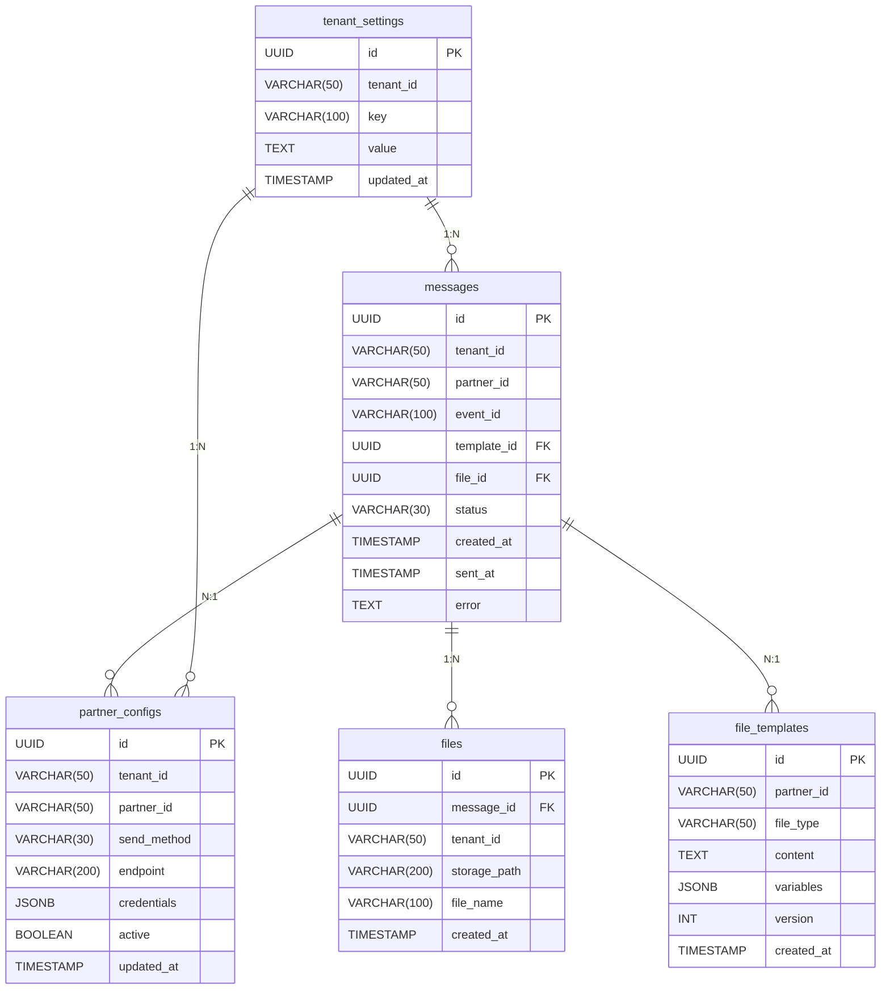

# 5. Vista de bloques de construcción

*Figura 5.1: Vista general de contenedores*

## 5.1 Contenedores principales

| Contenedor             | Responsabilidad principal                | Tecnología         |
|------------------------|------------------------------------------|--------------------|
| Event Processor        | Ingesta y procesamiento de eventos SITA  | .NET 8, Worker Service, SNS+SQS |
| Message Sender         | Envío de archivos SITA a partners        | .NET 8, Background Service      |
| SITA Messaging DB      | Almacenamiento de datos y colas          | PostgreSQL                     |
| SITA Message Queue     | Cola de eventos para procesamiento       | AWS SQS                        |
| File Storage           | Almacenamiento de archivos SITA          | S3-compatible                   |
| Autenticación          | Gestión de identidad y acceso            | Keycloak                        |
| Observabilidad         | Métricas, logs, trazabilidad            | Prometheus, Serilog, OpenTelemetry |

## 5.2 Componentes principales

### Event Processor

*Figura 5.2: Componentes principales del procesamiento de eventos*

| Componente                | Rol/Función                                               | Tecnología                |
|---------------------------|----------------------------------------------------------|---------------------------|
| Event Consumer            | Consume y deserializa eventos de Track & Trace           | .NET 8                    |
| Event Orchestrator        | Coordina generación y registro de mensajes SITA          | .NET 8                    |
| Message Repository        | Registra mensajes SITA para envío posterior              | .NET 8, EF Core           |
| Template Engine           | Procesa plantillas SITA                                  | .NET 8, Scriban           |
| Template Repository       | Accede a plantillas SITA por partner y tipo de mensaje   | .NET 8, EF Core           |
| File Generator            | Genera archivos SITA finales                             | .NET 8                    |
| TenantSettings Repository | Gestiona configuraciones por tenant                      | .NET 8, EF Core           |
| SecretsAndConfigs         | Acceso centralizado a configuraciones y secretos         | AWS Secrets Manager, AppConfig |
| Observability             | Logging, métricas, health checks                         | Serilog, Prometheus, HealthChecks |

### Message Sender

*Figura 5.3: Componentes principales del servicio de envío*

| Componente                | Rol/Función                                               | Tecnología                |
|---------------------------|----------------------------------------------------------|---------------------------|
| Sending Worker            | Monitorea y orquesta envíos de mensajes SITA             | .NET 8, Quartz.NET        |
| Message Dispatch Service  | Orquesta envío programado a partners externos            | .NET 8                    |
| Message Repository        | Consulta y actualiza mensajes SITA                       | .NET 8, EF Core           |
| PartnerConfig Repository  | Gestiona preferencias de envío por partner/tenant         | .NET 8, EF Core           |
| File Fetcher              | Obtiene archivos SITA desde storage                      | .NET 8, S3 SDK            |
| Email Sender              | Envía archivos SITA por email usando Notification System | .NET 8, Notification System API |
| SITA Provider Sender      | Envía archivos SITA vía API SITA                         | .NET 8, HTTP Client       |
| SecretsAndConfigs         | Acceso centralizado a configuraciones y secretos         | AWS Secrets Manager, AppConfig |
| Observability             | Logging, métricas, health checks                         | Serilog, Prometheus, HealthChecks |

---

## 5.4 Esquemas de base de datos

### 5.4.1 Modelo de datos (ER)

---

### 5.4.2 Tabla: `messages`

| Campo         | Tipo         | Descripción                                 | Restricciones                  |
|---------------|--------------|---------------------------------------------|-------------------------------|
| id            | UUID         | Identificador único del mensaje SITA        | PRIMARY KEY                   |
| tenant_id     | VARCHAR(50)  | Identificador del tenant                    | NOT NULL, INDEX               |
| partner_id    | VARCHAR(50)  | Identificador del partner                   | NOT NULL, INDEX               |
| event_id      | VARCHAR(100) | ID del evento origen                        | NOT NULL                      |
| template_id   | UUID         | Referencia a la plantilla utilizada         | FOREIGN KEY, NOT NULL         |
| file_id       | UUID         | Referencia al archivo generado              | FOREIGN KEY, NULL             |
| status        | VARCHAR(30)  | Estado del mensaje: pending, sent, failed   | NOT NULL                      |
| created_at    | TIMESTAMP    | Fecha de creación                           | NOT NULL, DEFAULT NOW()       |
| sent_at       | TIMESTAMP    | Fecha de envío                              | NULL                          |
| error         | TEXT         | Mensaje de error (si aplica)                | NULL                          |

**Ejemplo de datos:**

| id                                   | tenant_id  | partner_id | event_id   | template_id | file_id   | status   | created_at           | sent_at              | error |
|---------------------------------------|------------|------------|------------|-------------|-----------|----------|----------------------|----------------------|-------|
| `1e2d3c4b-5a6f-7e8d-9c0b-1a2b3c4d5e6f` | `tenant-pe`| `partner-01`| `evt-001`  | `tpl-001`   | `file-001`| sent     | `2025-09-24T10:01:00Z` | `2025-09-24T10:02:00Z` | NULL  |

---

### 5.4.3 Tabla: `file_templates`

| Campo         | Tipo         | Descripción                                         | Restricciones                  |
|---------------|--------------|-----------------------------------------------------|-------------------------------|
| id            | UUID         | Identificador único de la plantilla de archivo SITA | PRIMARY KEY                   |
| partner_id    | VARCHAR(50)  | Identificador del partner                           | NOT NULL, INDEX               |
| file_type     | VARCHAR(50)  | Tipo de archivo SITA                                | NOT NULL                      |
| content       | TEXT         | Contenido de la plantilla de archivo                | NOT NULL                      |
| variables     | JSONB        | Lista de parámetros/variables a reemplazar en el archivo | NULL                      |
| version       | INT          | Versión de la plantilla                             | NOT NULL, DEFAULT 1           |
| created_at    | TIMESTAMP    | Fecha de creación                                   | NOT NULL, DEFAULT NOW()       |

**Ejemplo de datos:**

| id                                   | partner_id  | file_type | content                  | variables                                 | version | created_at           |
|---------------------------------------|-------------|-----------|--------------------------|-------------------------------------------|---------|----------------------|
| `tpl-001`                            | `partner-01`| `FBL`     | `...contenido...`        | {"flightNumber":"string","date":"date"} | 1       | `2025-09-24T09:00:00Z`|

---

### 5.4.4 Tabla: `tenant_settings`

| Campo         | Tipo         | Descripción                                 | Restricciones                  |
|---------------|--------------|---------------------------------------------|-------------------------------|
| id            | UUID         | Identificador único de la configuración     | PRIMARY KEY                   |
| tenant_id     | VARCHAR(50)  | Identificador del tenant                    | NOT NULL, INDEX               |
| key           | VARCHAR(100) | Clave de configuración                      | NOT NULL                      |
| value         | TEXT         | Valor de configuración                      | NOT NULL                      |
| updated_at    | TIMESTAMP    | Fecha de actualización                      | NOT NULL, DEFAULT NOW()       |

**Ejemplo de datos:**

| id                                   | tenant_id  | key           | value         | updated_at           |
|---------------------------------------|------------|---------------|--------------|----------------------|
| `ts-001`                             | `tenant-pe`| `timezone`    | `America/Lima`| `2025-09-24T08:00:00Z`|

---

### 5.4.5 Tabla: `partner_configs`

| Campo         | Tipo         | Descripción                                 | Restricciones                  |
|---------------|--------------|---------------------------------------------|-------------------------------|
| id            | UUID         | Identificador único de la configuración     | PRIMARY KEY                   |
| tenant_id     | VARCHAR(50)  | Identificador del tenant                    | NOT NULL, INDEX               |
| partner_id    | VARCHAR(50)  | Identificador del partner                   | NOT NULL, INDEX               |
| send_method   | VARCHAR(30)  | Método de envío: email, api, sftp           | NOT NULL                      |
| endpoint      | VARCHAR(200) | Endpoint de integración                     | NULL                          |
| credentials   | JSONB        | Credenciales y configuración                | NULL                          |
| active        | BOOLEAN      | Configuración activa                        | DEFAULT TRUE                  |
| updated_at    | TIMESTAMP    | Fecha de actualización                      | NOT NULL, DEFAULT NOW()       |

**Ejemplo de datos:**

| id                                   | tenant_id  | partner_id | send_method | endpoint                | credentials         | active | updated_at           |
|---------------------------------------|------------|------------|------------|------------------------|---------------------|--------|----------------------|
| `pc-001`                             | `tenant-pe`| `partner-01`| `sftp`     | `sftp://host`          | `{...}`             | true   | `2025-09-24T08:30:00Z`|

---

### 5.4.6 Tabla: `files`

| Campo         | Tipo         | Descripción                                 | Restricciones                  |
|---------------|--------------|---------------------------------------------|-------------------------------|
| id            | UUID         | Identificador único del archivo             | PRIMARY KEY                   |
| message_id    | UUID         | Referencia al mensaje SITA                  | FOREIGN KEY, NOT NULL         |
| tenant_id     | VARCHAR(50)  | Identificador del tenant                    | NOT NULL, INDEX               |
| storage_path  | VARCHAR(200) | Ruta en el storage S3                       | NOT NULL                      |
| file_name     | VARCHAR(100) | Nombre del archivo                          | NOT NULL                      |
| created_at    | TIMESTAMP    | Fecha de creación                           | NOT NULL, DEFAULT NOW()       |

**Ejemplo de datos:**

| id                                   | message_id | tenant_id  | storage_path         | file_name      | created_at           |
|---------------------------------------|------------|------------|---------------------|---------------|----------------------|
| `file-001`                           | `1e2d3c4b-5a6f-7e8d-9c0b-1a2b3c4d5e6f`| `tenant-pe` | `/sita/2025/09/24/` | `FBL_001.txt` | `2025-09-24T10:02:00Z`|

---
