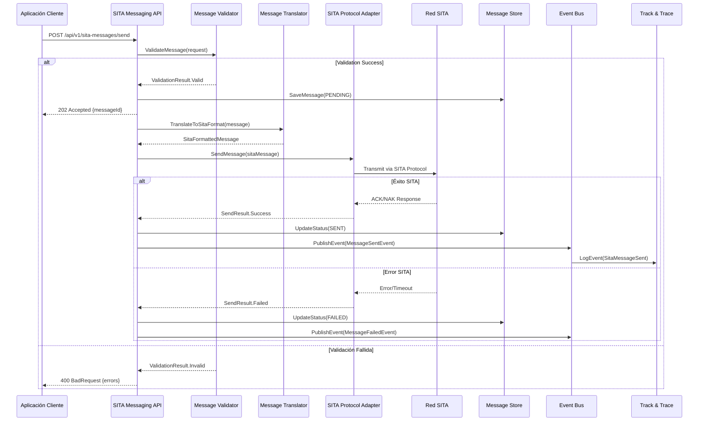
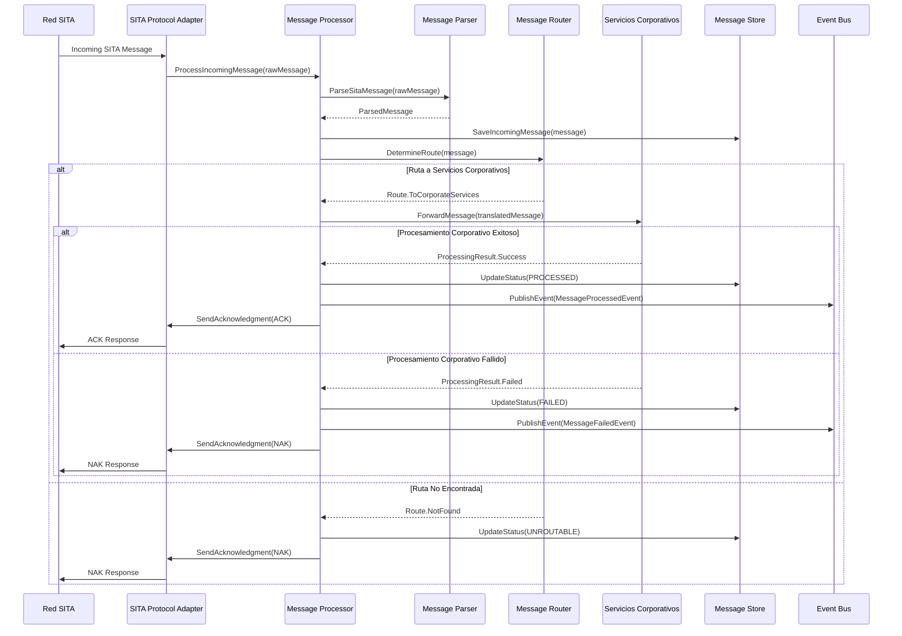
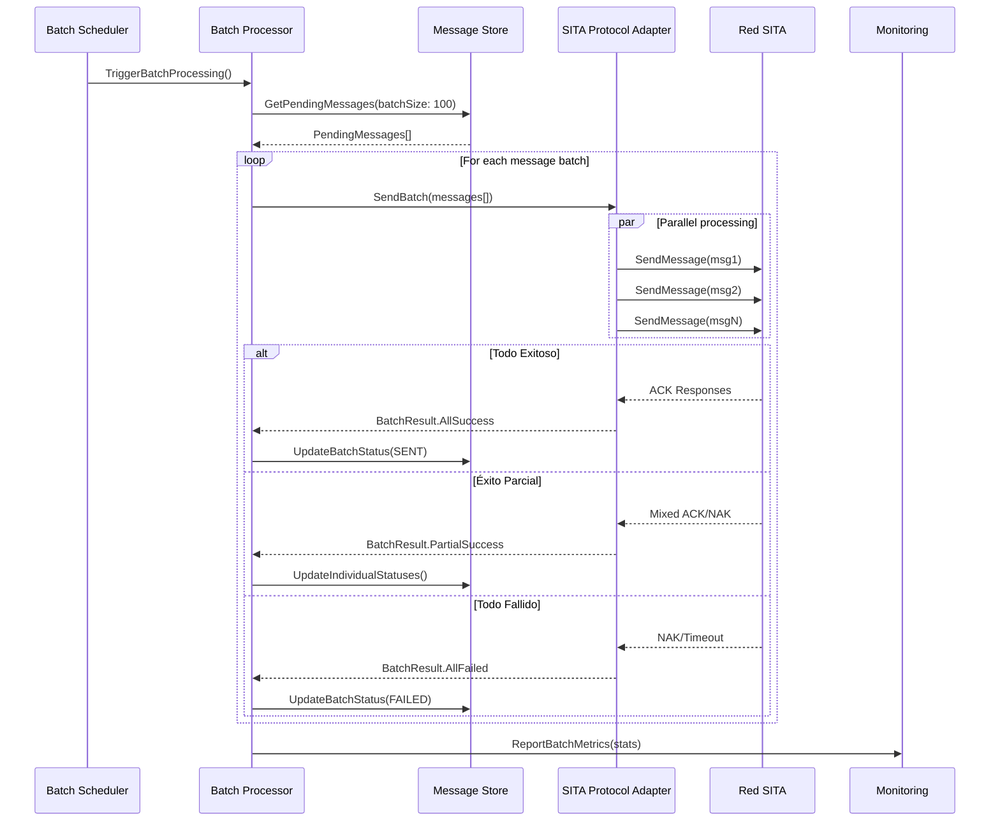

# 6. Vista de tiempo de ejecución

Esta sección describe los principales escenarios de ejecución y patrones de interacción del sistema de mensajería SITA, detallando flujos críticos, manejo de errores, patrones de resiliencia y consideraciones de monitoreo y despliegue, alineados a mejores prácticas de arquitectura y operación.

## 6.1 Escenarios principales

| Escenario                  | Flujo                                         | Componentes        |
|----------------------------|-----------------------------------------------|--------------------|
| **Procesamiento evento**   | Event Consumer → Orchestrator → Generator     | Event Processor    |
| **Generación archivo**     | Template Engine → SITA Generator → Storage    | Event Processor    |
| **Envío programado**       | Sending Worker → Fetcher → Partner Sender     | Sender            |

## 6.2 Patrones de interacción

| Patrón           | Descripción                | Tecnología           |
|------------------|---------------------------|----------------------|
| **Event-Driven** | Procesamiento asíncrono    | PostgreSQL queue     |
| **Worker Service** | Procesamiento background | .NET 8               |
| **File-based**   | Intercambio archivos       | Sistema archivos     |

## 6.3 Flujos de ejecución detallados

### 6.3.1 Envío de mensaje SITA outbound

### 6.3.2 Recepción de mensaje SITA inbound

### 6.3.3 Procesamiento batch de mensajes

## 6.4 Flujos de control y resiliencia

### 6.4.1 Gestión de conexiones SITA

- Pool de conexiones concurrentes y heartbeat
- Health checks y auto-reconexión
- Load balancing y failover automático

### 6.4.2 Validación y transformación de mensajes

- Validación de esquema y reglas de negocio
- Transformación entre formatos y enriquecimiento
- Cache de reglas y validaciones asíncronas

### 6.4.3 Manejo de errores y retry logic

- Retries con backoff exponencial para errores transitorios
- Dead letter para errores permanentes
- Logging y métricas de intentos y fallos

## 6.5 Patrones de runtime

- **Connection Pool**: Conexiones persistentes y balanceadas
- **Circuit Breaker**: Protección ante fallos de destino
- **Bulkhead**: Aislamiento de recursos por tenant
- **Saga**: Coordinación de procesos multi-step

## 6.6 Performance y monitoreo

- 1,000 mensajes/segundo por instancia
- Batch de 100 mensajes para eficiencia
- P95 < 200ms API, < 2s transmisión SITA
- Uso de CPU/memoria autoescalable
- Health checks, métricas y alertas operacionales

## 6.7 Escenarios de despliegue

- **Blue-Green**: Zero downtime, validación y rollback instantáneo
- **Canary**: Rollout gradual, monitoreo y auto-rollback
- **Disaster Recovery**: RTO 15min, RPO 5min, failover automático
