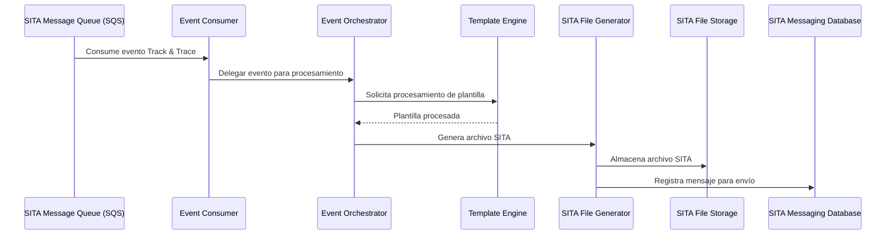
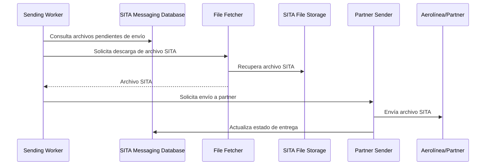

# 6. Vista de tiempo de ejecución

Esta sección describe los principales escenarios de ejecución y patrones de interacción del sistema de mensajería SITA, alineados a los componentes y tecnologías implementados.

## 6.1 Escenarios principales

| Escenario                  | Flujo principal                                                                 |
|----------------------------|-------------------------------------------------------------------------------|
| Procesamiento de evento    | Event Consumer → Event Orchestrator → Template Engine → SITA File Generator    |
| Persistencia y auditoría   | SITA File Generator → File Storage / Delivery Log Table                        |
| Envío programado           | Sending Worker → File Fetcher → Partner Sender → Delivery Tracker              |

## 6.2 Patrones de interacción

| Patrón           | Descripción                        | Tecnología principal      |
|------------------|------------------------------------|--------------------------|
| Event-Driven     | Procesamiento asíncrono de eventos | SNS+SQS, .NET 8 Worker   |
| Batch            | Procesamiento por lotes            | .NET 8, Quartz.NET       |
| File-based       | Intercambio de archivos SITA       | S3-Compatible Storage    |
| Observabilidad   | Monitoreo y logging estructurado   | Prometheus, Serilog      |

## 6.3 Flujos de ejecución

### 6.3.1 Procesamiento de evento SITA

### 6.3.2 Envío programado de mensajes

