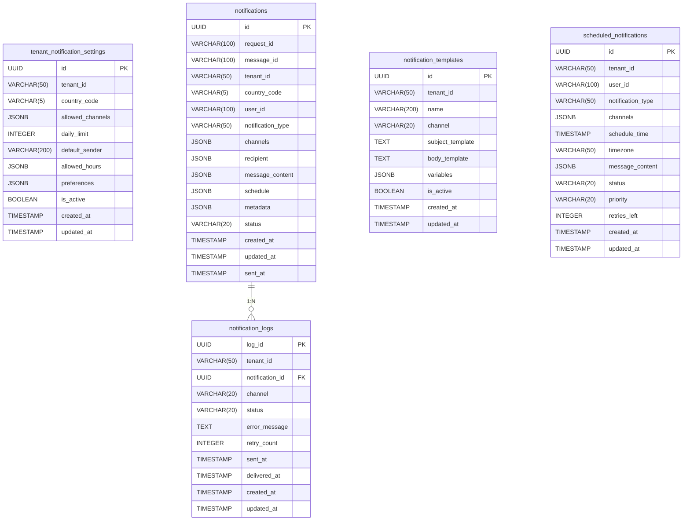

# 5. Vista de bloques de construcción

Esta sección describe la estructura modular y desacoplada del Sistema de Notificación, detallando contenedores, componentes, esquemas de datos, APIs y ejemplos de implementación. Se incluyen diagramas C4 para ilustrar la arquitectura y la interacción entre los bloques principales, priorizando la escalabilidad, resiliencia y observabilidad.


*Figura 5.1: Contenedores principales del sistema*

## 5.1 Contenedores principales

| Contenedor                | Responsabilidad                                        | Tecnología              |
|---------------------------|--------------------------------------------------------|-------------------------|
| `Notification API`        | Recepción, validación, orquestación, deduplicación e idempotencia de solicitudes, gestión de plantillas | `.NET 8 Web API`        |
| `Notification Database`   | Persistencia, auditoría, versionado de datos y plantillas | `PostgreSQL 15+`        |
| `emailQueue`              | Desacoplamiento y buffering de mensajes `email`         | `AWS SQS`               |
| `smsQueue`                | Desacoplamiento y buffering de mensajes `SMS`           | `AWS SQS`               |
| `whatsappQueue`           | Desacoplamiento y buffering de mensajes `WhatsApp`      | `AWS SQS`               |
| `pushQueue`               | Desacoplamiento y buffering de mensajes `push`          | `AWS SQS`               |
| `SNS` (opcional)          | Fan-out y routing avanzado a colas SQS                 | `AWS SNS`               |
| `Email Processor`         | Procesamiento y entrega de `email`                      | `.NET 8 Worker Service` |
| `SMS Processor`           | Procesamiento y entrega de `SMS`                        | `.NET 8 Worker Service` |
| `WhatsApp Processor`      | Procesamiento y entrega de `WhatsApp`                   | `.NET 8 Worker Service` |
| `Push Processor`          | Procesamiento y entrega de notificaciones `push`        | `.NET 8 Worker Service` |
| `Attachment Storage`      | Almacenamiento seguro y escalable de adjuntos           | `AWS S3`                |

> La deduplicación, idempotencia y versionado de plantillas son responsabilidades internas de los componentes principales (`Notification API`, `Template Controller`, `Notification Database`) y se implementan mediante lógica de aplicación, claves de idempotencia y versionado en base de datos, no como contenedores independientes.

## 5.2 Vista de componentes y detalles


*Figura 5.2: Componentes internos de Notification API*

| Componente                | Responsabilidad                                        | Tecnología              |
|---------------------------|--------------------------------------------------------|-------------------------|
| `Notification Controller` | Exposición de endpoints `REST`, control de acceso, deduplicación e idempotencia | `ASP.NET Core`          |
| `Template Controller`     | Gestión de plantillas con versionado e `i18n`          | `ASP.NET Core`          |
| `Attachment Service`      | Manejo seguro y validación de adjuntos                 | `.NET 8`, `S3 SDK`      |
| `Validation Service`      | Validación de datos, límites y reglas por tenant       | `FluentValidation`      |
| `Message Publisher`       | Publicación confiable a colas (`outbox pattern`)       | `.NET 8`, `PostgreSQL`, `SQS`|
| `Config Manager`          | Gestión de configuración multi-tenant                  | `.NET 8`, `EF Core`     |
| `Structured Logger`       | Logging estructurado y trazabilidad                    | `Serilog`               |
| `Metrics Collector`       | Recolección de métricas y monitoreo                    | `Prometheus.NET`        |

> La deduplicación, idempotencia y versionado de plantillas están integrados como lógica interna en los componentes críticos (`Notification API`, `Template Controller`, `Notification Database`), siguiendo el modelo real del sistema. No existen como servicios o contenedores independientes en el DSL.

### Email processor


*Figura 5.3: Componentes internos de Email Processor*

| Componente           | Responsabilidad                                      | Tecnología                  |
|----------------------|------------------------------------------------------|-----------------------------|
| `Consumer`           | Consume mensajes de la cola de notificación `email`  | `C# .NET 8`, `AWS SDK`      |
| `Service`            | Procesa y envía notificaciones por `email`           | `C# .NET 8`                 |
| `Adapter`            | Envía notificaciones al proveedor externo de `email` | `C# .NET 8`, `AWS SDK`      |
| `Repository`         | Actualiza el estado de las notificaciones enviadas   | `C# .NET 8`, `Entity Framework Core` |
| `Attachment Fetcher` | Obtiene archivos adjuntos desde almacenamiento       | `C# .NET 8`, `AWS SDK`      |
| `Configuration Manager`| Gestiona configuraciones del servicio y por tenant | `C# .NET 8`, `EF Core`      |

### SMS processor


*Figura 5.4: Componentes internos de SMS Processor*

| Componente           | Responsabilidad                                      | Tecnología                  |
|----------------------|------------------------------------------------------|-----------------------------|
| `Consumer`           | Consume mensajes de la cola notificación `SMS`         | `C# .NET 8`, `AWS SDK`      |
| `Service`            | Procesa y envía notificaciones `SMS`                   | `C# .NET 8`                 |
| `Adapter`            | Envía notificaciones al proveedor externo de `SMS`     | `C# .NET 8`, `AWS SDK`      |
| `Repository`         | Actualiza el estado de las notificaciones enviadas   | `C# .NET 8`, `Entity Framework Core` |
| `Configuration Manager`| Gestiona configuraciones del servicio y por tenant | `C# .NET 8`, `EF Core`      |

### WhatsApp processor


*Figura 5.5: Componentes internos de WhatsApp Processor*

| Componente           | Responsabilidad                                      | Tecnología                  |
|----------------------|------------------------------------------------------|-----------------------------|
| `Consumer`           | Consume mensajes de la cola notificación `WhatsApp`    | `C# .NET 8`, `AWS SDK`      |
| `Service`            | Procesa y envía notificaciones `WhatsApp`              | `C# .NET 8`                 |
| `Adapter`            | Envía notificaciones al proveedor externo de `WhatsApp`| `C# .NET 8`, `AWS SDK`      |
| `Repository`         | Actualiza el estado de las notificaciones enviadas   | `C# .NET 8`, `Entity Framework Core` |
| `Attachment Fetcher` | Obtiene archivos adjuntos desde almacenamiento       | `C# .NET 8`, `AWS SDK`      |
| `Configuration Manager`| Gestiona configuraciones del servicio y por tenant | `C# .NET 8`, `EF Core`      |

### Push processor


*Figura 5.6: Componentes internos de Push Processor*

| Componente           | Responsabilidad                                      | Tecnología                  |
|----------------------|------------------------------------------------------|-----------------------------|
| `Consumer`           | Consume mensajes de la cola notificación `Push`         | `C# .NET 8`, `AWS SDK`      |
| `Service`            | Procesa y envía notificaciones `Push`                  | `C# .NET 8`                 |
| `Adapter`            | Envía notificaciones al proveedor externo de `Push`    | `C# .NET 8`, `AWS SDK`      |
| `Repository`         | Actualiza el estado de las notificaciones enviadas   | `C# .NET 8`, `Entity Framework Core` |
| `Attachment Fetcher` | Obtiene archivos adjuntos desde almacenamiento       | `C# .NET 8`, `AWS SDK`      |
| `Configuration Manager`| Gestiona configuraciones del servicio y por tenant | `C# .NET 8`, `EF Core`      |

### Scheduler


*Figura 5.7: Componentes internos de Scheduler*

| Componente           | Responsabilidad                                      | Tecnología                  |
|----------------------|------------------------------------------------------|-----------------------------|
| `Scheduler Worker`   | Ejecuta tareas programadas para enviar notificaciones| `Worker Service`, `C# .NET 8`  |
| `Service`            | Procesa y programa el envío de notificaciones        | `C# .NET 8`                 |
| `Queue Publisher`    | Envía notificaciones programadas a la cola           | `C# .NET 8`, `AWS SDK`      |
| `Repository`         | Acceso a notificaciones programadas en la base de datos| `C# .NET 8`, `Entity Framework Core` |
| `Configuration Manager`| Gestiona configuraciones del servicio y por tenant | `C# .NET 8`, `EF Core`      |

---

## 5.4 Esquemas de base de datos

### 5.4.1 Modelo de datos (ER)



---

### 5.4.2 Tabla: `notifications`

| Campo              | Tipo           | Descripción                        | Restricciones                  |
|--------------------|---------------|------------------------------------|-------------------------------|
| id                 | UUID          | Identificador único                | PRIMARY KEY                   |
| request_id         | VARCHAR(100)  | ID de la solicitud                 | NOT NULL, INDEX               |
| message_id         | VARCHAR(100)  | ID del mensaje                     | UNIQUE                        |
| tenant_id          | VARCHAR(50)   | Identificador del tenant           | NOT NULL, INDEX               |
| country_code       | VARCHAR(5)    | Código de país (PE, EC, CO, MX)    | NOT NULL, INDEX               |
| user_id            | VARCHAR(100)  | ID del usuario destinatario        | NOT NULL                      |
| notification_type  | VARCHAR(50)   | transactional, marketing           | NOT NULL                      |
| channels           | JSONB         | Canales solicitados                | NOT NULL                      |
| recipient          | JSONB         | Datos del destinatario             | NOT NULL                      |
| message_content    | JSONB         | Contenido del mensaje              | NOT NULL                      |
| schedule           | JSONB         | Configuración de programación      | NULL                          |
| metadata           | JSONB         | Metadatos adicionales              | NULL                          |
| status             | VARCHAR(20)   | pending, processing, sent, failed  | NOT NULL, DEFAULT 'pending'   |
| created_at         | TIMESTAMP     | Fecha de creación                  | NOT NULL, DEFAULT NOW()       |
| updated_at         | TIMESTAMP     | Fecha de actualización             | NOT NULL, DEFAULT NOW()       |
| sent_at            | TIMESTAMP     | Fecha de envío                     | NULL                          |

**Ejemplo de datos:**

| id                                   | request_id | message_id | tenant_id  | country_code | user_id    | notification_type | channels                                 | recipient                                                                 | message_content                                                                                                   | schedule                                 | metadata                                 | status    | created_at           | updated_at           | sent_at              |
|---------------------------------------|------------|------------|------------|--------------|------------|-------------------|------------------------------------------|---------------------------------------------------------------------------|-------------------------------------------------------------------------------------------------------------------|------------------------------------------|------------------------------------------|-----------|----------------------|----------------------|----------------------|
| `1e2d3c4b-5a6f-7e8d-9c0b-1a2b3c4d5e6f` | `req-001`    | `msg-001`    | `tenant-pe`   | `PE`           | `usuario789` | `transactional`     | `["email", "sms", "push"]`              | `{"userId":"usuario789","email":"<usuario@ejemplo.com>"}`              | `{"subject":"Confirmación de Pedido","body":"¡Gracias por su pedido!"}`                                      | `{"sendAt":"2024-09-17T15:00:00Z"}`   | `{"priority":"high","retries":3}`    | `sent`      | `2025-08-13T10:01:00Z` | `2025-08-13T10:01:00Z` | `2025-08-13T10:01:00Z` |
| `2f3a4b5c-6d7e-8f9a-0b1c-2d3e4f5a6b7c` | `req-002`    | `msg-002`    | `tenant-ec`   | `EC`           | `usuario123` | `marketing`         | `["email"]`                              | `{"userId":"usuario123","email":"<otro@ejemplo.com>"}`                 | `{"subject":"Promo","body":"¡Oferta especial solo hoy!"}`                                                  | `NULL`                                     | `{"priority":"low","retries":1}`     | `pending`   | `2025-08-13T11:00:00Z` | `2025-08-13T11:00:00Z` | `NULL`                 |

---

### 5.4.3 Tabla: `notification_logs`

| Campo            | Tipo           | Descripción                                 | Restricciones                  |
|------------------|----------------|---------------------------------------------|-------------------------------|
| log_id           | UUID           | Identificador único del log                 | PRIMARY KEY                   |
| tenant_id        | VARCHAR(50)    | Identificador del tenant                    | NOT NULL, INDEX               |
| notification_id  | UUID           | Referencia a notification                   | FOREIGN KEY, NOT NULL         |
| channel          | VARCHAR(20)    | Canal: email, sms, push, whatsapp, in-app   | NOT NULL                      |
| status           | VARCHAR(20)    | Estado del intento: sent, delivered, failed | NOT NULL                      |
| error_message    | TEXT           | Mensaje de error (si aplica)                | NULL                          |
| retry_count      | INTEGER        | Número de reintentos en este intento        | DEFAULT 0                     |
| sent_at          | TIMESTAMP      | Fecha/hora de envío                         | NULL                          |
| delivered_at     | TIMESTAMP      | Fecha/hora de entrega confirmada            | NULL                          |
| created_at       | TIMESTAMP      | Fecha de creación del log                   | NOT NULL, DEFAULT NOW()       |
| updated_at       | TIMESTAMP      | Fecha de actualización del log              | NOT NULL, DEFAULT NOW()       |

**Ejemplo de datos:**

| log_id                               | tenant_id  | notification_id                        | channel | status    | error_message | retry_count | sent_at              | delivered_at         | created_at           | updated_at           |
|---------------------------------------|------------|----------------------------------------|---------|-----------|--------------|------------|----------------------|----------------------|----------------------|----------------------|
| `1a2b3c4d-5e6f-7a8b-9c0d-1e2f3a4b5c6d` | `tenant-pe`  | `1e2d3c4b-5a6f-7e8d-9c0b-1a2b3c4d5e6f`   | `email`   | `sent`      | `NULL`         | `0`          | `2025-08-13T10:01:00Z` | `2025-08-13T10:01:10Z` | `2025-08-13T10:01:00Z` | `2025-08-13T10:01:00Z` |
| `2b3c4d5e-6f7a-8b9c-0d1e-2f3a4b5c6d7e` | `tenant-pe`  | `1e2d3c4b-5a6f-7e8d-9c0b-1a2b3c4d5e6f`   | `sms`     | `failed`    | `"Timeout"`    | `1`          | `2025-08-13T10:01:05Z` | `NULL`                 | `2025-08-13T10:01:05Z` | `2025-08-13T10:01:05Z` |

---

### 5.4.4 Tabla: `notification_templates`

| Campo              | Tipo         | Descripción                        | Restricciones                  |
|--------------------|-------------|------------------------------------|-------------------------------|
| id                 | UUID        | Identificador único                | PRIMARY KEY                   |
| tenant_id          | VARCHAR(50) | Identificador del tenant           | NOT NULL, INDEX               |
| name               | VARCHAR(200)| Nombre descriptivo                 | NOT NULL                      |
| channel            | VARCHAR(20) | Canal: email, sms, push, whatsapp, in-app | NOT NULL              |
| subject_template   | TEXT        | Template del asunto                | NULL                          |
| body_template      | TEXT        | Template del cuerpo                | NOT NULL                      |
| variables          | JSONB       | Variables disponibles              | NULL                          |
| is_active          | BOOLEAN     | Estado del template                | DEFAULT true                  |
| created_at         | TIMESTAMP   | Fecha de creación                  | NOT NULL, DEFAULT NOW()       |
| updated_at         | TIMESTAMP   | Fecha de actualización             | NOT NULL, DEFAULT NOW()       |

**Ejemplo de datos:**

| id                                   | tenant_id  | name                    | channel | subject_template           | body_template                        | variables                                 | is_active | created_at           | updated_at           |
|---------------------------------------|------------|-------------------------|---------|---------------------------|---------------------------------------|-------------------------------------------|-----------|----------------------|----------------------|
| `3c4d5e6f-7a8b-9c0d-1e2f-3a4b5c6d7e8f` | `tenant-pe`  | `Confirmación de Pedido`  | `email`   | `"Confirmación de Pedido"` | `"¡Gracias por su pedido, {{user}}!"` | `{"user":"string","orderId":"int"}` | `true`      | `2025-08-13T09:00:00Z` | `2025-08-13T09:00:00Z` |
| `4d5e6f7a-8b9c-0d1e-2f3a-4b5c6d7e8f9a` | `tenant-ec`  | `Promoción Especial`      | `email`   | `"Promo"`                  | `"¡Oferta solo hoy, {{user}}!"`       | `{"user":"string"}`                     | `true`      | `2025-08-13T09:30:00Z` | `2025-08-13T09:30:00Z` |

---

### 5.4.5 Tabla: `scheduled_notifications`

| Campo           | Tipo           | Descripción                                 | Restricciones                  |
|-----------------|----------------|---------------------------------------------|-------------------------------|
| id              | UUID           | Identificador único                         | PRIMARY KEY                   |
| tenant_id       | VARCHAR(50)    | Identificador del tenant                    | NOT NULL, INDEX               |
| user_id         | VARCHAR(100)   | ID del usuario destinatario                 | NOT NULL                      |
| notification_type| VARCHAR(50)   | transactional, marketing, alert             | NOT NULL                      |
| channels        | JSONB          | Canales solicitados                         | NOT NULL                      |
| schedule_time   | TIMESTAMP      | Fecha/hora programada de envío              | NOT NULL                      |
| timezone        | VARCHAR(50)    | Zona horaria                                | NULL                          |
| message_content | JSONB          | Contenido del mensaje                       | NOT NULL                      |
| status          | VARCHAR(20)    | pending, scheduled, sent, failed            | NOT NULL, DEFAULT 'pending'   |
| priority        | VARCHAR(20)    | Prioridad de la notificación                | NULL                          |
| retries_left    | INTEGER        | Reintentos restantes                        | DEFAULT 0                     |
| created_at      | TIMESTAMP      | Fecha de creación                           | NOT NULL, DEFAULT NOW()       |
| updated_at      | TIMESTAMP      | Fecha de actualización                      | NOT NULL, DEFAULT NOW()       |

**Ejemplo de datos:**

| id                                   | tenant_id  | user_id    | notification_type | channels                      | schedule_time         | timezone   | message_content                                         | status    | priority | retries_left | created_at           | updated_at           |
|---------------------------------------|------------|------------|-------------------|-------------------------------|----------------------|------------|--------------------------------------------------------|-----------|----------|-------------|----------------------|----------------------|
| `5e6f7a8b-9c0d-1e2f-3a4b-5c6d7e8f9a0b` | `tenant-co`  | `usuario789` | `transactional`     | `["email","sms"]`            | `2025-08-14T09:00:00Z` | `America/Lima` | `{"subject":"Recordatorio","body":"No olvide su cita"}` | `scheduled` | `high`     | `2`           | `2025-08-13T08:00:00Z` | `2025-08-13T08:00:00Z` |
| `6f7a8b9c-0d1e-2f3a-4b5c-6d7e8f9a0b1c` | `tenant-mx`  | `usuario123` | `marketing`         | `["email"]`                   | `2025-08-15T10:00:00Z` | `UTC`        | `{"subject":"Promo","body":"¡Solo hoy!"}`              | `pending`   | `low`      | `1`           | `2025-08-13T08:30:00Z` | `2025-08-13T08:30:00Z` |

---

### 5.4.6 Tabla: `tenant_notification_settings`

| Campo           | Tipo           | Descripción                                         | Restricciones                  |
|-----------------|----------------|-----------------------------------------------------|-------------------------------|
| id              | UUID           | Identificador único                                 | PRIMARY KEY                   |
| tenant_id       | VARCHAR(50)    | Identificador del tenant                            | NOT NULL, INDEX               |
| country_code    | VARCHAR(5)     | Código de país (PE, EC, CO, MX)                     | NOT NULL, INDEX               |
| allowed_channels| JSONB          | Canales permitidos (email, sms, push, etc.)         | NOT NULL                      |
| daily_limit     | INTEGER        | Límite diario de notificaciones                     | NULL                          |
| default_sender  | VARCHAR(200)   | Remitente por defecto (email, nombre, etc.)         | NULL                          |
| allowed_hours   | JSONB          | Horarios permitidos para envío (ej: [8,21])         | NULL                          |
| preferences     | JSONB          | Preferencias adicionales (idioma, formato, etc.)    | NULL                          |
| is_active       | BOOLEAN        | Configuración activa                                | DEFAULT true                  |
| created_at      | TIMESTAMP      | Fecha de creación                                   | NOT NULL, DEFAULT NOW()       |
| updated_at      | TIMESTAMP      | Fecha de actualización                              | NOT NULL, DEFAULT NOW()       |

**Ejemplo de datos:**

| id                                   | tenant_id  | country_code | allowed_channels                | daily_limit | default_sender         | allowed_hours | preferences                                 | is_active | created_at           | updated_at           |
|---------------------------------------|------------|--------------|-------------------------------|-------------|-----------------------|---------------|---------------------------------------------|-----------|----------------------|----------------------|
| `7a8b9c0d-1e2f-3a4b-5c6d-7e8f9a0b1c2d` | `tenant-pe`  | `PE`           | `["email","sms","push"]`    | `1000`        | `"<notificaciones@acme.com>"` | `[8,21]`        | `{"idioma":"es","formato":"html"}`     | `true`      | `2025-08-13T07:00:00Z` | `2025-08-13T07:00:00Z` |
| `8b9c0d1e-2f3a-4b5c-6d7e-8f9a0b1c2d3e` | `tenant-ec`  | `EC`           | `["email"]`                    | `500`         | `"<info@ejemplo.com>"`         | `[9,18]`        | `{"idioma":"en"}`                        | `true`      | `2025-08-13T07:30:00Z` | `2025-08-13T07:30:00Z` |

---

## 5.5 Endpoints de API

Se describen los principales endpoints REST para la gestión y consulta de notificaciones y plantillas. Los contratos de datos siguen el estándar DTO y están alineados con la arquitectura Clean Architecture.

### 5.5.1 Notification API

- POST `/api/v1/notifications`: Enviar nueva notificación
- GET `/api/v1/notifications/{notificationId}`: Consultar estado de notificación

### 5.5.2 Attachment API

- POST `/api/v1/attachments/upload`: Subir un archivo adjunto (multipart/form-data)
- GET `/api/v1/attachments/{attachmentId}/download`: Descargar un archivo adjunto
- DELETE `/api/v1/attachments/{attachmentId}`: Eliminar un archivo adjunto

> Los adjuntos se almacenan en S3 y se asocian a notificaciones mediante URLs seguras. El endpoint de carga retorna la URL de acceso y el identificador del adjunto.

---

## 5.6 Contratos de datos

Los siguientes contratos definen la estructura de los datos de entrada y salida de la API:

### 5.6.1 NotificationRequest (Contrato)

| Campo                | Tipo                | Descripción                                                                                 |
|----------------------|---------------------|---------------------------------------------------------------------------------------------|
| requestId            | string              | Identificador único de la solicitud                                                         |
| timestamp            | string (ISO 8601)   | Fecha y hora de la solicitud                                                               |
| notificationType     | string              | Tipo de notificación: "transactional", "marketing", "alert"                              |
| channels             | array de string     | Canales solicitados                                                                        |
| recipient            | objeto              | Información del destinatario (ver subcampos)                                               |
| recipient.userId     | string              | Identificador del usuario                                                                  |
| recipient.email      | string (opcional)   | Correo electrónico del destinatario                                                        |
| recipient.phone      | string (opcional)   | Teléfono del destinatario                                                                  |
| recipient.pushToken  | string (opcional)   | Token push                                                                                 |
| recipient.customFields | objeto (opcional)  | Campos personalizados del destinatario                                                     |
| message              | objeto              | Contenido del mensaje (ver subcampos)                                                      |
| message.subject      | string (opcional)   | Asunto (para email)                                                                        |
| message.body         | string              | Cuerpo del mensaje                                                                         |
| message.attachments  | array de string (op)| URLs de adjuntos                                                                          |
| message.smsText      | string (opcional)   | Texto SMS                                                                                  |
| message.pushNotification | objeto (op)     | Datos para notificación push (ver subcampos)                                               |
| message.pushNotification.title | string    | Título de la notificación push                                                             |
| message.pushNotification.body  | string    | Cuerpo de la notificación push                                                             |
| message.pushNotification.icon  | string (op)| URL de icono                                                                              |
| message.pushNotification.action| objeto (op)| Acción asociada                                                                           |
| message.pushNotification.action.type | string| Tipo de acción                                                                            |
| message.pushNotification.action.url  | string| URL destino                                                                              |
| schedule              | objeto (opcional)  | Programación de envío (ver subcampos)                                                      |
| schedule.sendAt       | string (ISO 8601)  | Fecha/hora de envío programado                                                             |
| schedule.timeZone     | string (opcional)  | Zona horaria                                                                              |
| metadata              | objeto (opcional)   | Metadatos adicionales (prioridad, reintentos, etc.)                                        |
| metadata.priority     | string              | Prioridad de la notificación                                                               |
| metadata.retries      | integer             | Número de reintentos permitidos                                                            |
| metadata.sentBy       | string              | Servicio o sistema que origina la notificación                                             |
| metadata.templateId   | string              | Identificador de la plantilla utilizada                                                    |

#### Ejemplo de contrato NotificationRequest

```json
{
  "requestId": "abc123",
  "timestamp": "2024-09-17T14:00:00Z",
  "notificationType": "transactional",
  "channels": ["email", "sms", "push"],
  "recipient": {
    "userId": "usuario789",
    "email": "usuario@ejemplo.com"
  },
  "message": {
    "subject": "Confirmación de Pedido",
    "body": "¡Gracias por su pedido! Su pedido #123456 ha sido confirmado.",
    "attachments": ["https://ejemplo.com/factura123456.pdf"],
    "smsText": "¡Gracias por su pedido! Pedido #123456 confirmado.",
    "pushNotification": {
      "title": "Pedido Confirmado",
      "body": "Su pedido #123456 ha sido confirmado. Revise su correo para más detalles.",
      "icon": "https://ejemplo.com/icono.png",
      "action": {
        "type": "verPedido",
        "url": "https://ejemplo.com/pedido/123456"
      }
    }
  },
  "schedule": {
    "sendAt": "2024-09-17T15:00:00Z"
  },
  "metadata": {
    "priority": "high",
    "retries": 3,
    "sentBy": "OrderService",
    "templateId": "orderConfirmationTemplate"
  }
}
```
