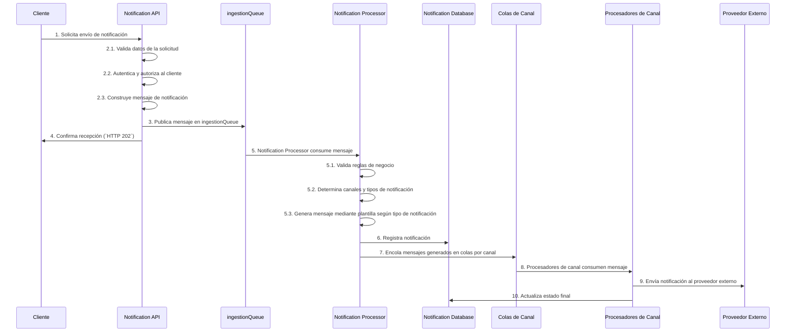

# 6. Vista De Tiempo De Ejecución

## 6.1 Escenarios Principales

| Escenario               | Flujo                              | Componentes         |
|-------------------------|------------------------------------|---------------------|
| Envío inmediato         | `Notification API` → `ingestionQueue` → `notificationProcessor` → `Notification Database` → [Colas de Canal] → [Procesadores de Canal] → Proveedor Externo → `Notification Database` | `Notification API`, `ingestionQueue`, `notificationProcessor`, `Notification Database`, `emailQueue`, `smsQueue`, `whatsappQueue`, `pushQueue`, `emailProcessor`, `smsProcessor`, `whatsappProcessor`, `pushProcessor`, `Attachment Storage` |
| Envío programado        | `Notification API` → `Notification Scheduler` → `ingestionQueue` → `notificationProcessor` → `Notification Database` → [Colas de Canal] → [Procesadores de Canal] → Proveedor Externo → `Notification Database` | `Notification API`, `Notification Scheduler`, `ingestionQueue`, `notificationProcessor`, `Notification Database`, `emailQueue`, `smsQueue`, `whatsappQueue`, `pushQueue`, `emailProcessor`, `smsProcessor`, `whatsappProcessor`, `pushProcessor` |
| Procesamiento plantilla | `Notification API` → `notificationProcessor` → `Notification Database` → [Colas de Canal] → [Procesadores de Canal] → Proveedor Externo → `Notification Database` | `Notification API`, `notificationProcessor`, `Notification Database`, `emailQueue`, `smsQueue`, `whatsappQueue`, `pushQueue`, `emailProcessor`, `smsProcessor`, `whatsappProcessor`, `pushProcessor` |

## 6.2 Patrones De Interacción

| Patrón      | Descripción                   | Tecnología / Componente         |
|-------------|------------------------------|---------------------------------|
| `CQRS`      | Separación comando/consulta  | `Notification API`, `notificationProcessor`, `emailProcessor`, `smsProcessor`, `whatsappProcessor`, `pushProcessor` |
| `Queue`     | Cola de mensajes             | `ingestionQueue`, `emailQueue`, `smsQueue`, `whatsappQueue`, `pushQueue` |
| `Template`  | Procesamiento de plantillas  | `Template Engine`               |

Esta sección describe los principales escenarios de ejecución del sistema, mostrando cómo los componentes interactúan durante el tiempo de ejecución para cumplir con los casos de uso más relevantes arquitectónicamente. Se priorizan la resiliencia, el desacoplamiento, la deduplicación, la idempotencia y la observabilidad en todos los flujos.

## 6.3 Escenario: Envío Transaccional Individual

### Participantes

- `Cliente`
- `Notification API`
- `ingestionQueue`
- `notificationProcessor`
- `Notification Database`
- Colas de Canal (`emailQueue`, `smsQueue`, `whatsappQueue`, `pushQueue`)
- Procesadores de Canal (`emailProcessor`, `smsProcessor`, `whatsappProcessor`, `pushProcessor`)
- Proveedor Externo

### Flujo Principal

### Aspectos Notables

- El flujo implementa desacoplamiento total entre recepción, procesamiento y entrega mediante colas y procesadores independientes.
- La deduplicación e idempotencia se garantizan en la `Notification API` y en los procesadores de canal.
- La observabilidad se implementa con logs estructurados (`Serilog`), métricas (`Prometheus`) y trazas distribuidas (`OpenTelemetry`).
- La resiliencia se logra mediante reintentos automáticos, `DLQ` y fallback de proveedores.
- Todos los nombres y responsabilidades de los componentes coinciden con el DSL.

## 6.4 Métricas De Ejecución

| Métrica                   | Target                | Medición                |
|---------------------------|----------------------|-------------------------|
| `API Response Time`       | `p95 < 100ms`        | Monitoreo APM           |
| `Event Processing`        | `< 500ms`            | Métricas personalizadas |
| `End-to-End Delivery`     | `< 30s` (transactional) | Métricas de negocio |
| `Capacidad de procesamiento` | `10K req/min/instancia` | Pruebas de carga   |

---

**Notas:**

- El sistema está diseñado para soportar picos de tráfico, garantizar entrega única y trazabilidad completa.
- El desacoplamiento y la resiliencia permiten tolerancia a fallos y recuperación automática ante errores de proveedores.
- La arquitectura prioriza la observabilidad y la entrega única en todos los escenarios.
