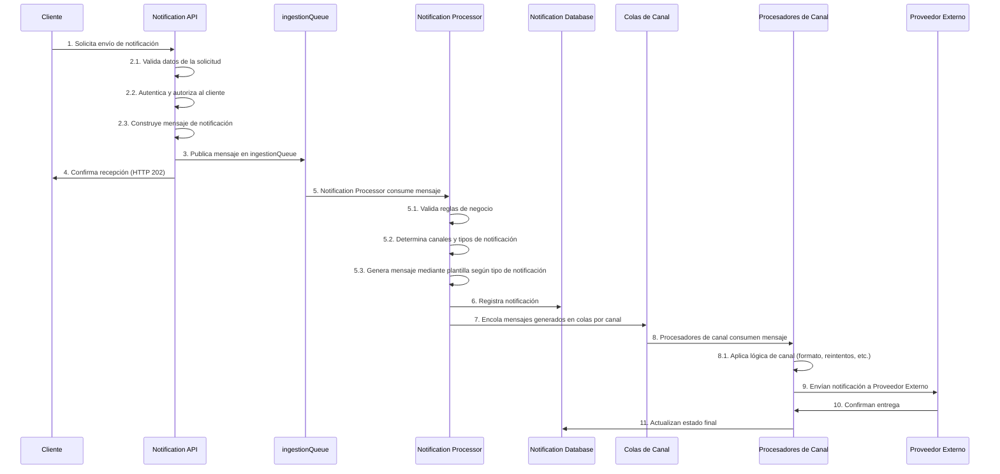
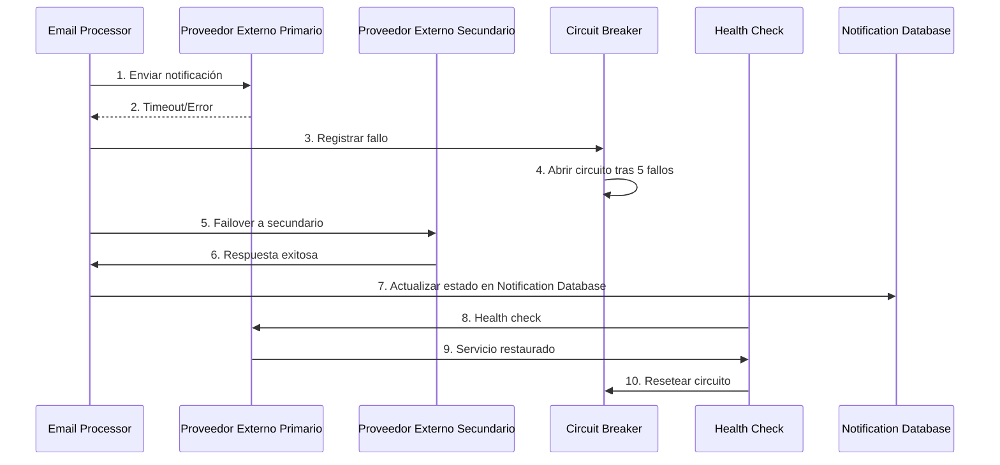

# 6. Vista De Tiempo De Ejecución

## 6.1 Escenarios Principales

| Escenario               | Flujo                              | Componentes         |
|-------------------------|------------------------------------|---------------------|
| Envío inmediato         | Notification API → ingestionQueue → notificationProcessor → Notification Database → [Colas de Canal] → [Procesadores de Canal] → Proveedor Externo → Notification Database | Notification API, ingestionQueue, notificationProcessor, Notification Database, emailQueue, smsQueue, whatsappQueue, pushQueue, emailProcessor, smsProcessor, whatsappProcessor, pushProcessor, Attachment Storage |
| Envío programado        | Notification API → Notification Scheduler → ingestionQueue → notificationProcessor → Notification Database → [Colas de Canal] → [Procesadores de Canal] → Proveedor Externo → Notification Database | Notification API, Notification Scheduler, ingestionQueue, notificationProcessor, Notification Database, emailQueue, smsQueue, whatsappQueue, pushQueue, emailProcessor, smsProcessor, whatsappProcessor, pushProcessor |
| Procesamiento plantilla | Notification API → notificationProcessor → Notification Database → [Colas de Canal] → [Procesadores de Canal] → Proveedor Externo → Notification Database | Notification API, notificationProcessor, Notification Database, emailQueue, smsQueue, whatsappQueue, pushQueue, emailProcessor, smsProcessor, whatsappProcessor, pushProcessor |

## 6.2 Patrones De Interacción

| Patrón      | Descripción                   | Tecnología         |
|-------------|------------------------------|--------------------|
| CQRS        | Separación comando/consulta  | Notification API, notificationProcessor, emailProcessor, smsProcessor, whatsappProcessor, pushProcessor |
| Queue       | Cola de mensajes             | ingestionQueue, emailQueue, smsQueue, whatsappQueue, pushQueue |
| Template    | Procesamiento de plantillas  | Template Engine    |

Esta sección describe los principales escenarios de ejecución del sistema, mostrando cómo los componentes interactúan durante el tiempo de ejecución para cumplir con los casos de uso más relevantes arquitectónicamente.

## 6.3 Escenario: Envío Transaccional Individual

### Participantes

- Cliente
- Notification API
- ingestionQueue
- notificationProcessor
- Notification Database
- Colas de Canal (emailQueue, smsQueue, whatsappQueue, pushQueue)
- Procesadores de Canal (emailProcessor, smsProcessor, whatsappProcessor, pushProcessor)
- Proveedor Externo

### Flujo Principal

### Aspectos Notables

- Notification Processor registra el evento inicial en Notification Database
- Notification Processor genera mensajes usando plantillas por canal y tipo de notificación
- Los Procesadores de Canal actualizan el estado final en Notification Database tras el envío
- Procesamiento paralelo y desacoplado por canal
- Los nombres de los componentes coinciden exactamente con el DSL

### Métricas De Rendimiento

| Métrica                   | Target                | Medición                |
|---------------------------|----------------------|-------------------------|
| `API Response Time`       | `p95 < 100ms`        | Monitoreo APM           |
| `Event Processing`        | `< 500ms`            | Métricas personalizadas |
| `End-to-End Delivery`     | `< 30s` (transactional) | Métricas de negocio |
| `Capacidad de procesamiento` | `10K req/min/instancia` | Pruebas de carga   |

## 6.4 Escenario: Failover y Recuperación

### Participantes

- Email Processor/SMS Processor/WhatsApp Processor/Push Processor
- Proveedor Externo Primario
- Proveedor Externo Secundario
- Circuit Breaker
- Health Check
- Notification Database

### Flujo de Ejecución

### Políticas de Recuperación

- Circuit breaker: 5 fallos consecutivos
- Timeout: 30 segundos por proveedor
- Health check: Cada 60 segundos
- Recuperación automática: Cuando el proveedor responde

## 6.14 Consideraciones Generales

- Reintentos automáticos ante fallos de canal
- Trazabilidad de cada mensaje
- Aislamiento multi-tenant en cada paso
- Logs estructurados para auditoría
