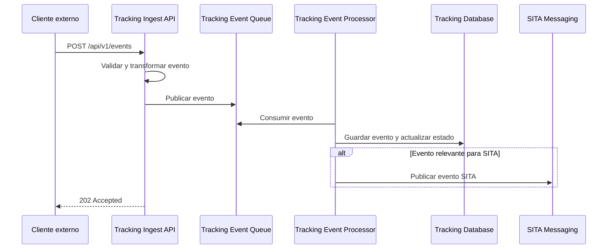
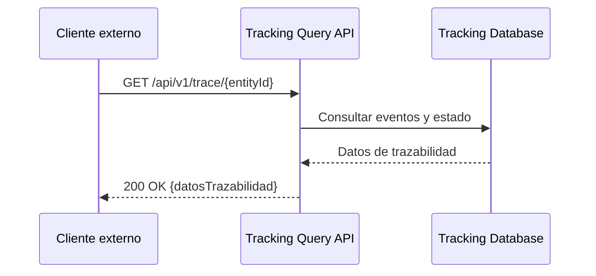

# 6. Vista de tiempo de ejecución

## 6.1 Escenarios principales

| Escenario                        | Flujo principal                                                                                  | Componentes involucrados                        |
|----------------------------------|--------------------------------------------------------------------------------------------------|-------------------------------------------------|
| Captura y procesamiento de evento| Cliente externo → Tracking Ingest API → Tracking Event Queue → Tracking Event Processor → Tracking Database / SITA Messaging | Tracking Ingest API, Tracking Event Queue, Tracking Event Processor, Tracking Database, SITA Messaging |
| Consulta de trazabilidad         | Cliente externo → Tracking Query API → Tracking Database                                         | Tracking Query API, Tracking Database           |

## 6.2 Patrones de interacción

| Patrón         | Descripción                                      | Tecnología/Componente         |
|----------------|--------------------------------------------------|-------------------------------|
| Asincronía     | Desacople entre ingesta y procesamiento          | AWS SQS, Tracking Event Queue |
| Persistencia   | Almacenamiento de eventos y estados              | PostgreSQL, Tracking Database |
| Integración    | Publicación de eventos a sistemas externos (SITA)| SITA Messaging, SNS/SQS       |

## 6.3 Escenarios de runtime

### 6.3.1 Captura y procesamiento de evento

### 6.3.2 Consulta de trazabilidad

