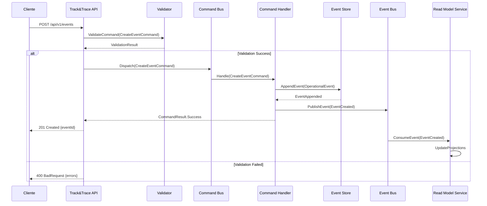
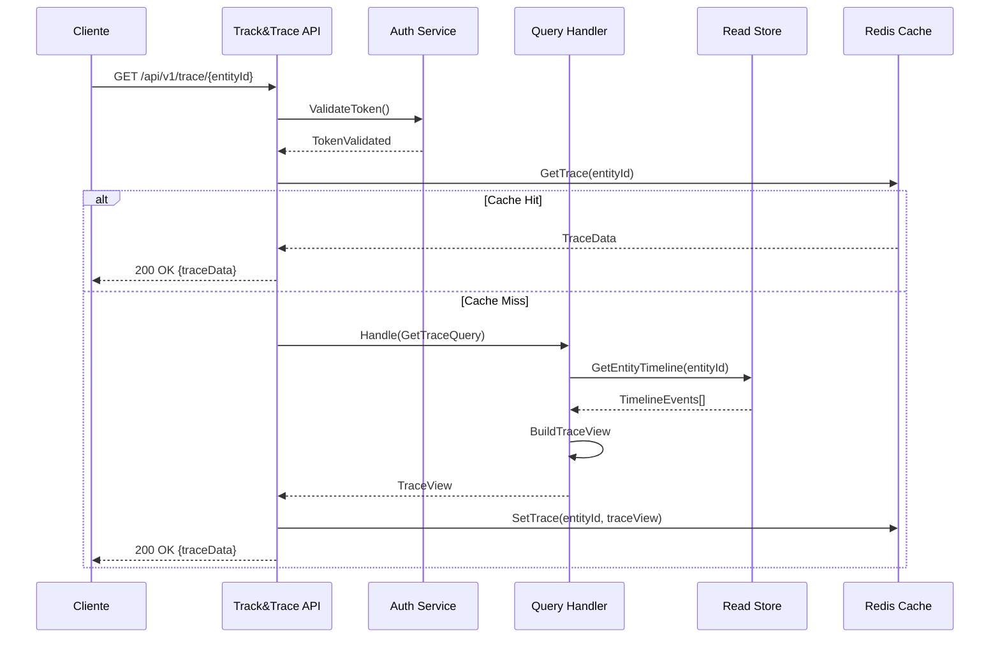
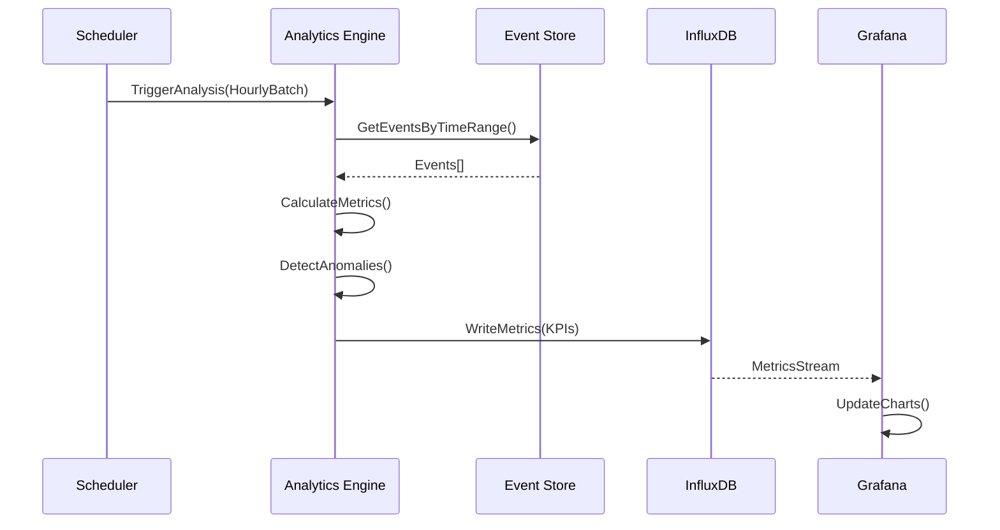

# 6. Vista de tiempo de ejecución

## 6.1 Escenarios principales

| Escenario | Flujo | Componentes |
|-----------|-------|-------------|
| **Registro evento** | API → Validator → Repository | API, Processor |
| **Consulta tracking** | API → Query Handler → Database | API |
| **Propagación evento** | Event Publisher → Queue → SITA | Processor |

## 6.2 Patrones de interacción

| Patrón | Descripción | Tecnología |
|---------|---------------|-------------|
| **CQRS** | Separación comando/consulta | API/Processor |
| **Event Sourcing** | Registro eventos | PostgreSQL |
| **Pub/Sub** | Propagación eventos | Queue |

## 6.1 Escenarios de runtime

### 6.1.1 Captura de evento operacional

### 6.1.2 Consulta de trazabilidad

### 6.1.3 Análisis de performance

## 6.2 Flujos principales

### 6.2.1 Ingesta de eventos

**Descripción**: Procesamiento de eventos operacionales desde múltiples fuentes

**Actores**: Sistemas externos, Aplicaciones internas, APIs de terceros

**Precondiciones**:
- Sistema autenticado
- Evento válido según schema
- Tenant activo

**Flujo normal**:
1. Recepción de evento vía API REST o Event Bus
2. Validación de formato y permisos
3. Enriquecimiento con metadata
4. Persistencia en Event Store
5. Publicación en event bus
6. Actualización de read models
7. Notificación a suscriptores

**Flujo alternativo - Evento duplicado**:
- Detección por deduplication key
- Retorno de referencia existente
- Log de intento duplicado
**Flujo de error**:
- Validación fallida → Error 400
- Problemas de conectividad → Retry automático
- Event Store no disponible → Circuit breaker

### 6.2.2 Construcción de timeline

**Precondiciones**:
- Entidad existente en el sistema
- Permisos de lectura para el tenant
- Read models actualizados

**Flujo normal**:
2. Consulta a read store optimizado
3. Aplicación de filtros temporales/contextuales
4. Construcción de timeline estructurado
5. Aplicación de transformaciones de vista
6. Cacheo del resultado
7. Retorno de timeline paginado

**Optimizaciones**:
- Cache distribuido con TTL
- Índices especializados por entidad
- Proyecciones pre-calculadas

### 6.2.3 Agregación de métricas

**Descripción**: Cálculo de KPIs y métricas de negocio

**Actores**: Scheduler, Usuarios de dashboard

**Precondiciones**:
- Event store con datos históricos
- Configuración de métricas por tenant
- Time series database disponible

**Flujo normal**:
1. Trigger por schedule o demanda
2. Consulta de eventos en ventana temporal
3. Aplicación de reglas de agregación
4. Cálculo de métricas derivadas
5. Detección de anomalías
6. Persistencia en time series DB
7. Actualización de dashboards

## 6.3 Patrones de runtime

### 6.3.1 Event Sourcing
- **Estado**: Reconstruido desde eventos
- **Persistencia**: Solo eventos, never snapshots para auditoría completa
- **Performance**: Snapshots opcionales para entidades con alta frecuencia

### 6.3.2 CQRS
- **Commands**: Modifican estado vía Event Store
- **Queries**: Leen desde read models especializados
- **Sincronización**: Eventually consistent vía event handlers

### 6.3.3 Saga Pattern
- **Coordinación**: Para procesos de larga duración
- **Compensación**: Rollback de operaciones fallidas
- **Estado**: Persistido como eventos de saga

## 6.4 Manejo de concurrencia

### 6.4.1 Optimistic Concurrency
- **Mecanismo**: Version-based concurrency control
- **Conflictos**: Detección y resolución automática
- **Retry**: Automatic retry con backoff exponencial

### 6.4.2 Particionado
- **Sharding**: Por tenant y tipo de entidad
- **Routing**: Basado en hash de entity ID
- **Balanceado**: Distribución equitativa de carga

## 6.5 Monitoreo de runtime

### 6.5.1 Métricas de negocio
- **Event ingestion rate**: Eventos/segundo por tenant
- **Query response time**: P95 < 100ms para timeline queries
- **Data freshness**: Lag entre command y query consistency

### 6.5.2 Métricas técnicas
- **Event store latency**: Append operations < 50ms
- **Read model lag**: < 5 segundos para projections críticas
- **Memory usage**: Bounded por configuración de tenant

### 6.5.3 Alertas
- **High lag**: Read model lag > 30 segundos
- **Failed commands**: Error rate > 1%
- **Storage growth**: Crecimiento anómalo de event store
