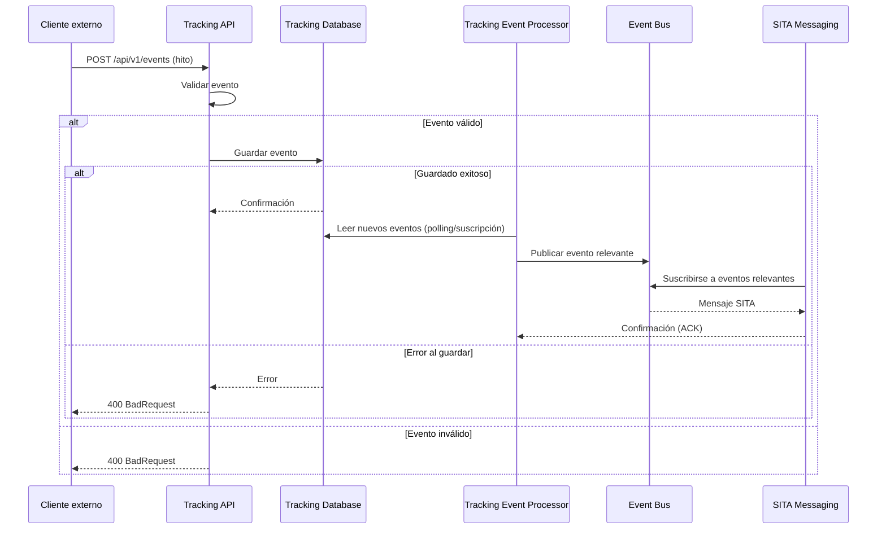
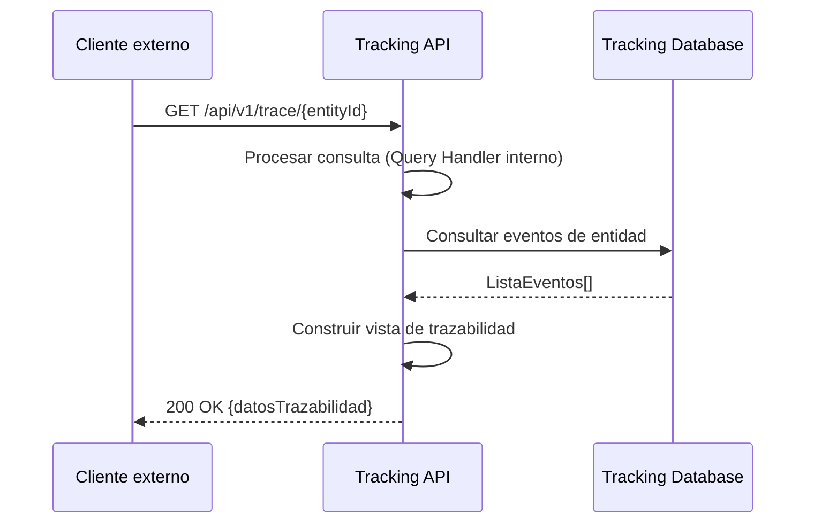

# 6. Vista de Tiempo de Ejecución

## 6.1 Escenarios Principales

| Escenario                | Flujo                                                        | Componentes principales         |
|--------------------------|--------------------------------------------------------------|---------------------------------|
| **Captura de hito y transmisión SITA** | `API REST` → `Validator` → `Event Store` → `Event Bus` → `SITA Messaging` | `API`, `Validator`, `Event Store`, `Event Bus`, `SITA` |
| **Consulta de trazabilidad**           | `API REST` → `Auth` → `Cache`/`Query Handler` → `Read Store`  | `API`, `Auth`, `Cache`, `Query Handler`, `Read Store`   |

## 6.2 Patrones de Interacción

| Patrón         | Descripción                  | Tecnología         |
|---------------|------------------------------|--------------------|
| **CQRS**          | Separación comando/consulta  | `API`, `Processor`     |
| **Event Sourcing**| Registro de eventos          | `PostgreSQL`         |
| **Pub/Sub**       | Propagación de eventos       | `Event Bus`, `SITA`    |

## 6.3 Escenarios de Runtime

### 6.3.1 Captura de hito operacional y transmisión SITA

### 6.3.2 Consulta de Trazabilidad

