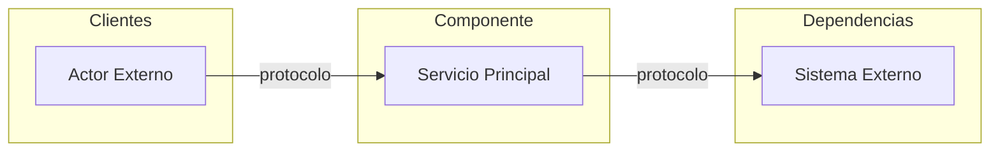
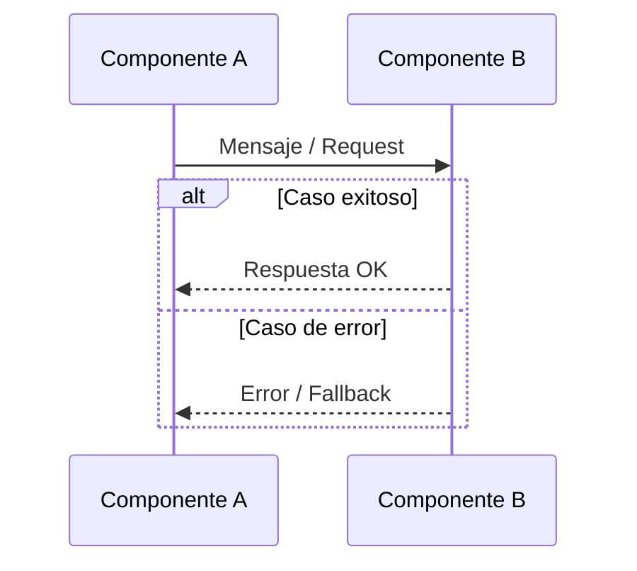

# Plantilla base para documentación arquitectónica (arc42)

> **Nota:** Esta es la plantilla de referencia consolidada para documentar componentes de la plataforma corporativa Talma siguiendo el estándar **arc42**. Está alineada con los patrones establecidos en los componentes ya documentados (API Gateway, Identidad y Accesos) y con las instrucciones del proyecto.
>
> **Reglas de uso:**
>
> - Cada componente genera **12 archivos Markdown** dentro de su carpeta, nombrados `01-introduccion-objetivos.md` … `12-glosario.md`.
> - Todo archivo debe incluir el **frontmatter YAML** con `sidebar_position`, `title` y `description`.
> - Los diagramas se realizan exclusivamente con **Mermaid** (`sequenceDiagram`, `graph`, `flowchart`).
> - Las decisiones arquitectónicas se referencian con su ID (`ADR-XXX`). Las decisiones locales al componente usan `DEC-XX`.
> - Nunca duplicar información ya definida en ADRs o en el DSL Structurizr.
> - Redacción en español neutro, voz activa, sin primera persona. Términos técnicos en backticks.

---

## Estructura de archivos

```
docs/<area>/<componente>/
├── _category_.json
├── 01-introduccion-objetivos.md
├── 02-restricciones-arquitectura.md
├── 03-contexto-alcance.md
├── 04-estrategia-solucion.md
├── 05-vista-bloques-construccion.md
├── 06-vista-tiempo-ejecucion.md
├── 07-vista-despliegue.md
├── 08-conceptos-transversales.md
├── 09-decisiones-arquitectura.md
├── 10-requisitos-calidad.md
├── 11-riesgos-deuda-tecnica.md
└── 12-glosario.md
```

---

## Frontmatter YAML (obligatorio en cada archivo)

```yaml
---
sidebar_position: 1 # Número del archivo (1–12)
title: Introducción y Objetivos
description: Breve descripción del contenido del archivo para Docusaurus.
---
```

---

## 1. Introducción y Objetivos

**Propósito (arc42):** Describir los requisitos relevantes, los objetivos de calidad y las partes interesadas. Es el punto de entrada para cualquier lector del documento.

**Contenido esperado:**

- Párrafo introductorio: qué es el componente, qué tecnología lo implementa y en qué ADR se decidió.
- Tabla de **funcionalidades o capacidades clave** (2 columnas: Funcionalidad | Descripción).
- Tabla de **requisitos de calidad** con métricas objetivo y valor crítico (Atributo | Objetivo | Crítico).
- Tabla de **partes interesadas** (Rol | Interés).
- Referencia al ADR principal de selección de tecnología.

**Guía de calidad:** Los requisitos de calidad deben ser concretos y medibles. Evitar frases como "alta disponibilidad" sin un número. Usar `99.9%`, `< 200ms p95`, `> 5,000 RPS`.

---

## 2. Restricciones de la Arquitectura

**Propósito (arc42):** Enumerar las limitaciones que el arquitecto debe respetar y no puede cambiar libremente. Incluyen restricciones técnicas, organizativas y de proceso.

**Contenido esperado:**

- Tabla de **restricciones técnicas** (Restricción | Valor | Razón).
- Tabla de **restricciones organizativas** (Restricción | Descripción).
- Tabla de **restricciones de proceso** (Restricción | Descripción).

**Guía de calidad:** Cada restricción debe indicar el motivo (ADR, estándar corporativo, regulación). No listar preferencias como restricciones.

---

## 3. Contexto y Alcance

**Propósito (arc42):** Delimitar el sistema y especificar sus interfaces externas. Diferencia el contexto de negocio (qué intercambia) del técnico (cómo lo intercambia).

**Contenido esperado:**

- Párrafo de contexto: qué hace el componente y qué no hace.
- **Diagrama Mermaid** de contexto del sistema (actores externos, componente central, dependencias).
- Tabla de **contexto de negocio** (Actor externo | Interfaz | Descripción).
- Tabla de **contexto técnico** (Interfaz | Protocolo | Dirección | Descripción).
- Sección **Fuera de Alcance** con lista de responsabilidades explícitamente excluidas.



---

## 4. Estrategia de Solución

**Propósito (arc42):** Resumir las decisiones fundamentales de diseño que configuran la arquitectura. Son la base de decisiones detalladas de implementación.

**Contenido esperado:**

- Tabla de **decisiones tecnológicas** (Dimensión | Decisión | Justificación).
- Si aplica, diagrama o descripción del **modelo de configuración o flujo de trabajo** principal.

**Guía de calidad:** Cada decisión debe justificarse en función del problema que resuelve o del objetivo de calidad que satisface. Referenciar ADRs cuando existan.

---

## 5. Vista de Bloques de Construcción

**Propósito (arc42):** Mostrar la descomposición estática del sistema en componentes y sus relaciones. Es el "plano de planta" del sistema — obligatorio en toda documentación arc42.

**Contenido esperado:**

- **Nivel 1:** Diagrama Mermaid del sistema en contexto (entradas, componente, salidas).
- **Nivel 2:** Tabla de componentes internos (Componente | Tecnología/Ref | Responsabilidad).
- Si aplica, diagrama de relaciones entre bloques internos.
- Tabla de **plugins, módulos o extensiones** habilitados (Nombre | Alcance | Función).

---

## 6. Vista de Tiempo de Ejecución

**Propósito (arc42):** Describir el comportamiento del sistema en escenarios relevantes usando diagramas de secuencia. Seleccionar escenarios por relevancia arquitectónica, no por exhaustividad.

**Contenido esperado:**

- Mínimo **2–3 flujos** representativos (flujo principal, flujo de error, flujo de resiliencia).
- Cada flujo: título descriptivo + **diagrama `sequenceDiagram` Mermaid** + tabla de manejo de errores si aplica.



**Guía de calidad:** Cubrir el flujo nominal, al menos un flujo de fallo y uno de resiliencia (circuit breaker, retry, fallback).

---

## 7. Vista de Despliegue

**Propósito (arc42):** Describir la infraestructura técnica y la asignación de componentes de software a elementos de infraestructura (contenedores, servidores, redes, entornos).

**Contenido esperado:**

- **Diagrama Mermaid** de topología de despliegue (regiones, VPC, contenedores, bases de datos).
- `Dockerfile` o imagen base si aplica (con justificación de la imagen elegida).
- Tabla de **variables de entorno** o configuración de tarea (Variable | Valor/Fuente | Descripción).
- Estructura del repositorio de configuración si aplica (árbol de archivos).

---

## 8. Conceptos Transversales

**Propósito (arc42):** Documentar patrones, prácticas o decisiones de diseño que aplican a múltiples componentes del sistema. No ser exhaustivo; priorizar lo relevante y no obvio.

**Contenido esperado:**

- Una sección por concepto transversal relevante (autenticación, observabilidad, multi-tenancy, etc.).
- Cada sección: descripción del patrón, configuración clave y ejemplos concretos (tablas de headers, parámetros, etc.).

**Guía de calidad:** No repetir información del ADR referenciado. Describir cómo se aplica el concepto en este componente específico.

---

## 9. Decisiones de Arquitectura

**Propósito (arc42):** Registrar las decisiones arquitectónicas que afectan estructuralmente al componente. Distinguir entre la decisión principal (ADR corporativo) y las decisiones locales al componente (DEC-XX).

**Contenido esperado:**

- Tabla de **decisión principal** (ADR | Decisión | Estado | Referencia).
- Una sección `### DEC-XX` por decisión local relevante, con estructura Nygard:

```markdown
### DEC-01: <Título de la decisión>

- **Estado**: Aceptado | Propuesto | Obsoleto
- **Contexto**: Descripción del problema o situación que motivó la decisión.
- **Decisión**: Qué se decidió hacer.
- **Consecuencias**: Efectos positivos, negativos y neutros de la decisión.
```

**Guía de calidad (arc42/Nygard):** Documentar solo decisiones con impacto estructural. No documentar preferencias de implementación ni decisiones triviales.

---

## 10. Requisitos de Calidad

**Propósito (arc42):** Especificar los atributos de calidad del sistema (ISO 25010 / Q42) con métricas concretas y escenarios de calidad medibles. Los más importantes ya aparecen en la sección 1; aquí se amplían con escenarios.

**Contenido esperado:**

- Tablas por atributo de calidad: **Rendimiento**, **Disponibilidad**, **Seguridad**, **Escalabilidad**.
- Tabla de **escenarios de calidad** con IDs referenciables:

| ID   | Estímulo                          | Respuesta Esperada                 |
| ---- | --------------------------------- | ---------------------------------- |
| Q-01 | Descripción concreta del estímulo | Comportamiento medible del sistema |

**Guía de calidad (ISO 25010 / Q42):** Los escenarios deben ser específicos y medibles. Evitar "el sistema responde rápido". Usar "latencia p95 < 10ms bajo 10,000 RPS".

---

## 11. Riesgos y Deuda Técnica

**Propósito (arc42):** Listar riesgos técnicos y operacionales conocidos, ordenados por severidad, con su mitigación. Separar la deuda técnica como trabajo pendiente identificado.

**Contenido esperado:**

### Riesgos Técnicos

| ID    | Riesgo | Probabilidad    | Impacto            | Severidad                       | Mitigación |
| ----- | ------ | --------------- | ------------------ | ------------------------------- | ---------- |
| RT-01 | …      | Alta/Media/Baja | Crítico/Alto/Medio | 🔴 Crítico / ⚠️ Alto / 🟡 Medio | …          |

### Riesgos Operacionales

| ID    | Riesgo | Probabilidad | Impacto | Severidad | Mitigación |
| ----- | ------ | ------------ | ------- | --------- | ---------- |
| RO-01 | …      | …            | …       | …         | …          |

### Deuda Técnica

| ID    | Deuda                            | Prioridad       | Acción                       |
| ----- | -------------------------------- | --------------- | ---------------------------- |
| DT-01 | Descripción concreta de la deuda | Alta/Media/Baja | Acción específica a realizar |

### Plan de Contingencia

| Escenario                         | Respuesta                                           |
| --------------------------------- | --------------------------------------------------- |
| Descripción del fallo o incidente | Acción inmediata que el sistema o el equipo ejecuta |

**Guía de calidad (arc42):** Los riesgos son inputs para decisiones de arquitectura. La deuda técnica se referencia desde ADRs o desde las decisiones locales cuando corresponde.

---

## 12. Glosario

**Propósito (arc42):** Definir términos técnicos y de dominio usados en el documento para asegurar que todas las partes interesadas compartan el mismo lenguaje.

**Contenido esperado:**

- Tabla de **términos del dominio** (Término | Definición).
- Tabla de **acrónimos** (Acrónimo | Significado).

**Guía de calidad:** Incluir solo términos que puedan generar ambigüedad o que sean específicos de este componente. Los términos corporativos generales van en el glosario global del proyecto.
