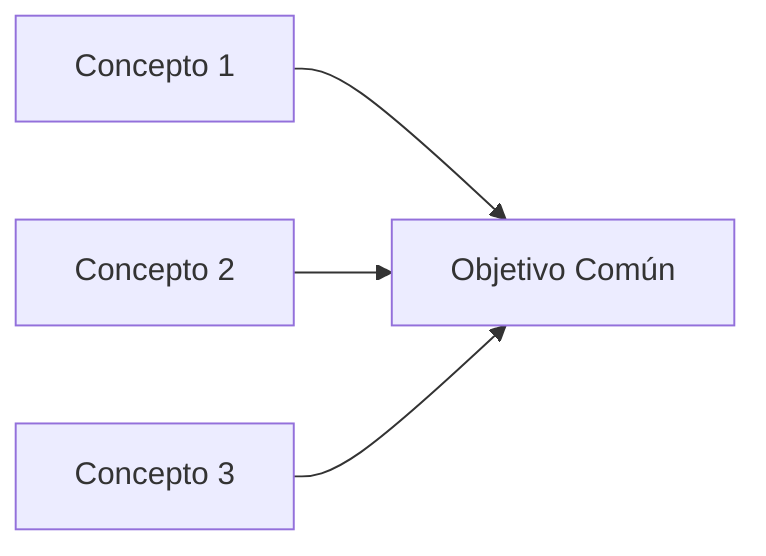

<!--
PLANTILLA PARA ESTÁNDARES CONSOLIDADOS

Esta es una ADAPTACIÓN de tu plantilla original para manejar estándares consolidados que cubren múltiples conceptos relacionados.

🎯 DIFERENCIAS CON PLANTILLA ATÓMICA:
- **Estándar Atómico**: 1 concepto → 1 archivo (circuit-breaker.md)
- **Estándar Consolidado**: N conceptos relacionados → 1 archivo (resilience-patterns.md que incluye circuit-breaker + retry + timeout + bulkhead + rate-limiting + graceful-degradation + graceful-shutdown)

📐 ESTRUCTURA ADAPTADA:
1. Mantén frontmatter y contexto igual (incluye ADR si existe)
2. Índice de conceptos → dentro de `## Contexto` o como sección propia con nombre descriptivo (no genérico)
3. Cada concepto → sección `## N. [Nombre Concepto]` independiente con subsecciones
4. Implementación integrada → solo si tiene sentido mostrar los conceptos combinados
5. Requisitos → unificados al final, agrupados por concepto con negrita si es necesario

🗂️ NOMBRES DE SECCIONES (igual que plantilla atómica):
- Evita nombres genéricos: "Conceptos Fundamentales", "Información General"
- Usa nombre descriptivo del contenido real: `## Patrones de Resiliencia`, `## Visión General`, `## Relación entre Conceptos`
- Regla: si no puedes nombrarlo sin una palabra genérica, intégralo en `## Contexto`

🎯 DENSIDAD:
- 800-1200 líneas para consolidados grandes (7-10 conceptos)
- 500-800 líneas para medianos (4-6 conceptos)
- 300-500 líneas para pequeños (2-3 conceptos)
-->

---

id: [nombre-estandar-consolidado]
sidebar_position: [número]
title: [Título Consolidado]
description: [Descripción que menciona todos los conceptos incluidos]

---

# [Título Consolidado]

## Contexto

Este estándar consolida [N conceptos relacionados] para [objetivo común]. Complementa el lineamiento [X](../../lineamientos/categoria/nombre.md) asegurando [valor que aporta].

**Decisión arquitectónica:** [ADR-XXX: Título](../../adrs/adr-xxx.md) (si existe)

**Conceptos incluidos:**

- [Concepto 1] → Referenciado desde [lineamiento A](link)
- [Concepto 2] → Referenciado desde [lineamiento B](link)
- [Concepto 3] → Referenciado desde [lineamiento C](link)
- [Concepto N] → Referenciado desde [lineamientos X, Y](links)

---

## Stack Tecnológico (si aplica)

> 💡 **Incluye si alguno de los conceptos usa tecnologías específicas**

| Componente        | Tecnología    | Versión | Uso                             |
| ----------------- | ------------- | ------- | ------------------------------- |
| **Resilience**    | Polly         | 8.0+    | Circuit breaker, retry, timeout |
| **API Gateway**   | Kong          | 3.5+    | Rate limiting, load balancing   |
| **Observability** | OpenTelemetry | 1.7+    | Monitoreo de resiliencia        |

---

## Visión General

> 💡 **Renombra esta sección por algo más descriptivo si aplica** (ej: `## Patrones de Resiliencia`, `## Modelo de Seguridad`).
> Si el índice de conceptos ya cabe en `## Contexto`, elimina esta sección.

### Índice de Conceptos

1. **[Concepto 1]**: [Descripción 1 línea]
2. **[Concepto 2]**: [Descripción 1 línea]
3. **[Concepto 3]**: [Descripción 1 línea]
4. **[Concepto N]**: [Descripción 1 línea]

### Relación entre Conceptos



**Cuándo usar cada uno:**

- **Concepto 1**: [Escenario específico]
- **Concepto 2**: [Escenario específico]
- **Concepto 3**: [Escenario específico]

---

## 1. [Concepto Principal 1]

### ¿Qué es [Concepto 1]?

[Definición concisa del concepto]

**Propósito:** [Para qué sirve]

**Componentes clave:**

- **[Elemento 1]**: [Descripción]
- **[Elemento 2]**: [Descripción]

**Beneficios:**
✅ [Beneficio 1]
✅ [Beneficio 2]
✅ [Beneficio 3]

### Ejemplo Comparativo

```csharp
// ❌ MALO: Sin [Concepto 1]
[Código antipatrón conciso]

// ✅ BUENO: Con [Concepto 1]
[Código correcto conciso]
```

### Implementación

```csharp
// Implementación técnica específica para .NET 8+
// Usando tecnologías del stack (Polly, EF Core, etc.)
```

### Configuración

```csharp
// Configuración en Program.cs o similar
services.Add[Feature](options =>
{
    options.[Setting] = valor;
});
```

---

## 2. [Concepto Principal 2]

### ¿Qué es [Concepto 2]?

[Definición concisa del concepto]

**Propósito:** [Para qué sirve]

**Componentes clave:**

- **[Elemento 1]**: [Descripción]
- **[Elemento 2]**: [Descripción]

**Beneficios:**
✅ [Beneficio 1]
✅ [Beneficio 2]

### Ejemplo Comparativo

```csharp
// ❌ MALO: Sin [Concepto 2]
[Antipatrón]

// ✅ BUENO: Con [Concepto 2]
[Patrón correcto]
```

### Implementación

```csharp
// Implementación específica
```

---

## 3. [Concepto Principal 3]

### ¿Qué es [Concepto 3]?

[Definición concisa]

**Propósito:** [Para qué sirve]

**Componentes clave:**

- **[Elemento 1]**: [Descripción]

**Beneficios:**
✅ [Beneficio 1]
✅ [Beneficio 2]

### Ejemplo Comparativo

```csharp
// ❌ MALO
[Antipatrón]

// ✅ BUENO
[Patrón correcto]
```

### Implementación

```csharp
// Implementación específica
```

---

<!-- Repetir la estructura anterior para cada concepto adicional -->

---

## Implementación Integrada (Opcional)

> 💡 **Solo si tiene sentido mostrar cómo los conceptos trabajan juntos**

### Ejemplo: Sistema Resiliente Completo

```csharp
// Código que combina Circuit Breaker + Retry + Timeout
public class ResilientHttpClient
{
    private readonly IAsyncPolicy<HttpResponseMessage> _policy;

    public ResilientHttpClient()
    {
        var timeout = Policy.TimeoutAsync<HttpResponseMessage>(TimeSpan.FromSeconds(10));
        var retry = Policy
            .Handle<HttpRequestException>()
            .WaitAndRetryAsync(3, retryAttempt =>
                TimeSpan.FromSeconds(Math.Pow(2, retryAttempt)));
        var circuitBreaker = Policy
            .Handle<HttpRequestException>()
            .CircuitBreakerAsync(5, TimeSpan.FromSeconds(30));

        // Combinar políticas: timeout → retry → circuit breaker
        _policy = Policy.WrapAsync(timeout, retry, circuitBreaker);
    }

    public async Task<HttpResponseMessage> GetAsync(string url)
    {
        return await _policy.ExecuteAsync(() =>
            new HttpClient().GetAsync(url));
    }
}
```

### Configuración Unificada

```csharp
// Program.cs - Configurar todos los patrones juntos
builder.Services.AddHttpClient("resilient-client")
    .AddPolicyHandler(GetRetryPolicy())
    .AddPolicyHandler(GetCircuitBreakerPolicy())
    .AddPolicyHandler(GetTimeoutPolicy())
    .AddPolicyHandler(GetBulkheadPolicy());
```

---

## Patrones de Uso Común

### Escenario 1: [Descripción del escenario]

**Conceptos aplicables:**

- ✅ [Concepto A] - [Por qué]
- ✅ [Concepto B] - [Por qué]
- ❌ [Concepto C] - No aplica porque [razón]

**Implementación:**

```csharp
// Código específico del escenario
```

### Escenario 2: [Descripción del escenario]

**Conceptos aplicables:**

- ✅ [Concepto X]
- ✅ [Concepto Y]

**Implementación:**

```csharp
// Código específico del escenario
```

---

## Matriz de Decisión

| Escenario                          | [Concepto 1] | [Concepto 2] | [Concepto 3] | [Concepto N] |
| ---------------------------------- | ------------ | ------------ | ------------ | ------------ |
| Llamadas HTTP a servicios externos | ✅           | ✅           | ✅           | -            |
| Procesamiento batch grande         | -            | ✅           | -            | ✅           |
| APIs públicas                      | ✅           | ✅           | ✅           | ✅           |
| Operaciones críticas               | ✅           | -            | ✅           | -            |

---

## Requisitos Técnicos

### MUST (Obligatorio)

**General:**

- **MUST** [requisito aplicable a todos los conceptos]

**[Concepto 1]:**

- **MUST** [requisito específico concepto 1]

**[Concepto 2]:**

- **MUST** [requisito específico concepto 2]

**[Concepto N]:**

- **MUST** [requisito específico concepto N]

### SHOULD (Fuertemente recomendado)

**General:**

- **SHOULD** [recomendación general]

**Por concepto:**

- **SHOULD** ([Concepto 1]) [recomendación específica]
- **SHOULD** ([Concepto 2]) [recomendación específica]

### MAY (Opcional)

- **MAY** [opción adicional cuando sea relevante]

### MUST NOT (Prohibido)

- **MUST NOT** [antipatrón a evitar]

---

## Monitoreo y Observabilidad

> 💡 **Solo si los conceptos consolidados requieren observabilidad específica**

### Métricas Recomendadas

```csharp
// Métricas para Concepto 1
_meter.CreateCounter<long>("concepto1.events");

// Métricas para Concepto 2
_meter.CreateHistogram<double>("concepto2.duration_ms");
```

### Logs Estructurados

```csharp
_logger.LogWarning(
    "[Concepto 1] activado: {Detail}",
    detail);
```

---

## Referencias

**Documentación oficial:**

- [Tecnología X](link)
- [Framework Y](link)

**Patrones y prácticas:**

- [Patrón A](link)
- [Patrón B](link)

**Relacionados:**

- [Otro estándar relacionado](link)
- [Lineamiento relacionado](link)
